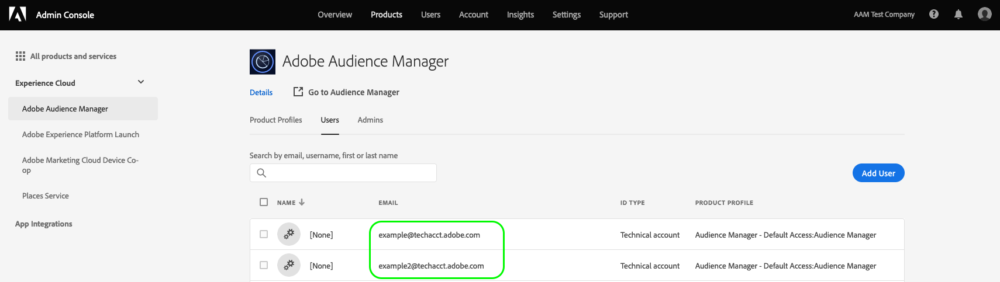

# 快速入門 [!DNL REST] [!DNL APIs] {#getting-started-with-rest-apis}

有關一般需求、驗證、選用查詢引數、請求的資訊 [!DNL URLs]和其他參照。

## API需求與Recommendations {#api-requirements-recommendations}

使用時，請注意下列事項 [AUDIENCE MANAGER API](https://bank.demdex.com/portal/swagger/index.html#/) 程式碼：

* **要求引數：** 除非另有指定，否則所有要求引數皆為必要。
* **請求標頭**：使用時 [Adobe Developer](https://www.adobe.io/) Token，您必須提供 `x-api-key` 標頭。 您可以取得您的 [!DNL API] 依照 [服務帳戶整合](https://www.adobe.io/authentication/auth-methods.html#!AdobeDocs/adobeio-auth/master/AuthenticationOverview/ServiceAccountIntegration.md) 頁面。
* **[!DNL JSON]內容型別：** 指定 `content-type: application/json`  *和*  `accept: application/json` 在您的程式碼中。
* **要求與回應：** 以正確格式傳送請求 [!DNL JSON] 物件。 [!DNL Audience Manager] 回應為 [!DNL JSON] 格式化資料。 伺服器回應可包含要求的資料、狀態代碼或兩者。
* **存取：** 您的 [!DNL Audience Manager] 顧問會提供使用者端ID和金鑰，供您製作 [!DNL API] 要求。
* **檔案和程式碼範例：** 文字輸入 *斜體* 代表您在進行或接收時提供或傳入的變數 [!DNL API] 資料。 取代 *斜體* 包含您自己的程式碼、引數或其他必要資訊的文字。

## 驗證 {#authentication}

此 [!DNL Audience Manager] [!DNL REST APIs] 支援三種驗證方法。

* [!BADGE 建議]{type=positive}[OAuth伺服器對伺服器驗證](#oauth-adobe-developer) 使用 [Adobe開發人員主控台](https://www.adobe.io/). [!DNL Adobe Developer] 是Adobe的開發人員生態系統和社群。 內容包括 [適用於所有Adobe產品的API](https://developer.adobe.com/apis/). 這是設定和使用的建議方式 [!DNL Adobe] [!DNL APIs]. 深入瞭解 [OAuth伺服器對伺服器驗證](https://developer.adobe.com/developer-console/docs/guides/authentication/ServerToServerAuthentication/implementation/) (在Adobe開發人員檔案中)。
* [!BADGE 已棄用]{type=negative}[JWT （服務帳戶）驗證](#jwt) 使用 [Adobe開發人員主控台](https://www.adobe.io/). [!DNL Adobe Developer] 是Adobe的開發人員生態系統和社群。 內容包括 [適用於所有Adobe產品的API](https://developer.adobe.com/apis/).
* [!BADGE 已棄用]{type=negative}[舊版OAuth驗證](#oauth-deprecated). 雖然此方法已過時，但擁有現有 [!DNL OAuth] 整合可繼續使用此方法。

>[!IMPORTANT]
>
>根據您的驗證方法，您需要調整請求 [!DNL URLs] 視情況而定。 請參閱 [環境](#environments) 區段，以瞭解您應使用之主機名稱的詳細資訊。

## 使用Adobe Developer的OAuth伺服器對伺服器驗證 {#oauth-adobe-developer}

本節說明如何收集驗證Audience ManagerAPI呼叫所需的認證，如下方流程圖所述。 您可以在初始的一次性設定中收集大部分必要的認證。 然而，存取權杖必須每24小時重新整理一次。


### Adobe Developer概觀 {#developer-overview}

[!DNL Adobe Developer] 是Adobe的開發人員生態系統和社群。 內容包括 [適用於所有Adobe產品的API](https://developer.adobe.com/apis).

這是設定和使用的建議方式 [!DNL Adobe] [!DNL APIs].

### 必備條件 {#prerequisites-server-to-server}

設定之前 [!DNL OAuth Server-to-Server] 驗證，確定您擁有 [Adobe Developer Console](https://developer.adobe.com/console/home) 在 [Adobe Developer](https://developer.adobe.com/). 如需存取要求，請聯絡您的組織管理員。

### 驗證 {#oauth}

請依照下列步驟進行設定 [!DNL OAuth Server-to-Server] 驗證使用 [!DNL Adobe Developer]：

1. 登入 [Adobe Developer Console](https://developer.adobe.com/console/home).
1. 請依照以下檔案中的步驟操作： [OAuth伺服器對伺服器認證實作指南](https://developer.adobe.com/developer-console/docs/guides/authentication/ServerToServerAuthentication/implementation/).
   * 期間 [步驟2：使用服務帳戶驗證新增API至您的專案](https://www.adobe.io/authentication/auth-methods.html#!AdobeDocs/adobeio-auth/master/AuthenticationOverview/ServiceAccountIntegration.md)，選擇 [!DNL Audience Manager] [!DNL API] 選項。
1. 請先建立連線，然後再試一次 [!DNL API] 根據的指示呼叫 [步驟3](https://www.adobe.io/authentication/auth-methods.html#!AdobeDocs/adobeio-auth/master/AuthenticationOverview/ServiceAccountIntegration.md).

>[!NOTE]
>
>若要設定與使用 [!DNL Audience Manager] [!DNL REST APIs] 您可以透過自動化方式，以程式設計方式輪換使用者端密碼。 另請參閱 [開發人員檔案](https://developer.adobe.com/developer-console/docs/guides/authentication/ServerToServerAuthentication/implementation/#rotating-client-secrets-programmatically) 以取得詳細指示。

### 將Audience Manager API新增至專案 {#add-aam-api-to-project}

前往 [Adobe Developer Console](https://www.adobe.com/go/devs_console_ui) 並使用您的Adobe ID登入。 接下來，請依照教學課程中概述的步驟進行 [建立空白專案](https://developer.adobe.com/developer-console/docs/guides/projects/projects-empty/) 在Adobe Developer Console檔案中。

建立新專案後，選取 **[!UICONTROL Add API]** 於 **[!UICONTROL Project Overview]** 畫面。

>[!TIP]
>
>如果您已布建多個組織，請使用介面右上角的組織選擇器，以確保您位於所需的組織中。


此 **[!UICONTROL Add an API]** 畫面隨即顯示。 選取Adobe Experience Cloud的產品圖示，然後選擇 **[!UICONTROL Audience Manager API]** 在選取之前 **[!UICONTROL Next]**.


>[!TIP]
>
>選取 **[!UICONTROL View docs]** 可在個別瀏覽器視窗中導覽以完成 [Audience Manager API參考檔案](https://bank.demdex.com/portal/swagger/index.html#).

### 選取OAuth伺服器對伺服器驗證型別 {#select-oauth-server-to-server}

接著，選取驗證型別以產生存取權杖並存取Audience ManagerAPI。

>[!IMPORTANT]
>
>選取 **[!UICONTROL OAuth Server-to-Server]** 方法，因為這將是日後唯一支援的方法。 此 **[!UICONTROL Service Account (JWT)]** 方法已過時。 雖然使用JWT驗證方法的整合功能在2025年1月1日之前將繼續運作，但Adobe強烈建議您在該日期之前將現有整合功能移轉至新的OAuth伺服器對伺服器方法。


### 選取要整合的產品設定檔 {#select-product-profiles}

在 **[!UICONTROL Configure API]** 畫面中，選取所需的產品設定檔。 您整合的服務帳戶可透過此處選取的產品設定檔存取精細功能。


選取 **[!UICONTROL Save configured API]** 當您準備好時。

### 收集認證 {#gather-credentials}

將API新增至專案後， **[!UICONTROL Audience Manager API]** 專案的頁面會顯示所有Audience ManagerAPI呼叫所需的下列認證：


* `{API_KEY}` ([!UICONTROL Client ID])
* `{ORG_ID}` ([!UICONTROL Organization ID])

## 產生存取權杖 {#generate-access-token}

下一步是產生 `{ACCESS_TOKEN}` 用於Audience Manager API呼叫的認證。 不像 `{API_KEY}` 和 `{ORG_ID}`，則必須每24小時產生新Token以繼續使用Audience ManagerAPI。 選取 **[!UICONTROL Generate access token]**，如下所示。


## 測試API呼叫 {#test-api-call}

取得驗證持有人權杖後，請執行API呼叫以測試您現在可以存取Audience ManagerAPI。

1. 導覽至 [API參考檔案](https://bank.demdex.com/portal/swagger/index.html#/Data%20Source%20API/get_datasources_).
2. 選取 **[!UICONTROL Authorize]** 並貼上您在中取得的存取權杖 [產生存取權杖](#generate-access-token) 步驟。

   

3. 執行GET呼叫 `/datasources` API端點會擷取所有全域可用資料來源的清單，如 [API參考檔案](https://bank.demdex.com/portal/swagger/index.html#/Data%20Source%20API/get_datasources_). 選取 **[!UICONTROL Try it out]**，後接 **[!UICONTROL Execute]**，如下所示。

   


>[!BEGINSHADEBOX]

>[!BEGINTABS]

>[!TAB API要求]

```shell
curl -X 'GET' \
  'https://api.demdex.com/v1/datasources/' \
  -H 'accept: application/json' \
  -H 'Authorization: Bearer your-access-token'
```


>[!TAB 使用正確持有人權杖時的API回應]


使用有效的存取Token時，API端點會傳回200回應，以及包含您的組織有權存取之所有全域資料來源的回應主體。

```json
[
  {
    "pid": 1794,
    "name": "testdatasource1",
    "description": "Test data source",
    "status": "ACTIVE",
    "integrationCode": "test_ds1",
    "dataExportRestrictions": [],
    "updateTime": 1595340792000,
    "crUID": 0,
    "upUID": 15910,
    "linkNamespace": false,
    "type": "GENERAL",
    "subIdType": "CROSS_DEVICE_PERSON",
    "inboundS2S": true,
    "outboundS2S": true,
    "useAudienceManagerVisitorID": false,
    "allowDataSharing": true,
    "masterDataSourceIdProvider": true,
    "uniqueTraitIntegrationCodes": false,
    "uniqueSegmentIntegrationCodes": false,
    "marketingCloudVisitorIdVersion": 0,
    "idType": "CROSS_DEVICE",
    "samplingEndTime": 1596550392825,
    "allowDeviceGraphSharing": false,
    "supportsAuthenticatedProfile": true,
    "deviceGraph": false,
    "authenticatedProfileName": "testdatasource1",
    "deviceGraphName": "",
    "customNamespaceId": 29769,
    "customNamespaceCode": "silviu_ds1",
    "customerProfileDataRetention": 62208000,
    "samplingStartTime": 1595340792825,
    "dataSourceId": 29769,
    "containerIds": [],
    "samplingEnabled": false
  },
  {
    "pid": 1794,
    "name": "AAM Test Company Audiences",
    "description": "Automatically generated trait data source",
    "status": "ACTIVE",
    "integrationCode": "adobe-provided",
    "dataExportRestrictions": [
      "PII"
    ],

    [...]
```

>[!ENDTABS]

>[!ENDSHADEBOX]

## [!BADGE 已棄用]{type=negative}[!DNL JWT] ([!DNL Service Account])使用Adobe Developer進行驗證 {#jwt}

+++ 檢視已棄用的相關資訊 [!DNL JWT] ([!DNL Service Account])取得驗證權杖的方法。

### Adobe Developer概觀 {#adobeio}

[!DNL Adobe Developer] 是Adobe的開發人員生態系統和社群。 內容包括 [適用於所有Adobe產品的API](https://www.adobe.io/apis.html).

這是設定和使用的建議方式 [!DNL Adobe] [!DNL APIs].

### 必備條件 {#prerequisites}

設定之前 [!DNL JWT] 驗證，確定您擁有 [Adobe Developer Console](https://console.adobe.io/) 在 [Adobe Developer](https://www.adobe.io/). 如需存取要求，請聯絡您的組織管理員。

### 驗證 {#auth}

請依照下列步驟進行設定 [!DNL JWT (Service Account)] 驗證使用 [!DNL Adobe Developer]：

1. 登入 [Adobe Developer Console](https://console.adobe.io/).
1. 請依照中的步驟操作 [服務帳戶連線](https://www.adobe.io/authentication/auth-methods.html#!AdobeDocs/adobeio-auth/master/AuthenticationOverview/ServiceAccountIntegration.md).
   * 期間 [步驟2：使用服務帳戶驗證新增API至您的專案](https://www.adobe.io/authentication/auth-methods.html#!AdobeDocs/adobeio-auth/master/AuthenticationOverview/ServiceAccountIntegration.md)，選擇 [!DNL Audience Manager] [!DNL API] 選項。
1. 請先建立連線，然後再試一次 [!DNL API] 根據的指示呼叫 [步驟3](https://www.adobe.io/authentication/auth-methods.html#!AdobeDocs/adobeio-auth/master/AuthenticationOverview/ServiceAccountIntegration.md).

>[!NOTE]
>
>若要設定與使用 [!DNL Audience Manager] [!DNL REST APIs] 您可以透過自動化方式產生 [!DNL JWT] 以程式設計方式。 另請參閱 [JWT （服務帳戶）驗證](https://www.adobe.io/authentication/auth-methods.html#!AdobeDocs/adobeio-auth/master/JWT/JWT.md) 以取得詳細指示。

### 技術帳戶RBAC許可權

如果您的Audience Manager帳戶使用 [角色型存取控制](../../features/administration/administration-overview.md)，您必須建立Audience Manager技術使用者帳戶，並將其新增至將進行API呼叫的Audience ManagerRBAC群組。

請依照下列步驟建立技術使用者帳戶，並將其新增至RBAC群組：

1. 建立 `GET` 呼叫 `https://aam.adobe.io/v1/users/self`. 通話會建立您可在中看到的技術使用者帳戶 [!UICONTROL Admin Console]，在 [!UICONTROL Users] 頁面。

   

1. 登入您的Audience Manager帳戶並 [新增技術使用者帳戶](../../features/administration/administration-overview.md#create-group) 至將進行API呼叫的使用者群組。

+++

## [!BADGE 已棄用]{type=negative}[!DNL OAuth] 驗證（已棄用） {#oauth-deprecated}

+++ 檢視已過時舊版的相關資訊 [!DNL OAuth] 取得驗證權杖的驗證方法。

>[!WARNING]
> [!DNL Audience Manager] [!UICONTROL REST API] 權杖驗證和續約，透過 [!DNL OAuth 2.0] 現已棄用。
>
> 請使用 [JWT （服務帳戶）驗證](#jwt-service-account-authentication-jwt) 而非。

此 [!DNL Audience Manager] [!UICONTROL REST API] 追蹤 [!DNL OAuth 2.0] 權杖驗證和續約的標準。 以下各節將說明如何驗證並開始使用 [!DNL API]s.

### 建立一般 [!DNL API] 使用者 {#requirements}

建議您另外建立一個技術使用者帳戶，以便使用 [!DNL Audience Manager] [!DNL API]s.這是一般帳戶，不會繫結至組織中的特定使用者或與其相關聯。 此型別 [!DNL API] 使用者帳戶可協助您完成2件事：

* 識別呼叫的服務 [!DNL API] (例如，來自使用我們的應用程式的呼叫 [!DNL API]或從其他製作工具 [!DNL API] 請求)。
* 提供對的不中斷存取 [!DNL API]s.與特定人員繫結的帳戶可能會在他們離開您的公司時刪除。 這會導致您無法使用可用的 [!DNL API] 程式碼。 未與特定員工繫結的一般帳戶可協助您避免此問題。

在此型別的帳戶範例或使用案例中，假設您想使用一次變更許多區段 [大量管理工具](../../reference/bulk-management-tools/bulk-management-intro.md). 若要這麼做，您的使用者帳戶需要 [!DNL API] 存取。 不要將許可權新增到特定使用者，請建立非特定， [!DNL API] 具有適當認證、金鑰和密碼的使用者帳戶 [!DNL API] 呼叫。 如果您開發自己的應用程式來使用 [!DNL Audience Manager] [!DNL API]s.

使用您的 [!DNL Audience Manager] 顧問以設定通用、 [!DNL API]-only使用者帳戶。

### 密碼驗證工作流程 {#password-authentication-workflow}

密碼驗證安全存取我們的 [!DNL REST API]. 以下步驟概述來自的密碼驗證工作流程 [!DNL JSON] 使用者端。

>[!TIP]
>
>如果您將Token儲存在資料庫中，請加密存取並重新整理Token。

#### 步驟1：要求 [!DNL API] 存取

請連絡您的合作夥伴解決方案經理。 他們將為您提供 [!DNL API] 使用者端ID和密碼。 ID和密碼會驗證您的 [!DNL API].

注意：如果您想要收到重新整理權杖，請在您請求時指定 [!DNL API] 存取。

#### 步驟2：要求權杖

使用您偏好的傳遞權杖請求 [!DNL JSON] 使用者端。 當您建置請求時：

* 使用 `POST` 要呼叫的方法 `https://api.demdex.com/oauth/token`.
* 將您的使用者端ID和密碼轉換為base-64編碼字串。 在轉換過程中使用冒號分隔ID和密碼。 例如，認證 `testId : testSecret` 轉換為 `dGVzdElkOnRlc3RTZWNyZXQ=`.
* 在中傳遞 [!DNL HTTP] [!DNL headers] `Authorization:Basic <base-64 clientID:clientSecret>` 和 `Content-Type: application/x-www-form-urlencoded` . 例如，您的標題看起來可能像這樣： <br/>`Authorization: Basic dGVzdElkOnRlc3RTZWNyZXQ=` <br/>`Content-Type: application/x-www-form-urlencoded`
* 設定要求內文，如下所示：
  <br/> `grant_type=password&username=<your-AudienceManager-user-name>&password=<your-AudienceManager-password>`

#### 步驟3：接收權杖

此 [!DNL JSON] 回應包含您的存取權杖。 回應應如下所示：

```json
{
    "access_token": "28fed402-eafd-456c-9341-ac753f25bbbc",
    "token_type": "bearer",
    "refresh_token": "b27122c0-b0c7-4b39-a71b-1547a3b3b88e",
    "expires_in": 21922,
    "scope": "read write"
}
```

此 `expires_in` key代表存取Token過期前的秒數。 如果代號公開時，最佳做法就是使用較短的到期時間來限制曝光。

### 重新整理Token {#refresh-token}

重新整理Token更新 [!DNL API] 在原始Token過期後存取。 若有要求，回應會顯示 [!DNL JSON] 在密碼工作流程中，包含重新整理權杖。 如果您沒有收到重新整理權杖，請透過密碼驗證程式建立新的權杖。

您也可以使用重新整理權杖，在現有存取權杖過期之前產生新權杖。

如果您的存取權杖已過期，您將會收到 `401 Status Code` 和回應中的下列標頭：

`WWW-Authenticate: Bearer realm="oauth", error="invalid_token", error_description="Access token expired: <token>"`

下列步驟概述使用重新整理權杖從建立新存取權杖的工作流程 [!DNL JSON] 使用者端。

#### 步驟1：要求新Token

以您偏好的方式傳入重新整理權杖請求 [!DNL JSON] 使用者端。 當您建置請求時：

* 使用 `POST` 要呼叫的方法 `https://api.demdex.com/oauth/token`.
* 將您的使用者端ID和密碼轉換為base-64編碼字串。 在轉換過程中使用冒號分隔ID和密碼。 例如，認證 `testId : testSecret` 轉換為 `dGVzdElkOnRlc3RTZWNyZXQ=`.
* 在HTTP標題中傳遞 `Authorization:Basic <base-64 clientID:clientSecret>` 和 `Content-Type: application/x-www-form-urlencoded`. 例如，您的標題看起來可能像這樣： <br> `Authorization: Basic dGVzdElkOnRlc3RTZWNyZXQ=` <br> `Content-Type: application/x-www-form-urlencoded`
* 在請求內文中，指定 `grant_type:refresh_token` 並傳入您先前存取請求中收到的重新整理Token。 要求應如下所示： <br> `grant_type=refresh_token&refresh_token=b27122c0-b0c7-4b39-a71b-1547a3b3b88e`

#### 步驟2：接收新Token

此 [!DNL JSON] 回應包含您的新存取權杖。 回應應如下所示：

```json
{
    "access_token": "4fdfc261-2ffc-4fb7-8dbd-64221714c45f",
    "token_type": "bearer",
    "refresh_token": "295fa487-1825-4caa-a715-80b81ac17dae",
    "expires_in": 21922,
    "scope": "read write"
}
```

### 授權代碼和隱含驗證 {#authentication-code-implicit}

此 [!DNL Audience Manager] [!UICONTROL REST API] 支援授權代碼和隱含驗證。 若要使用這些存取方法，您的使用者需要登入 `https://api.demdex.com/oauth/authorize` 以取得存取權並重新整理Token。

+++

## 進行驗證 [!DNL API] 請求 {#authenticated-api-requests}

通話需求 [!DNL API] 方法會在您收到驗證權杖之後。

對可用發出呼叫的方式 [!DNL API] 方法：

* 在 `HTTP` 標題，設定 `Authorization: Bearer <token>`.
* 使用時 [JWT （服務帳戶）驗證](#jwt)，您必須提供 `x-api-key` 標頭，將會與您的 `client_id`. 您可以取得您的 `client_id` 從 [Adobe Developer整合](https://www.adobe.io/authentication/auth-methods.html#!AdobeDocs/adobeio-auth/master/AuthenticationOverview/ServiceAccountIntegration.md) 頁面。
* 呼叫必要的 [!DNL API] 方法。

## 可選 [!DNL API] 查詢引數 {#optional-api-query-parameters}

設定傳回物件所有屬性的方法可用的選用引數。

您可以使用這些選擇性引數搭配 [!DNL API] 傳回的方法 *全部* 物件的屬性。 將此查詢傳入時，請在要求字串中設定這些選項 [!DNL API].

| 參數 | 說明 |
|--- |--- |
| `page` | 依頁碼傳回結果。 編號從0開始。 |
| `pageSize` | 設定要求傳回的回應結果數目（預設為10）。 |
| `sortBy` | 根據指定的排序並傳回結果 [!DNL JSON] 屬性。 |
| `descending` | 以遞減順序排序並傳回結果。 `ascending` 是預設值。 |
| `search` | 根據您要用作搜尋引數的指定字串傳回結果。 例如，假設您想要尋找在該專案的任何值欄位中有「Test」字詞的所有模型的結果。 您的範例請求可能如下所示：   `GET https://aam.adobe.io/v1/models/?search=Test`.  您可以搜尋「」傳回的任何值[!DNL get all]&quot;方法。 |
| `folderId` | 傳回所有ID [!UICONTROL traits] 在指定的資料夾內。 並非所有方法都可使用。 |
| `permissions` | 根據指定的許可權傳回區段清單。 `READ` 是預設值。 許可權包括：<ul><li>`READ` ：傳回並檢視區段的相關資訊。</li><li>`WRITE` ：使用  `PUT`  更新區段。</li><li>`CREATE` ：使用  `POST`  以建立區段。</li><li>`DELETE` ：刪除區段。 需要存取基礎特徵（如果有）。 例如，如果您想要移除區段，則需要擁有刪除屬於該區段之特徵的許可權。</li></ul><br>使用不同的索引鍵值配對指定多個許可權。 例如，若要傳回含有以下專案的區段清單：  `READ`  和  `WRITE`  僅限許可權，傳入  `"permissions":"READ"`， `"permissions":"WRITE"` . |
| `includePermissions` | ([!DNL Boolean])設為 `true` 以傳回該區段的許可權。 預設為 `false`. |

### 關於頁面選項的附註

頁面資訊時間 *不是* 指定，要求會傳回plain [!DNL JSON] 結果會出現在陣列中。 若頁面資訊 *是* 指定，則傳回的清單會包裝在 [!DNL JSON] 包含總結果和目前頁面相關資訊的物件。 您使用頁面選項的範例請求看起來可能類似這樣：

```
GET https://aam.adobe.io/v1/models/?page=1&pageSize=2&search=Test
```

## [!DNL API URLs] {#api-urls}

[!DNL URLs] 請求、測試和生產環境及版本。

## 請求 [!DNL URLs] {#request-urls}

下表列出請求 [!DNL URLs] 用於傳入 [!DNL API] 請求，依方法。

根據您使用的驗證方法，您需要調整請求 [!DNL URLs] 根據下表。

### 請求 [!DNL URLs] 的 [!DNL JWT] 驗證 {#request-urls-jwt}

| [!DNL API] 方法 | 請求 [!DNL URL] |
|--- |--- |
| [!DNL Algorithmic Modeling] | `https://aam.adobe.io/v1/models/` |
| [!DNL Data Source] | `https://aam.adobe.io/v1/datasources/` |
| [!DNL Derived Signals] | `https://aam.adobe.io/v1/signals/derived/` |
| [!DNL Destinations] | `https://aam.adobe.io/v1/destinations/` |
| [!DNL Domains] | `https://aam.adobe.io/v1/partner-sites/` |
| [!DNL Folders] | 特徵：  `https://aam.adobe.io/v1/folders/traits /`<br>區段：  `https://aam.adobe.io/v1/folders/segments /` |
| [!DNL Schema] | `https://aam.adobe.io/v1/schemas/` |
| [!DNL Segments] | `https://aam.adobe.io/v1/segments/` |
| [!DNL Traits] | `https://aam.adobe.io/v1/traits/` |
| [!DNL Trait Types] | `https://aam.adobe.io/v1/customer-trait-types` |
| [!DNL Taxonomy] | `https://aam.adobe.io/v1/taxonomies/0/` |

### 請求 [!DNL URLs] 的 [!DNL OAuth] 驗證（已棄用） {#request-urls-oauth}

| [!DNL API] 方法 | 請求 [!DNL URL] |
|--- |--- |
| [!DNL Algorithmic Modeling] | `https://api.demdex.com/v1/models/` |
| [!DNL Data Source] | `https://api.demdex.com/v1/datasources/` |
| [!DNL Derived Signals] | `https://api.demdex.com/v1/signals/derived/` |
| [!DNL Destinations] | `https://api.demdex.com/v1/destinations/` |
| [!DNL Domains] | `https://api.demdex.com/v1/partner-sites/` |
| [!DNL Folders] | 特徵：  `https://api.demdex.com/v1/folders/traits /`<br>區段：  `https://api.demdex.com/v1/folders/segments /` |
| [!DNL Schema] | `https://api.demdex.com/v1/schemas/` |
| [!DNL Segments] | `https://api.demdex.com/v1/segments/` |
| [!DNL Traits] | `https://api.demdex.com/v1/traits/` |
| [!DNL Trait Types] | `https://api.demdex.com/v1/customer-trait-types` |
| [!DNL Taxonomy] | `https://api.demdex.com/v1/taxonomies/0/` |

## 環境 {#environments}

此 [!DNL Audience Manager] [!DNL API]提供不同工作環境的存取權。 這些環境可協助您針對個別資料庫測試程式碼，而不會影響即時生產資料。 下表列出可用的 [!DNL API] 環境和對應的資源主機名稱。

根據您使用的驗證方法，您需要調整環境 [!DNL URLs] 根據下表。

| 環境 | 主機名稱 [!DNL JWT] authentication | 主機名稱 [!DNL OAuth] authentication |
|---|---|---|
| **生產** | `https://aam.adobe.io/...` | `https://api.demdex.com/...` |
| **測試版** | `https://aam-beta.adobe.io/...` | `https://api-beta.demdex.com/...` |

>[!NOTE]
>
>此 [!DNL Audience Manager] 測試版環境是生產環境的較小規模、獨立版本。 您想要測試的所有資料都必須在此環境中輸入和收集。

## 版本 {#versions}

這些檔案的新版本 [!DNL API]會定期發行。 新發行版本會增加 [!DNL API] 版本號碼。 請求中參考了版本號碼 [!DNL URL] 作為 `v<version number>` 如下列範例所示：

`https://<host>/v1/...`

## 已定義的回應代碼 {#response-codes-defined}

`HTTP` 狀態代碼和傳回的回應文字 [!DNL Audience Manager] [!UICONTROL REST API].

| 回應代碼ID | 回應文字 | 定義 |
|---|---|---|
| `200` | `OK` | 已成功處理要求。 如有必要，將傳回預期的內容或資料。 |
| `201` | `Created` | 已建立資源。 傳回 `PUT` 和 `POST` 要求。 |
| `204` | `No Content` | 已刪除資源。 回應本文將為空白。 |
| `400` | `Bad Request` | 伺服器不瞭解此要求。 通常是因為語法錯誤。 請檢查您的請求，然後再試一次。 |
| `403` | `Forbidden` | 您無權存取資源。 |
| `404` | `Not Found` | 找不到指定路徑的資源。 |
| `409` | `Conflict` | 由於與資源的狀態衝突，無法完成要求。 |
| `500` | `Server Error` | 伺服器發生未預期的錯誤，因此無法完成要求。 |

>[!MORELIKETHIS]
>
>* [JWT （服務帳戶）驗證](https://www.adobe.io/authentication/auth-methods.html#!AdobeDocs/adobeio-auth/master/JWT/JWT.md)
>* [OAuth驗證](../../api/rest-api-main/aam-api-getting-started.md#oauth)
>* [OAuth 2.0](https://oauth.net/2/)
>* [OAuth 2簡體](https://aaronparecki.com/articles/2012/07/29/1/oauth2-simplified#browser-based-apps)
