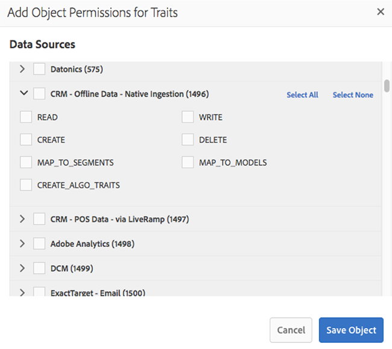

# 管理（RBAC控制） {#administration}

功能表下的選 [!UICONTROL Administration] 項可讓您建立Audience manager使用者並將其指派給群組。 您也可以檢視限制（特徵、區段、目的地和模型）。

使用其所 [!DNL Audience Manager] 有資料的企業客戶需要一個資料管理平台，但必須能夠控制不同資料元素對特定業務單位的可見度。 您可以使用群組權限(也稱為( [!UICONTROL Role-Based Access Control][!UICONTROL RBAC]))來完成此作業。

[!DNL Audience Manager] 使用群組來指派權限。 在使用者層級不會指派權限。 群組權限會系結至物件（特徵、區段等）以及可對這些物件執行的動作（編輯、檢視等）。 這些控制項也可透過Audience Manager REST API取得。 請參 [閱使用者](/help/using/api/rest-api-main/aam-api-user-group-permission/aam-api-user.md)、 [群組管理](/help/using/api/rest-api-main/aam-api-user-group-permission/aam-api-group.md)、權限 [管理](/help/using/api/rest-api-main/aam-api-user-group-permission/aam-api-permissions.md) API方法。

## Create Users {#create-users}

<!-- t_create_users.xml -->

在中建立使 [!DNL Audience Manager] 用者，並指定使用者詳細資訊、登入狀態，以及指派使用者至群組。

1. 按一下 **[!UICONTROL Administration]** > **[!UICONTROL Users]**.
1. 按一  下以顯示 [!UICONTROL Create New User] 頁面。
1. Under **[!UICONTROL User Details]**, fill in the fields:
   * **** 使用者名稱：指定Audience Manager的唯一使用者名稱。
   * **** 名字：指定使用者的名字。
   * **** 姓氏：指定使用者的姓氏。
   * **** 電子郵件地址：指定使用者的電子郵件地址。 [!DNL Audience Manager] 不會定期傳送通知給使用者。 [!DNL Audience Manager] 管理員可存取使用者的電子郵件地址，並可視需要手動以電子郵件寄送使用者。 例如，如果使用者忘記密碼，則此欄位中指定的電子郵件地址會用來傳送暫時密碼和重設密碼的指示。
   * **** 電話號碼：指定使用者的電話號碼。
   * **** 是管理員：指定此使用者是否為管 [!DNL Audience Manager] 理員。 管理員使用者可以管理使用者（建立、編輯等）和群組（建立、指派權限等）。 非管理員使用者只能控制自己的使用者設定檔，包括編輯其電子郵件地址及重設自己的密碼。 如需詳細資訊，請參 [閱編輯帳戶設定](../../features/administration/edit-account-settings.md)。
1. 在下 **[!UICONTROL Login]**&#x200B;方，選取所要的狀態：
   * **** 活動： 作用中使用者可 [!DNL Audience Manager] 以存取並擁有群組成員資格的權限。
   * **** 已停用： 已停用的使用者無 [!DNL Audience Manager] 法存取，也沒有任何權限。 如果您停用使用者，其使用者資訊會保留在中， [!DNL Audience Manager] 而且您可以視需要輕鬆重新啟用使用者。 如果您移除使用者，則必須重新建立使用者(如果他們日後需要 [!DNL Audience Manager] 再次使用)。
   * **** 過期：使用者的密碼早於90天。
   * **** 待定：使用者具有暫時密碼，例如重設密碼後或全新帳戶，而且他們尚未設定永久密碼。
   * **** 鎖定：5次不正確的登入嘗試會鎖定使用者。
1. 在 **[!UICONTROL Assigned Groups]**下方，從下拉式清單中，選取您要指派此使用者的所需群組。
如需群組和權限的詳細資訊，請參 [閱建立群組](../../features/administration/administration-overview.md#create-group)。
1. 按一下 **[!UICONTROL Save]**.

## 建立群組 {#create-group}

群 *組* ，是共用目標、區段和特徵物件存取權限的使用者集合。 您可以僅將群組限制為單一物件，或讓群組廣泛存取不同物件的組合。

<!-- t_create_groups.xml -->

要建立群組:

1. 按一下 **[!UICONTROL Administration]** > **[!UICONTROL Groups]**.
1. 按一  下以開啟 [!UICONTROL Group Settings] 頁面。
1. 在 [!UICONTROL Group Details]:
   * 命名群組。
   * 提供簡短的群組說明。
1. 在中 [!UICONTROL Group Members]，從選項中按一下用戶 **[!UICONTROL Add Users]** 將其添加到組中。
1. 在中 [!UICONTROL Group Permissions]，選擇特 [徵](../../features/traits/trait-details-page.md)、 [特徵](../../features/segments/segments-purpose.md)區段 [、目的](../../features/destinations/destinations.md) 地 **[!UICONTROL Add Object]**。
這會開啟您所選物件的權限視窗。
1. 選中您希望群組成員擁有的權限的核取方塊。
1. *（選用）* 將萬用 [字元權限指派給群組](../../features/administration/administration-overview.md#wild-card-permissions) 。
1. 按一下 **[!UICONTROL Save Group]**.

## 瞭解萬用字元權限 {#wild-card-permissions}

使用簡化群組權限管理 [!UICONTROL Wild Card Permissions]。

<!-- c_wildcard_permissions.xml -->

[!UICONTROL Wild Card Permissions] 為群組成員提供與區段、目標或特徵相關的每個資料來源的自動存取權。 相較之下，一般權限僅可讓您將特定資料來源指派給其中一個物件。 此外，當您新增資料來源時，群組成員無法存取這些新來源。

您必須開啟群組權限，並指派這些新資料來源給群組。 [!UICONTROL Wild Card Permissions] 讓您避免使用手動資料來源更新程式。 具有未 [!UICONTROL Wild Card Permissions] 明確授權存取新資料來源的群組。

請閱讀以下內容，以瞭解每個通配符權限的含義：

**特性**

* `MAP_ALL_TRAITS_TO_MODELS` -使用者可選擇特徵作為模型的基準。
* `EDIT_ALL_TRAITS` -使用者可編輯其公司帳戶內設定的所有特徵。
* `VIEW_ALL_TRAITS` -使用者可檢視其公司帳戶內設定的所有特徵。
* `DELETE_ALL_TRAITS` -使用者可刪除其公司帳戶內設定的所有特徵。
* `CREATE_ALL_ALGO_TRAITS` -使用者可建立演算法特徵。
* `MAP_ALL_TO_SEGMENTS` -使用者可將屬於其公司的任何特徵新增至區段。
* `CREATE_ALL_TRAITS` -使用者可建立特徵。

**報表**

* `PTRREPORTS` -此萬用字元權限是指過時的功能，不久將從Audience Manager UI移除。

**型號**

* `VIEW_MODELS` -用戶有權查看屬於其公司的模型。

**衍生信號**

* `VIEW_DERIVED_SIGNALS` -用戶可以查看屬於其公司的所有衍生信號。
* `CREATE_DERIVED_SIGNALS` -用戶可以建立派生信號。
* `EDIT_DERIVED_SIGNALS` -用戶可以編輯屬於其公司的所有衍生信號。
* `DELETE_DERIVED_SIGNALS` -用戶可以刪除屬於其公司的任何衍生信號。

**目標**

* `EDIT_ALL_DESTINATIONS` -使用者可編輯其公司帳戶內設定的所有目標。
* `CREATE_DESTINATIONS` -用戶可以建立目標。
* `VIEW_ALL_DESTINATIONS` -使用者可檢視其公司帳戶內設定的所有目標。
* `DELETE_ALL_DESTINATIONS` -使用者可以刪除公司帳戶內設定的所有目標。

**標記**

* `VIEW_TAGS` -使用者可在其「標籤容器」上執行一切（檢視、建立、編輯、刪除）。

**Audience Lab**

* `MANAGE_SEGMENT_TEST_GROUPS` -使用者可在其Audience lab測試群組上執行所有作業（檢視、建立、編輯、刪除）。

**區段**

* `CREATE_ALL_SEGMENTS` -使用者可以建立區段。
* `DELETE_ALL_SEGMENTS` -使用者可刪除其公司帳戶內設定的所有區段。
* `MAP_ALL_TO_DESTINATIONS` -使用者可將屬於其公司的任何區段對應至目標。
* `EDIT_ALL_SEGMENTS` -使用者可編輯其公司帳戶內設定的所有區段。
* `MAP_ALL_SEGMENTS_TO_MODELS` -使用者可選取區段作為模型的基準。
* `VIEW_ALL_SEGMENTS` -使用者可檢視其公司帳戶內設定的所有區段。

**信號**

* `VIEW_ALL_SIGNALS` -使用者可檢視資料總管中擷取的所 [有訊號](/help/using/features/data-explorer/data-explorer-overview.md)。

## 使用個案 {#use-cases}

### 監視用戶訪問 {#monitoring-user-access}

[!UICONTROL Role-Based Access Control] 可協助您監控使用者登入狀態，讓您清楚瞭解哪些人可以存取您的Audience manager實例。

視您的業務需求而定，您可以視需要啟用和停用使用者帳戶。

### 確保敏感資料源的訪問保護 {#protect-sensitive-data-sources}

您可以針 [!UICONTROL Role-Based Access Control] 對每個使用者群組在特徵、區段和目標層級進行設定。

此功能可協助您管理使用者檢視、建立、讀取、寫入和編輯特定資料集的方式，甚至限制使用者存取他們無法存取的資料集。

