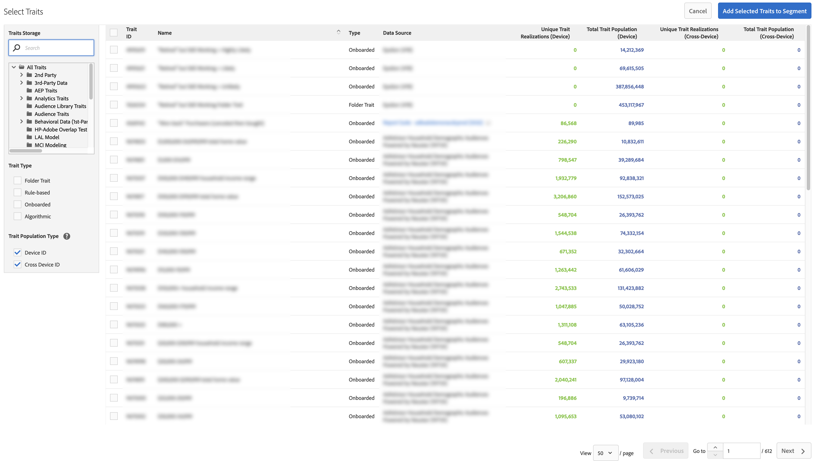

# 建立相似模型 {#create-an-algorithmic-model}

說明可讓您建立[!UICONTROL Look-Alike Model]的必要和選用步驟。

## 模型產生器區段

[!UICONTROL Model Builder] 由和節 [!UICONTROL Basic Information] 組 [!UICONTROL Configuration] 成。要建立模型，請完成這兩個節中的必需欄位。 儲存模型以啟動演算法。 [!DNL Audience Manager] 在第一次資料執行完成後傳送自動通知給您。收到電子郵件後，您可以前往[特徵產生器](../../features/traits/about-trait-builder.md)並建立演算法特徵。

>[!NOTE]
>
>* 如果您建立模型且不使用模型建立任何特徵，則模型程式只會執行一次。
>* 從包含大量資訊的資料來源建立模型。 資料不足的模型會執行，但不會傳回結果。
>* *不要使* 用其他演算法特徵或區段建立模型。
>* 自動化電子郵件通知只會傳送一次（在第一次資料執行後）。

## 建立模型

請依照下列步驟建立[!UICONTROL Look-Alike Model]:

1. 前往&#x200B;**[!UICONTROL Audience Data]** > **[!UICONTROL Models]**，然後按一下[!UICONTROL Look-Alike Modeling]區段中的&#x200B;**[!UICONTROL Add New]**。
   
1. 在[基本資訊](../../features/algorithmic-models/create-model.md#basic-information)部分中
   * 命名模型。
   * *（可選）* 提供模型的簡要說明。
   * 將模型的狀態設定為&#x200B;**[!UICONTROL Active]**&#x200B;或&#x200B;**[!UICONTROL Inactive]**。 非活動模型將不運行，也不會生成任何資料。
      
1. 在[Configuration](../../features/algorithmic-models/create-model.md#configuration)部分：
   * 按一下&#x200B;**[!UICONTROL Browse All Traits]**&#x200B;或&#x200B;**[!UICONTROL Browse All Segments]**&#x200B;以選取您要建立模型的特徵或區段。 依名稱、ID、說明或資料來源搜尋特徵。 在搜索時按一下一個資料夾，將結果限制在該資料夾及其子資料夾。 您也可以依特徵類型（[!UICONTROL Folder Trait]、[!UICONTROL Rule-based]、[!UICONTROL Onboarded]和[!UICONTROL Algorithmic]）或人口類型（[裝置ID](../../reference/ids-in-aam.md)和[跨裝置ID](../../reference/ids-in-aam.md)）篩選特徵。
      
   * 選擇30、60或90天回顧時段。 這會設定模型的時間範圍。
   * 預設會選取[!UICONTROL TraitWeight]演算法。
   * 從[!UICONTROL Available Data]清單中選擇資料源。
   * 完成後，按一下&#x200B;**[!UICONTROL Save]**。
      

請觀看以下影片，詳細瞭解跨裝置量度的運作方式。

>[!VIDEO](https://docs.adobe.com/content/help/en/audience-manager-learn/tutorials/build-and-manage-audiences/profile-merge/understanding-cross-device-metrics-in-audience-manager.html)

## 演算法模型的基本資訊{#basic-information}

<!-- r_model_basic.xml -->

在[!UICONTROL Model Builder]中，[!UICONTROL Basic Information]設定可讓您建立新模型或編輯現有模型。 要建立新模型，請提供名稱並移至[!UICONTROL Configuration]設定。 說明欄位為選用。

| 欄位 | 說明 |
|---|---|
| **[!UICONTROL Name]** | 為模型提供簡短的邏輯名稱，以說明其功能或用途。 避免縮寫、特殊字元和重音符號。 |
| **[!UICONTROL Description]** | 一個欄位，用於有關模型的其他描述性資訊。 |
| **[!UICONTROL Status]** | 激活或停用模型（預設情況下為活動）。 |

## 設定 {#configuration}

在[!UICONTROL Model Builder]中，[!UICONTROL Configuration]區段可讓您新增特徵或區段至模型。 在本節中，選取基準特徵或區段、回顧期間，以及來自您第一方與第三方資料來源的資料。

<!-- r_model_configuration.xml -->

### 必要條件

請先填寫[!UICONTROL Basic Information]章節中的必填欄位。

<table id="table_7A6BE5E5498D4776A30323B743954150"> 
 <thead> 
  <tr> 
   <th colname="col1" class="entry"> 欄位 </th> 
   <th colname="col2" class="entry"> 說明 </th> 
  </tr> 
 </thead>
 <tbody> 
  <tr> 
   <td colname="col1"> 
<b>選取基準特徵或區段(1)</b> 
 </td> 
   <td colname="col2"> 
按一下特徵或區段按鈕，即可查看您所有特徵或區段的清單。 您選取的區段或特徵會成為系統演算法用於建模的基準。 
 
 
<b>注意</b>:選取已登入的特徵、規則型特徵或區段作為基準。否則，您的模型將不運行。 
 
 </td> 
  </tr> 
  <tr> 
   <td colname="col1"> 
<b>選擇回顧期間(2)</b> 
 </td> 
   <td colname="col2"> 
設定模型的時間範圍。 根據您的選擇，演算法會包含並評估前30、60或90天的資料。 
 </td> 
  </tr> 
  <tr> 
   <td colname="col1"> 
<b>選擇演算法(3)</b> 
 </td> 
   <td colname="col2"> 
目前，模型產生器僅能與我們專屬的特徵加權演算法搭配使用。  觀眾管 理員可在後續版本中新增其他演算功能。 
 </td>
  </tr>
  <tr> 
   <td colname="col1"> 
<b>從資料源中選擇模型資料(4)</b> 
 </td> 
   <td colname="col2"> 
可讓您選取想要在模型中使用的第一方和第三方資料來源。 
 </td>
  </tr> 
  <tr> 
   <td colname="col1"> 
<b>排除(5)</b> 
 </td> 
   <td colname="col2"> 
您可以從選取的模型資料來源中排除特徵。 使用排除清單並讀取<a href="../../features/algorithmic-models/trait-exclusion-algo-models.md">演算法模型：特徵排除</a>以瞭解詳細資訊。 
 </td>
  </tr> 
 </tbody>
</table>

觀看以下影片，瞭解如何建立第一方外觀相似的模型，以便您找到更多自己的訪客，其外觀更像您的轉換器。

>[!VIDEO](https://video.tv.adobe.com/v/23504/)

>[!MORELIKETHIS]
>
>* [瞭解特徵權重](../../features/algorithmic-models/understanding-models.md#understanding-traitweight)

