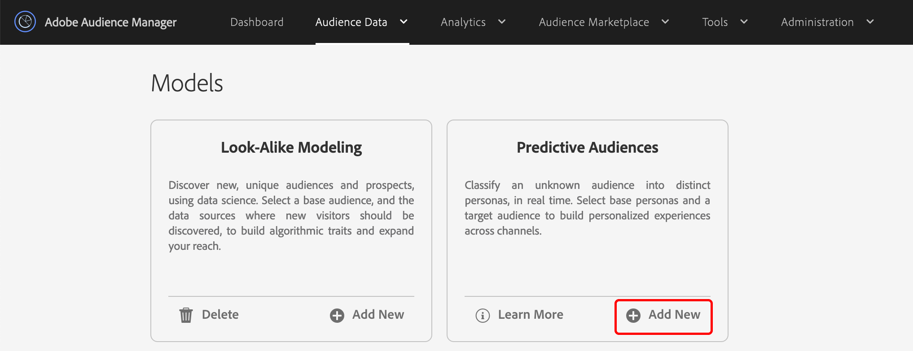

# 預測受眾快速入門 {#predictive-audiences-getting-started}

>[!IMPORTANT]
>本文包含旨在引導您完成此功能設定與使用的產品檔案。 本協定中沒有任何法律建議。 請洽詢您自己的法律顧問以取得法律指導。

## 建立預測性觀眾模型 {#create-predictive-audiences}

在建立模 [!UICONTROL Predictive Audiences] 型之前，您必須決定要指派特徵和區段給哪個第 [!UICONTROL Predictive Audiences] 一方資料來源。 您可以使用現有的第一方資料來源，或建立新的資料來源。 如需 [如何建立新第一方資料來源的詳細資訊](https://docs.adobe.com/content/help/en/audience-manager/user-guide/features/data-sources/manage-datasources.html) ，請參閱管理資料來源。

一旦您知道要使用哪個資料來源，請遵循下列步驟。

1. 前往 **[!UICONTROL Audience Data]** > **[!UICONTROL Models]**。
1. 在區段 [!UICONTROL Predictive Audiences] 中，按一下 **[!UICONTROL Add New]**。

   

1. 接著，定義您要依據對象分類的角色。 您可以選擇特徵或群體來建立角色， 使用熒 [!UICONTROL Traits] 幕左 [!UICONTROL Segments] 上角的和標籤，在特徵和區段目錄之間切換。 在您識別要用作角色的特徵或群體後，按一下欄中的 **[!UICONTROL Add]** 對應圖 [!UICONTROL Action] 示。
   
   >[!NOTE]
   >您必須為基準角色選擇至少兩個特徵或兩個群體。 您無法同時使用特徵和區段的組合。
1. 定義 **[!UICONTROL Next]** 您的角色後，按一下。
1. 接著，選取您要分類的第一方對象，方法是為此對象選擇第一方特徵或群體。 使用熒 [!UICONTROL Traits] 幕左 [!UICONTROL Segments] 上角的和標籤，在特徵和區段目錄之間切換。 選取您想要用作對象的第一方特徵或群體，以將其新增至模型。
   
1. 在選 **[!UICONTROL Next]** 擇您的觀眾後按一下。
1. 填寫模型詳細資料：
   * **[!UICONTROL Model Name]**: 為模型輸入描述性名稱，這將幫助您稍後識別它。 由模型生成的段的名稱將以模型的名稱開頭。
   * **[!UICONTROL Description]**: 輸入有助於識別其使用案例的模型說明。
   * **[!UICONTROL Data Source]**: 選擇您要將此模型中的區段指 [!UICONTROL Predictive Audiences] 派給的第一方資料來源。
   * **[!UICONTROL Profile Merge Rule]**: 為此模 [!UICONTROL Profile Merge Rule] 型建立的所有預測性 [!UICONTROL segments] 選擇要指派的。 如果您選取的目標對象是 [!UICONTROL segment]一個，我們建議選取與目標 [!UICONTROL Profile Merge Rule] 對象相同的對象。
      
1. 按一下 **[!UICONTROL Save]**.

## 編輯預測性對象 {#edit-predictive-audiences}

Audience Manager不支援編輯現有的 [!UICONTROL Predictive Audiences] 模型。 要更改模型的配置，必須建立新模型。 如果已達到10個模型的限 [!UICONTROL Predictive Audiences] 制並需要編輯其中一個模型，則必須刪除模型並建立新模型。

## 刪除預測性對象 {#delete-predictive-audiences}

要刪除模 [!UICONTROL Predictive Audiences] 型，請轉至 **[!UICONTROL Audience Data]** > **[!UICONTROL Models]**，查找要刪除的模型，然後按一下圖 **[!UICONTROL Delete]** 標。
