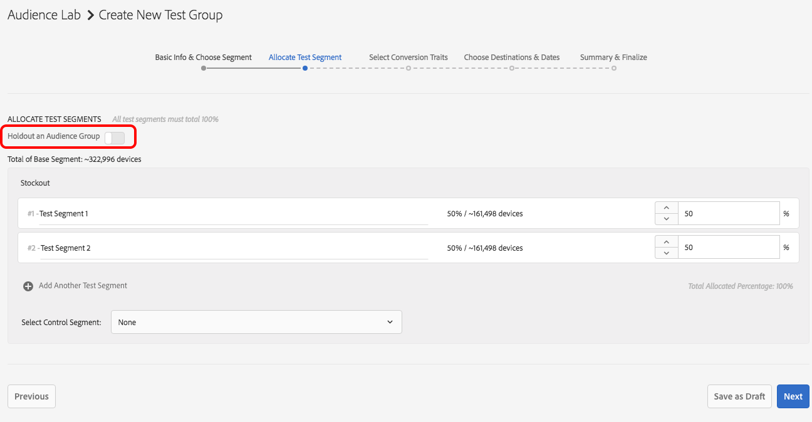

# [!DNL Audience Lab] 進階功能 {#audience-lab-advanced-functionality}

This article describes two features which provide advanced functionality for [!DNL Audience Lab]: [!DNL Duplicate Allocation Template] and [!DNL Segment Holdout].

## Duplicate Allocation Template {#duplicate-allocation-template}

<!-- 

The <b>Allocation Template</b> represents how you split a test group into test segments and the way the test segments are mapped to destinations. 

 -->

In [!DNL Audience Lab], the [!DNL Allocation Template] represents the various selections you make when creating a test group:

* 在測試區段之間分配裝置；
* 將測試區段對應至目的地；
* 用於測試群組的轉換特徵；
* 測試群組publishes與您所選取目的地的日期範圍。

透過複製配置範本，您可以在新的測試群組中重復使用不同基底區段的測試區段和目的地分發。以下說明配置範本的範例。The image is taken from the [!UICONTROL Summary & Finalize] step in the **Create Test Group** workflow.

<!--
With the option to duplicate allocation templates, you can increase your productivity when running multivariate tests as part of multivariate campaigns.
-->

### 使用重復配置範本

Create an initial test group, then select **[!UICONTROL Duplicate Allocation Template]** to reuse the same settings across multiple test groups. 例如，如果您要執行測試，決定多個區段的多個目的地效用，您可以使用此功能。

1. 在Audience Lab主檢視中，搜尋您要在新測試群組中重制其配置範本的測試群組。In the drop-down box, select **[!UICONTROL Duplicate Allocation Template]**.

   

2. [!UICONTROL Create Test Group] 在精靈中，您可以視需要指定基本區段並重新命名測試區段。
3. You *cannot* modify:

   * 在測試區段之間分配裝置；
   * 轉換特徵；
   * 將測試區段對應至目的地。您只能填入需要一個目的地的對應索引鍵。
   * 測試群組將發佈至所選目的地的日期範圍。

4. Review the information you added in the previous steps and select **[!UICONTROL Finalize Group]**.

## Test Segment Holdout {#test-segment-holdout}

>[!NOTE]
>
>[!UICONTROL Test Segment Holdout] 是進階功能，在客戶要求上啓用。Please contact [!DNL Customer Care] or [!DNL Adobe Consulting] to activate this feature.

使用此功能讓部分觀眾不參與測試。您選取的百分比會離開測試。如此，您就可以測量並比較來自目標(已啓動於目的地)和未定位(完整群組)對象的轉換次數。

<!--

Note that this option is different to the control segment because it subtracts the percentage ................. You can withhold an audience group and still use a control segment. 

-->

### 使用測試區段Holdout

1. Create a new test group by using the [!UICONTROL Create Test Group] wizard.
1. **[!UICONTROL Allocate Test Segment]** 在此步驟中，您可以選取部分對象不受測試所拘束。

   

1. 使用滑桿可調整您要在測試之外的裝置個數。請注意，Test Segment和Test Segment現在只佔總裝置的70%。

   

1. Go through the rest of the steps in the **[!UICONTROL Create Test Group]** workflow and select **[!UICONTROL Finalize Group]** when you&#39;re satisfied with your selection. 您現在有一個測試群組，其中包含部分觀眾不受測試。
