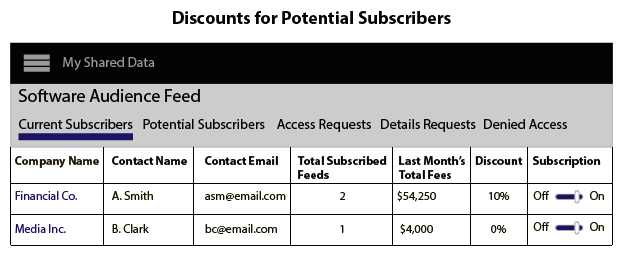

# 建立、定價和管理資料摘要 {#create-price-and-manage-data-feeds}

## 建立公共或專用資料源 {#create-public-private-data-feed}

資料饋送需要名稱、說明、資料源和規劃類型。 在您保存並激活源之前，源將被禁用。 在中設定公共或私有資料源 **[!UICONTROL Audience Marketplace > My Shared Data]**。 僅供資料銷售者使用。

<!-- t_data_feed.xml -->

您必須具有管理員權限才能建立公共或專用資料源。
要建立資料饋送，請執行以下操作：

1. 按一下 **[!UICONTROL New Data Feed]**.
1. 命名資料饋送。 資料購買者可以根據名稱搜索您的訂閱源。
1. 提供簡要說明（最多255個字元）。

   正確的描述應準確描述您的訂閱源。 例如，您可以包括市場營銷類別、人口統計和地理覆蓋範圍的文本(例如， [!DNL US] 或北美)。 描述文本可搜索，並幫助購買者查找或評估您的訂閱源。 良好的描述是吸引訂閱者訪問資料源的重要部分。
1. 從 **[!UICONTROL Data Source]** 頁籤 資料源僅限於單個資料源。 不能將多個資料源分配給同一資料源。

   >[!IMPORTANT]
   >
   >屬於此資料源的任何當前和將來特徵都將作為此源的一部分與資料購買者共用。

1. 在 [!UICONTROL Plan Types]，選擇要使用的選項，然後按一下 **[!UICONTROL Add Plan]**。

   源可包含多個計畫。 計畫可包含多個使用案例。 有關詳細資訊，請參閱 [資料源的規劃類型](../../../features/audience-marketplace/marketplace-data-providers/marketplace-create-manage-feeds.md#plan-types)。

1. 按一下 **[!UICONTROL Save]** 保存資料源 *無* 激活它。
1. 要保存並激活資料饋送，請執行以下操作：
   1. 移動 **[!UICONTROL Availability]** 滑動 **[!UICONTROL Active]**。
   1. 按一下 **[!UICONTROL Save]**.

   >[!NOTE]
   >
   >* 無法刪除已保存和激活的資料源。
   >* 買家只查看活動源。

### 可選：建立專用資料源

在 [!UICONTROL Settings] ，將滑塊移動到：

* **[!UICONTROL Private]** 和 **[!UICONTROL Branded]**:買家 [!UICONTROL Marketplace] 清單顯示提供程式列中賣方的名稱，並且所有其它資料都隱藏。

* **[!UICONTROL Private]** 和 **[!UICONTROL Unbranded]**:買家 [!UICONTROL Marketplace] 清單僅顯示資料源名稱和說明。 資料提供程式名稱顯示為 [!UICONTROL Private Seller]。

要瞭解私人訂閱源對購買者的樣式，請參閱 [專用資料源](../../../features/audience-marketplace/marketplace-private-feeds.md)。

## 停用訂閱者的資料饋送 {#deactivate-data-feed}

作為 [!UICONTROL Audience Marketplace] 資料提供程式，您可以撤消採購員對訂閱資料饋送的訪問權限。 您可能希望將買家從訂閱源中刪除，原因包括延遲付款/未支付費用或他們不正確使用特性資料。

<!-- marketplace-deactiva4te-subscribers.xml -->

要撤消訂閱伺服器：

1. 在 [!UICONTROL My Shared Data]，查找訂閱者正在使用的源。

   >[!NOTE]
   >
   >帶有逾期帳戶的資料源標籤為三角形/感嘆號表徵圖。

1. 在 [!UICONTROL Subscribers] 列中，按一下計數訂閱者的藍色數字。 這將開啟訂閱詳細資訊頁面。
1. 移動 **[!UICONTROL Subscription]** 滑動 **[!UICONTROL Off]**。 這將開啟確認對話框窗口。
1. 在 [!UICONTROL Confirmation] 彈出，按一下 **[!UICONTROL Yes]** 停用訂閱或 **[!UICONTROL Cancel]** 退出而不進行訂閱更改。

### 停用訂閱伺服器後發生的情況

撤消對資料源的訪問權限會向資料採購員帳戶中的所有管理員用戶發送通知電子郵件。 電子郵件包含一個附件，該附件列出已撤銷的特徵。 此清單可幫助訂閱者從其段和模型中查找和刪除停用的特徵。

### 開單和訂閱源停用

取消對資料源的訪問後，訂閱者將負責上個月或當月的費用，具體取決於您停用資料源的時間。

## 資料源的規劃類型 {#plan-types}

[!DNL Plan types] 是 [!UICONTROL Audience Marketplace] 資料饋送。 作為資料提供商，它們允許您為源建立多個使用案例和價格選項。 此外，為每個資料饋送建立幾個計畫可能是一個很好的策略。 這為購買者提供了不同的選擇選項，從他們尋找模型資料或發送到目標資料時就可以進行選擇。

[建立資料饋送](../../../features/audience-marketplace/marketplace-data-providers/marketplace-create-manage-feeds.md#create-public-private-data-feed) 選擇 [!UICONTROL Plan Types]。

## 計畫類型和使用案例選項 {#plan-types-use-cases}

<!-- c_feed_options.xml -->

的 [!UICONTROL Use Case] 設定允許賣家控制買家如何使用您的資料。

### 段和重疊

A **[!UICONTROL Segments and Overlap]** 用例建立計畫，讓買家在 [特質 — 特質重疊報告](../../../reporting/dynamic-reports/trait-trait-overlap-report.md#trait-to-trait-overlap-report)。 此外，購買者可以將您的資料添加到資料段中，並與 [片段到特徵](../../../reporting/dynamic-reports/segment-trait-overlap-report.md) 和 [分部至分部](../../../reporting/dynamic-reports/segment-segment-overlap-report.md) 報告。

每個資料饋送必須至少包括一個 [!UICONTROL Segments and Overlap] 用例。 如果訂閱源不包含 [!UICONTROL Segments and Overlap] 用例，單獨使用或與其他用例組合使用。

重疊比較可幫助買家：

* **擴大受眾範圍：** 重疊度低表明您的特徵包含買家以前從未見過的用戶。 因此，買家可能希望這些特徵能將新用戶添加到其受眾群體中。
* **增強現有受眾：** 高度重疊表明您的特徵包含的用戶與買家已經知道的用戶相似。 因此，買家可能希望這些特徵有助於對發達受眾進行有針對性的漸進改進。

將此使用情形定價如下：

* 單位：固定費用
* 價格：免費（0.00美元）

### 建模

A **[!UICONTROL Modeling]** 用例建立計畫，讓買家將您的特徵與 [算法建模](../../../features/algorithmic-models/understanding-models.md#understanding-models)。 買家查看模型結果以在資料中找到與自己具有相似轉換屬性的新受眾。 將此使用情形定價如下：

* 單位：固定費用
* 價格：折扣或市場利率價格

### 啟用

安 **[!UICONTROL Activation]** 用例允許買方將資料發送到 [目標](../../../features/destinations/destinations.md)。 在這種使用情形下，買家無法將資料與重疊報告或算法模型進行比較。 將此使用情形定價如下：

* 單位： [!DNL CPM]
* 價格： [!DNL CPM] 市場

## 開單和價格選項 {#billing}

計費和價格選項控制買家為您的資料支付的方式。

<table id="table_CCEAAF24295942EA82F20753827D1A23"> 
 <thead> 
  <tr> 
   <th colname="col1" class="entry"> 選項 </th> 
   <th colname="col2" class="entry"> 說明 </th>
  </tr> 
 </thead>
 <tbody> 
  <tr> 
   <td colname="col1"> <b> 開單週期</b> </td> 
   <td colname="col2"> <b> 每月拖欠</b> 是唯一的選擇。 記帳週期於每月第10天結束。 </td> 
  </tr> 
  <tr> 
   <td colname="col1"> <b> 單位</b> </td> 
   <td colname="col2">按CPM費率或統一費率向資料購買者收費。 
    <ul id="ul_D5F125E0F7364C568D9F3107E090059D"> 
     <li id="li_A79F47FFC1DC4B9DADC014621A9C12A1"> 通過CPM定價，資料購買者需要自我報告使用情況。 </li> 
     <li id="li_DFED3194854A492F9DD0E7BA1A655E96">使用固定費用定價，資料購買者不會報告使用情況，因為他們收取固定費率。 </li> 
    </ul> </td>
  </tr> 
  <tr> 
   <td colname="col1"> <b> 價格</b> </td>
   <td colname="col2"> 賣方按CPM費率或固定費用價格向買方收取的金額，以美元計。 </td>
  </tr> 
 </tbody> 
</table>

## 計畫注釋 {#plan-notes}

在 **[!UICONTROL Additional Notes]** 欄位中，需要一些時間來描述源中的每個資料計畫。 一個簡短的好說明可幫助購買者瞭解資料源中每個計畫的內容或用途。 採購員在搜索或評估新資料源時可以讀取資料饋送和計畫說明。

## 管理專用資料饋送請求 {#manage-private-requests}

用於管理來自採購員的私有源請求的提供程式工作流。

要複查、批准或拒絕採購員請求，請轉到 [!UICONTROL My Shared Data] 及：

<!-- t_private_feed_workflows.xml -->

1. 按一下專用資料源的名稱。
2. 按一下 **[!UICONTROL Access Requests]** 查看所有希望訪問您的資料源的買家。
3. 在 [!UICONTROL Allow Access] 在每個請求框的「 」部分，按一下複選標籤以批准請求，或按一下X以拒絕訪問。
4. 確認或取消確認彈出窗口中的選定操作。

## 資料提供程式折扣 {#discounts}

在 [!UICONTROL Audience Marketplace]，折扣允許您降低單個訂閱者的資料源的發佈價格。 您可以向已提交訂閱請求的訂閱者或已請求資料饋送詳細資訊的訂閱者提供折扣。 應用於的折扣 [!DNL CPM] 和平息。 在您希望為新客戶提供訂閱獎勵或獎勵客戶忠誠度時，折扣會很有幫助。

## 將折扣應用於資料源 {#apply-discounts}

<!-- marketplace-seller-discounts.xml -->

要折扣訂單，請將折扣金額作為%添加到折扣欄位並確認更改。 資料提供程式可以在 [!UICONTROL Audience Marketplace] 從以下任一：

* **[!UICONTROL My Shared Data > Potential Subscribers]**
* **[!UICONTROL My Shared Data > Details Requests]**

在這些例子中，賣方給 [!UICONTROL Software Audience] 資料饋送。

## 查看折扣源 {#review-discounted-feeds}

資料提供商可以查看其所有訂閱者和折扣訂閱源 **[!UICONTROL Audience Marketplace > My Shared Data > Current Subscribers]**。

>[!MORELIKETHIS]
>
>* [私人資料摘要](../../../features/audience-marketplace/marketplace-private-feeds.md)

