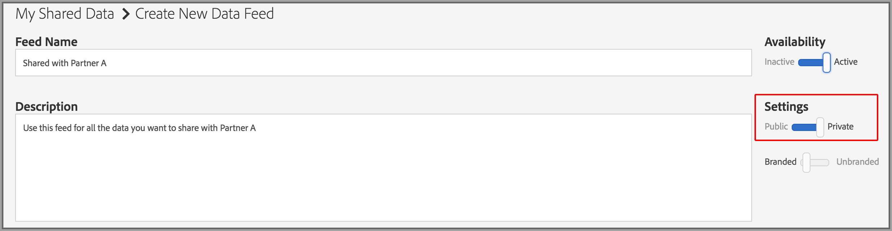

# 私人資料摘要 {#private-data-feeds}

私人資料饋送是一種選項，可讓提供者限制買家存取其資料。 資料提供者和購買者在建立和訂閱私人資料饋送之前，應先檢閱此資訊。

<!-- c_marketplace_privatefeed.xml -->

## 提供者的私人資料饋送 {#private-data-feeds-providers}

身為提供者，您的資料饋送可以是公開或私人。 私人資料饋送可讓您限制買家存取您的資料，包括資料賣家的姓名。 您可能想要建立私人資料饋送，以提供特殊優惠、折扣，或在隱私權和存取控制很重要時。 透過私人資料饋送，您可以檢閱及核准買家要求。 在您核准請求後，動態消息看起來就像是買家的公開資料動態消息。 您可以在中檢視和管理所有動態消息 **[!UICONTROL Audience Marketplace > My Shared Data]**。 如下所示，此類型的動態消息在狀態欄中標示為「私用」。

### 管理動態消息請求

按一下來自的私人資料饋送名 [!UICONTROL My Shared Data] 稱會帶您前往包含數個標籤的頁面。 按一下標籤以管理您的私人資料饋送請求。

下表定義了每個操作頁籤提供的角色或函式。

<table id="table_AFB429CA52A34658859448D9A5215F9F"> 
 <thead> 
  <tr> 
   <th colname="col1" class="entry"> 定位 </th> 
   <th colname="col2" class="entry"> 說明 </th> 
  </tr> 
 </thead>
 <tbody> 
  <tr> 
   <td colname="col1"> 
 <b> 目前訂閱者</b> 
 </td> 
   <td colname="col2"> 
列出已訂閱私人資料饋送的已核准購買者。 
 </td> 
  </tr> 
  <tr> 
   <td colname="col1"> 
 <b> 潛在訂閱者</b> 
 </td> 
   <td colname="col2"> 
列出未訂閱私人資料饋送的已核准購買者。 
 
核准可讓購買者檢視資料饋送，就像它是公開的。 這可讓他們在訂閱之前，先檢閱並評估您的動態消息。 您也可以為列為潛在訂閱者的買家提供資料饋送的折扣。 購買者訂閱後，其個人檔案會移至「目前的訂 <b> 閱者」</b>。 
 </td>
  </tr> 
  <tr> 
   <td colname="col1"> 
 <b> 存取要求</b> 
 </td>
   <td colname="col2"> 
列出私人資料饋送的新訂閱請求。 按一下此標籤可複查、批准或拒絕採購員請求。 

    <ul id="ul_BE0A835A90B14C05B3F63226B79D052D"> 
     <li id="li_2C5686CEB6F4430BA18AED5AD75C330A">已核准的購買者會移至 <b> 潛在訂閱者</b>。 </li>
     <li id="li_929591FCF81E43A3881813BDBD3AC278">已拒絕的買家將移至「拒 <b> 絕存取權</b>」。 </li>
    </ul> </td>
  </tr>
  <tr> 
   <td colname="col1"> 
 <b> 詳細資訊要求</b> 
 </td>
   <td colname="col2"> 
列出尚未訂閱資料饋送且要求取得更多動態消息資訊的已核准購買者。 
 
核准可讓購買者檢視資料饋送，就像它是公開的。 這可讓他們在訂閱之前，先檢閱並評估您的動態消息。 您也可以為要求存取權的買家提供資料饋送的折扣。 響應詳細資訊請求會從此標籤中刪除採購員配置檔案。 如果他們尚未訂閱，購買者個人檔案仍在「潛在訂閱者」 <b> 中</b>。 
 </td>
  </tr>
  <tr> 
   <td colname="col1"> 
 <b> 拒絕存取</b> 
 </td> 
   <td colname="col2"> 
列出私人資料饋送的已拒絕訂閱請求。 
 
要重新批准拒絕的買家，請將「拒絕狀  態」更改<b> 為「允許」</b>。 這會將買方移至「潛 <b> 在訂閱者」</b>。 
 </td> 
  </tr> 
 </tbody> 
</table>

### 後續步驟

下列檔案可協助您開始使用私人資料饋送。

* [建立公開或私人資料饋送](../../features/audience-marketplace/marketplace-data-providers/marketplace-create-manage-feeds.md#create-public-private-data-feed)
* [檢閱、核准或拒絕私人動態消息請求](../../features/audience-marketplace/marketplace-data-providers/marketplace-create-manage-feeds.md#manage-private-requests)
* [購買者的私人資料饋送](../../features/audience-marketplace/marketplace-private-feeds.md#private-data-feeds-for-buyers)

## 購買者的私人資料饋送 {#private-data-feeds-for-buyers}

身為購買者，私人資料饋送會像其他選 [件一樣](../../features/audience-marketplace/marketplace-data-buyers/marketplace-data-buyers.md#about-marketplace) ，出現在Marketplace中。 不過，在此情況下，動態消息清單不會顯示特徵、獨特使用者和使用者重疊的摘要資訊。 此外，資料銷售者也可以選擇在清單的欄中顯示或隱 [!UICONTROL Provider] 藏其名 [!UICONTROL Marketplace] 稱。 賣家核准您的訂閱要求後，私人動態消息中的所有資料都可供您使用（其運作方式與公開動態消息類似）。 以下 [!UICONTROL Marketplace] 範例會列出您作為採購員可使用的3種不同饋送類型。

動態消息類型包括：

表格說明這些不同的動態消息類型如何顯示或隱藏資料。

<table id="table_41D4A798ACF548A3A03ACB427CA4652D"> 
 <thead> 
  <tr> 
   <th colname="col1" class="entry"> 摘要類型 </th> 
   <th colname="col2" class="entry"> 說明 </th> 
  </tr> 
 </thead>
 <tbody> 
  <tr> 
   <td colname="col1"> 
<b> 公共</b> 
 </td> 
   <td colname="col2"> 
提供者的名稱、特徵和唯一資料會出現在清單中。 
 </td> 
  </tr> 
  <tr> 
   <td colname="col1"> 
<b> 無品牌的私有</b> 
 </td> 
   <td colname="col2"> 
提供者的名稱已設為「私人賣家」，而您看不到特徵計數、唯一資料和特徵重疊資料。 
 </td> 
  </tr> 
  <tr> 
   <td colname="col1"> 
<b> 具有品牌的私有</b> 
 </td> 
   <td colname="col2"> 
提供者的名稱會出現在清單中，但您看不到特徵計數、唯一資料和特徵重疊資料。 
 </td> 
  </tr> 
 </tbody> 
</table>

### 後續步驟

請參閱 訂 [閱私人資料饋送](../../features/audience-marketplace/marketplace-data-buyers/marketplace-manage-subscriptions.md#subscript-private-data-feed) ，以要求存取。

## 如何建立資料提供者與資料購買者的共用關係 {#set-up-sharing-relationship}

### 步驟1 —— 啟用——資料提供者與資料購買者

此程式的第一步需要Adobe諮詢或客戶服務的介入。 資料提供者和資料購買者應聯絡Adobe諮詢或客戶服務以要求啟用。

### 步驟2 —— 資料提供者——建立新資料來源

在您的Audience manager帳戶中，建立新的Cookie資料來源，其中包含：

* **Audience Manager ID** （傳入金鑰）;
* 已勾 **選「啟用** 共用」選項。

按一下「儲 **存**」後，「特徵儲存&gt;第三方資料」中會自 **動建立新的子資料夾**。

### 步驟3 —— 資料提供者——識別共用特徵

在此步驟中，您會識別您要與合作夥伴分享的特徵。 您可以建立新特徵或編輯現有特徵。 無論如何，您都需要這些特徵：

* 與您在步驟2中建立的資料來源建立關聯。
* 儲存在新建立的子資料夾中，位於第三方資料下方。

閱讀更多有關建 [立特徵](/help/using/features/traits/create-onboarded-rule-based-traits.md) 和編 [輯特徵的資訊](/help/using/features/traits/manage-trait-rules.md#edit-trait)。

### 步驟4 —— 資料提供者——建立資料饋送

接著，建立資料饋送，與資料購買者分享您的特徵。 如需如 [何建立資料饋送的指示](/help/using/features/audience-marketplace/marketplace-data-providers/marketplace-create-manage-feeds.md) ，請參閱建立公用或私用資料饋送。

>[!IMPORTANT]
>
>在「設定」中，選取「私人」選項。 如果您將此欄位設為「公開」，則任何Audience Marketplace客戶都可以訂閱您的動態消息。

### 步驟5 —— 資料採購員——請求訪問

前往「 **Audience Marketplace &gt; Marketplace**」。 搜尋資料提供者在上一步驟中建立的資料饋送。 按一 **下「請求存取**」。 資料提供方指定的聯絡人現在會收到電子郵件通知。 另請參閱 [訂閱私人資料饋送](/help/using/features/audience-marketplace/marketplace-data-buyers/marketplace-manage-subscriptions.md#subscript-private-data-feed)。

### 步驟6 —— 資料提供者——授予訪問權限

前往「 **Audience Marketplace &gt;我的共用資料** 」，並搜尋您在步驟4中建立的動態消息。 按一下新的存取要求，然後按一 **下「允許存取** 」以核准請求。 另請參閱「 [檢閱、核准或拒絕私人動態消息請求」](/help/using/features/audience-marketplace/marketplace-data-providers/marketplace-create-manage-feeds.md#manage-private-requests)。

### 步驟7 —— 資料購買者——開啟訂閱

資料提供者授與資料饋送的存取權後，您就可以在「對象市集&gt;市集」的帳 **戶中查看饋送**。 檢閱詳細資訊，開啟「訂閱」按鈕，然後按一下「檢閱 **與訂閱」**。 如需 [在何處尋找第三方特徵的詳細資訊](/help/using/features/audience-marketplace/marketplace-data-buyers/marketplace-manage-subscriptions.md#find-subscribed-data-fee) ，請參閱訂閱資料饋送的儲存。

請注意，這些特徵只能在資料提供者的帳戶中編輯。

