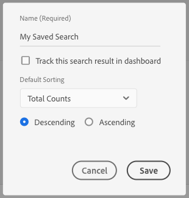

# 儲存搜尋條件 {#save-search-criteria}

將最多10組搜尋標準儲存起來，以便在需要時使用，並在上追蹤，以最佳化訊號搜尋工作 [!UICONTROL Signals Dashboard]。 每次載入時，Audience manager都會重新載入儲存的搜尋 [!UICONTROL Signals Dashboard]。

1. Go to  and run a  with the key-value pairs and/or the filters that you want to save for future searches.**[!UICONTROL Audience Data > Signals > Search]****[!UICONTROL Signals Search]**
1. Click  once you get the search results.**[!UICONTROL Save this Search]**

   
1. 輸入搜尋的建議性名稱，以便您稍後識別。
1. （可選）如果希 **[!UICONTROL Track this search result in the dashboard]** 望信號儀表板在當前搜索集中包含信號，請啟用該選項。
1. Select the **[!UICONTROL Default Sorting]** criteria:
   * **[!UICONTROL Total Counts]**
   * **[!UICONTROL Key Name]**
1. 選擇模 **[!UICONTROL Default Sorting]** 式：
   * **[!UICONTROL Descending]**
   * **[!UICONTROL Ascending]**
1. Click **[!UICONTROL Save]**. 您可在區段中看到儲存的搜 [!UICONTROL Saved Search] 尋，並在需要時使用它。

觀看以下視訊，瞭解如何儲存訊號搜尋。

>[!VIDEO](https://video.tv.adobe.com/v/25147/?captions=chi_hant)
