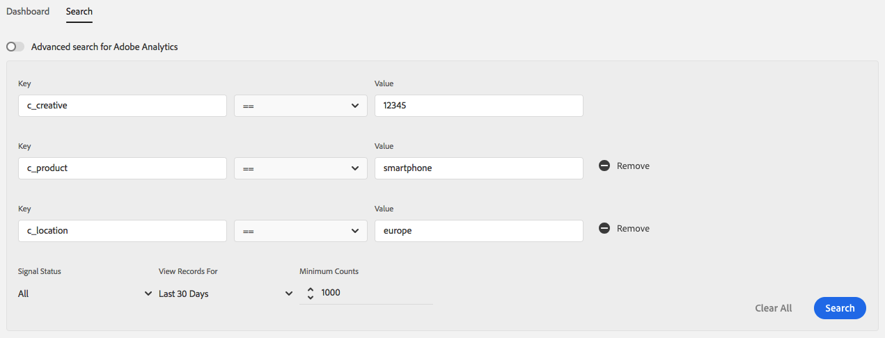
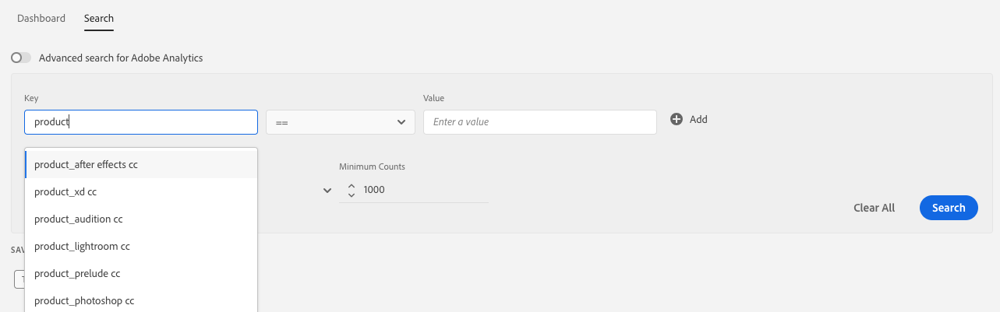

# 按鍵值對搜索信號 {#search-signals-by-key-value-pairs}

根據一或多個信號各自的鍵值對來搜索這些信號。
要搜索多個信號，請按一下「添加」  。 輸入要搜尋的索引鍵值配對，然後使用下列篩選器縮小結果範圍。

* **信號狀態**:搜索特徵中包含的信號、未使用的信號或兩者。
* **查看以下記錄**:選擇搜索接收信號的時間間隔。
* **最小計數**:僅顯示在選定間隔內具有指定最小總計數的信號。

>[!IMPORTANT]
>
>為簡化使用體驗，索引鍵值配對搜尋結果是以資料取樣為基礎。 如需 [資料取樣和錯誤率的詳細資訊，請](/help/using/reporting/report-sampling.md) 參閱資料取樣和錯誤率 [!DNL Audience Manager] ，以瞭解在比較索引鍵值搜尋與一般搜尋時，如何使用資料取樣，以及為何會出現細微的結果變化。

當使用多個鍵值對搜索信號時， [!DNL Audience Manager] 使用邏輯 **AND運算子連結該對** 。 例如，假設您使用下列鍵值配對執行搜尋：

* [!DNL c_creative == "12345"]
* [!DNL c_product == "smartphone"]
* [!DNL c_location == "europe"]

此搜尋只會傳回符合相同呼叫所有三個篩選條件的結果： `c_creative == "12345"``AND``c_product == "smartphone"``AND``c_location == "europe"`..

## 信號搜索中排除的信號 {#excluded-signals}

Audience manager使用並加上前置詞和前置詞的 `d_` 關鍵 `h_` 變數不會呈現 [!UICONTROL Signals Search]。 如需詳 [細資訊，請參閱關鍵變數的首碼](../../traits/trait-variable-prefixes.md) 。

## 區分大小寫與搜尋自動完成 {#case-insensitivity}

索引鍵和值搜尋欄位不區分大小寫。 關鍵搜尋欄位包含自動完成的建議。

假設接收 [!DNL Audience Manager] 到下列信號：

* `productCategory == smartphone`
* `newProduct == iPhone`
* `PRODUCT == phone`
* `product == PHONE`

在鍵搜 `product` 尋欄位中輸入時，您會收到自動完成的 `productCategory`、 `newProduct`、 `PRODUCT`和建議 `product`。

同樣地，在搜索時， `product == phone`會 [!UICONTROL Data Explorer] 同時返回和 `PRODUCT == phone` 結果 `product == PHONE`。
回填的特徵實現不區分大小寫。 包含具有鍵值對的信號的特徵 `PRODUCT == SMARTPHONE` 也使信號與鍵值對保持一致 `product == smartphone`。