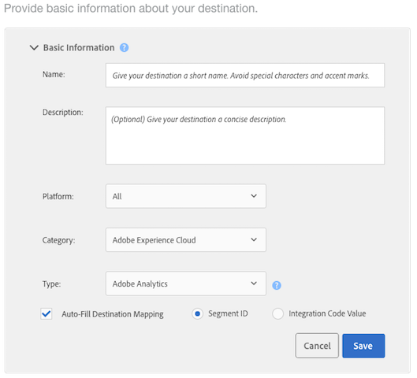

# 設定Analytics目標

## 要求 {#requirements}

若要設定Analytics目標，您的Audience Manager使用者必須擁有管理員權限。 請參 [閱《管理指南](/help/using/features/administration/administration-overview.md#create-users) 》中的「建立使用者」。 請注意，擁有萬用 `CREATE_DESTINATIONS` 字 [元權限](/help/using/features/administration/administration-overview.md#wild-card-permissions) ，並不足以建立Analytics目標。
如需進一步需求，請參閱 [Audience Analytics中的必要條件](https://docs.adobe.com/content/help/en/analytics/integration/audience-analytics/mc-audiences-aam.html)。

## 您的預設Analytics目的地和新的Analytics目的地

| Analytics目標類型 | 說明 |
|---|---|
| 預設值 | 此預設目標的名稱為「Adobe Analytics」，您可加以編輯。 對應的報表套裝ID會顯示在Audience Manager特徵和區段的資料夾儲存中。    如果您的帳戶有：    <ul><li>符合Audience Analytics檔案中 [描述的要求](https://docs.adobe.com/content/help/en/analytics/integration/audience-analytics/mc-audiences-aam.html) 。</li><li>Analytics中 [的報表](https://docs.adobe.com/content/help/en/analytics/admin/manage-report-suites/report-suites-admin.html) 套裝。</li><li>[將報表套裝對應至組織](https://docs.adobe.com/content/help/en/core-services/interface/about-core-services/report-suite-mapping.html)。</li></ul> |
| 新增 | 若要建立新的Analytics目的地，請前往「對象資料>目的地>建立新目的地」，並依照下述各節的步驟進行。 |

## 步驟1: 提供基本資訊

本節包含可啟動Analytics目標建立程式的欄位和選項。 要完成本節：

1. 按一 **下「基本資訊** 」以公開控制項。
2. 命名目標。 避免縮寫和特殊字元。
3. *（可選）* ，描述目標。 簡明的描述是定義或提供目標更多資訊的有效方式。
4. *（可選）* ，在「平 **台」清單中** ，將預設值保留為「全 **部」**。 目前，這些選項並無用處。 這些功能可支援日後可能新增的功能。
5. 在「類 **別** 」清單中，選 **取「Adobe Experience Cloud」**。
6. 在「類 **型** 」清單中，選 **取Adobe Analytics**。
7. 按一 **下「儲存** 」以前往「設定」設定，或按一下「資料匯出標籤 **** 」以套用匯出控制項至目標。

>[!NOTE]
>
>對於Analytics目標，預設會 **選取「自動填滿目標對應** 」核取 **方塊和「區段ID** 」選項。 您無法變更這些設定。

## 步驟2: 設定資料匯出控制

本節包含將「資料匯出控 [制」套用至](/help/using/features/data-export-controls.md) Analytics目標的選項。 如果您不使用資料匯出控制，請略過此步驟。 要完成本節：

1. 按一 **下「資料匯出控制** 」以公開控制項。
1. 選擇與應用於目標的資料導出控制相對應的標籤(請參 [閱將資料導出標籤添加到目標](/help/using/features/destinations/add-data-export-labels.md) )。 對於Analytics目標，預設會選取PII核取方塊。
1. 按一下&#x200B;**「儲存」**。

## 步驟3: 對應報表套裝

「設定」區段會列出已啟用伺服器端轉送的Analytics報表套裝。 如果您有多個Analytics目標，則指派給這些目標的報表套裝將互斥，並由Audience Manager強制執行。 要完成本節：

1. 按一 **下設定** ，以公開控制項。
1. 選取一（或多個）要傳送區段至的報表套裝。
1. 按一下&#x200B;**「儲存」**。

## 步驟4: 區段對應

本節提供選項，可讓您自動或手動對應區段。

| 對應選項 | 說明 |
|---|---|
| 自動映射所有目前和未來的區段 | 依預設，此功能會將訪客符合的所有區段，依點擊次數傳送至Analytics。    如果訪客在單次點擊上屬於超過150個Audience Manager區段，則只會傳送150個最近符合資格的區段至Analytics，而其餘的清單會遭截斷。 Analytics會傳送其他標幟，表示區段清單已截斷。 此動作在「對象名稱」維度中顯示為「已達對象限制」，在「對象ID」維度中顯示為「1」。 請參閱常 [見問答](https://docs.adobe.com/content/help/en/analytics/integration/audience-analytics/audience-analytics-workflow/mc-audiences-faqs.html) ，以取得詳細資訊。    此外，此選項也會影響「區段產生器」中的 [目標可用性](/help/using/features/segments/segment-builder.md)。 例如，如果區段自動對應至Analytics目標，則無法在「區段產生器」的「目標對應」區段 [中選取](/help/using/features/segments/segment-builder.md#segment-builder-controls-destinations) 該目標。 Analytics目標會顯示為灰色，並在「目標」瀏覽器的「類型」欄中顯示「Analytics」。 |
| 手動映射區段 | 此選項會公開搜尋和瀏覽控制項，讓您選擇要傳送至Analytics的區段。    若要搜尋區段：    <ol><li>在搜尋欄位中輸入區段名稱或ID。</li><li>Click <b>Add.</b></li><li>繼續搜尋並新增區段，或按一下「 <b>完成</b>」。</li></ol>   若要瀏覽區段： <ol><li>按一 <b>下「瀏覽所有區段</b>」。 這會顯示可用區段的清單。</li><li>從清單中，選取您要使用之區段的核取方塊，然後按一下「新 <b>增選取的區段」</b>。</li><li>在「添 <b>加映射</b> 」窗口中按一下「保存」。 在測試版發行期間，您無法變更對應、開始或結束日期。</li><li>繼續瀏覽並新增區段，或按一下「 <b>完成</b>」。</li></ol>  |

## 後續步驟

建立並儲存目標後，您就可以在Analytics中處理該資料。 不過，選取的報表套裝中會先花上數小時的資料。 See [Use the Audience Data in Analytics](https://docs.adobe.com/content/help/en/analytics/integration/audience-analytics/audience-analytics-workflow/use-audience-data-analytics.html).
