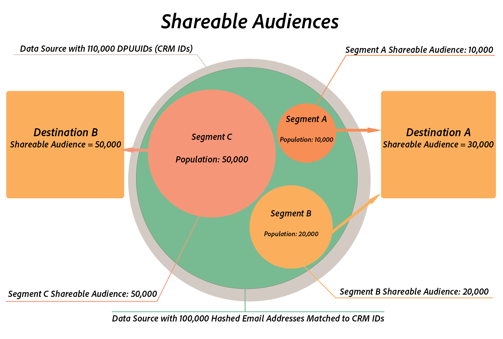

# 可共用的受眾 {#shareable-audiences}

>[!IMPORTANT]
>本文包含旨在引導您完成此功能設定與使用的產品檔案。 本協定中沒有任何法律建議。 請洽詢您自己的法律顧問以取得法律指導。

[!DNL People-Based Destinations] 把概念帶到 [!DNL Shareable Audiences] Audience Manager。此量度可協助您瞭解Audience Manager可與目標平台共用的雜湊電子郵件地址數量。

[!DNL Shareable Audiences] 是一種度量，可協助您在內容中解譯觀眾資料 [!DNL People-Based Destinations]。您可以在[!UICONTROL Destinations]頁面和[!UICONTROL Segment]頁面中看到此度量。

## 區段可共用對象{#segment-shareable-audiences}

區段頁面中的[!DNL Segment Shareable Audience]量度會指出來自資料來源的雜湊電子郵件地址數目（與[DPUUID](../../reference/ids-in-aam.md)相符），在指定回顧時段內，此量度也符合定義區段的資格，因為套用了描述檔合併規則，且該Audience Manager可與目標平台共用。

此量度有1天回顧期。 這可協助您瞭解特定目的地區隔的受眾觸及面。

## 目標可共用對象{#destination-shareable-audience}

基於人員的目標頁面中的[!DNL Destination Shareable Audience]量度會指出來自資料來源的雜湊電子郵件地址總數，並符合[DPUUIDs](../../reference/ids-in-aam.md)，該Audience Manager可與目標平台共用，來自映射至該目標的所有區段。

此量度具有期限回顧期間。 這可協助您瞭解從雜湊電子郵件地址資料來源可觸及的受眾規模。

## 範例

Audience Manager客戶的資料源為110,000 [DPUUIDs](../../reference/ids-in-aam.md)(CRM ID)。 他們會將100,000個雜湊電子郵件地址收錄到Audience Manager中，以便與多個以人為本的目的地搭配使用，並針對CRM ID對100,000個雜湊電子郵件地址執行ID同步。 客戶可使用[!DNL All Cross-Device Profiles]合併規則來建立三個對象區段：

* 區段A，人口數為10,000，對應至目標A;
* 區段B，人口計數為20,000，對應至目標A;
* 區段C，人口計數為50,000，對應至目標B。

在此案例中：

* 區隔A可分享的對象= 10,000;
* B區段可分享的對象= 20,000;
* 區段C可分享對象= 50,000;
* 目標A可分享對象=可分享對象分段A+可分享對象分段B=30,000;
* 目標B可分享對象=區段C可分享對象= 50,000。

>[!NOTE]
>
>在上述範例中，這並不表示三個區段的所有80,000個雜湊電子郵件地址都符合目標平台中的現有帳戶。 它僅表示Audience Manager將三個區段的雜湊識別碼傳送至其各自的目的地。 將受眾細分傳送至以人為本的目的地時，合作夥伴會進行受眾比對。 目標A最多可有30,000個相符的使用者帳戶，而目標B最多可能有50,000個相符的使用者帳戶，但無法保證符合率。 Adobe無法存取特定於合作夥伴的量度。 如需符合率中「基於人的目的地可見度」的常見問題，請參閱[符合率](../../faq/faq-people-based-destinations.md#match-rates)。
