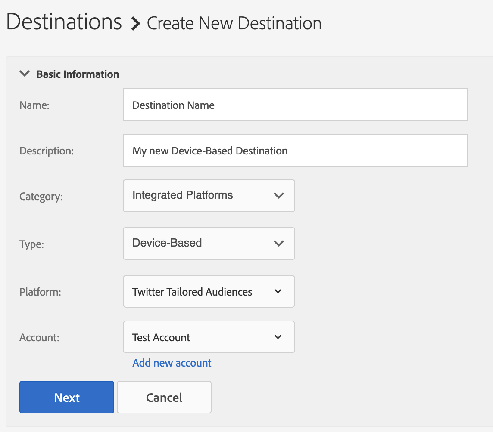

# 設定 [!DNL Twitter Tailored Audiences] 為自助服務裝置型目的地 {#configure-twitter}

本文說明如何針對新和現有整合設定 [Twitter Tailed Audiences](https://business.twitter.com/en/targeting/tailored-audiences.html) 。

## 必備條件 {#prerequisites}

在您設定 [!DNL Twitter Tailored Audiences] 目的地之前，請務必檢閱您需要符合的Twitter必要條件。

1. 您 [!DNL Twitter Ads] 的帳戶必須符合廣告資格。新 [!DNL Twitter Ads] 帳戶在建立廣告後的前周不符合廣告資格。
2. 您在Audience Manager中授權存取的Twitter使用者帳戶必須啓用 [「合作夥伴對象管理員](https://business.twitter.com/en/help/troubleshooting/multi-user-login-faq.html#accesslevels) 」權限。
3. 如果您要 [將現有Twitter整合更新為自助服務管理](#update-existing-twitter-integrations)，則您的Twitter使用者帳戶必須啓用 [廣告管理器](https://business.twitter.com/en/help/troubleshooting/multi-user-login-faq.html#accesslevels) 權限。

## 新增 [!DNL Twitter Tailored Audiences] 目標 {#add-new-twitter-destination}

本節說明設定新裝置目的地時，您需要遵循的步驟 [!DNL Twitter Tailored Audiences]。此案例假設您沒有透過Adobe顧問或客戶服務設定的現有 [!DNL Twitter Tailored Audiences] 目的地。

### 步驟 1. 驗證使用 [!DNL Twitter Tailored Audiences]{#step1-authenticate-with-twitter}

您必須先連結Audience Manager和 [!DNL Twitter Tailored Audiences] 帳戶，才能新增裝置目的地。以下是如何做到這一點：

1. 登入您的Audience Manager帳戶 **[!DNL Administration > Integrated Accounts]**&#x200B;並前往。如果您先前已設定與目的地平台整合，則應在此頁面中查看它。否則，頁面是空的。
2. Click **[!DNL Add Account]**.
3. 選取 [!DNL Twitter Tailored Audiences] 並按一 **[!DNL Confirm]** 下以重新導向至驗證頁面。
4. 在驗證後，將會重新導向至Audience Manager，您應該會看到相關聯的廣告商帳戶。選取您要使用並按一下 **[!DNL Confirm]**&#x200B;的廣告商帳戶。

### 步驟 2.建立新裝置型目的地 {#step2-create-new-destination}

在您連結Audience Manager和您的之後 [!DNL Twitter Tailored Audiences]，您可以建立新目的地。以下是如何做到這一點：

>[!NOTE]
>
>您無法變更現有裝置目的地的名稱。請務必提供名稱以協助您正確識別目標。

1. 登入您的Audience **[!DNL Audience Data > Destinations]** Manager帳戶，前往並按一下 **[!DNL Create Destination]**。
2. **[!DNL Basic Information]** 在區段中，輸入新 **[!DNL Name]** 目的地並 **[!DNL Description]** 使用下列設定： 
3. Click **[!DNL Next]**.
4. 選擇您要為此目的地設定的 [「資料匯出標籤](/help/using/features/data-export-controls.md#controls-labels) 」。
5. Click **[!DNL Save]**.
6. 在 **[!DNL Segment Mappings]** 區段中，選取您要傳送至此目的地的對象區段。
7. 儲存目的地。

## 將現有Twitter整合更新為自助服務管理 {#update-existing-twitter-integrations}

為了改善使用者體驗並簡化設定程序，我們將 [!DNL Twitter Tailored Audiences] 整合升級至自助服務模型，您可從Audience Manager UI本身執行設定。本節說明更新現有Twitter整合所需的步驟。

>[!IMPORTANT]
>
>只有當您現有的整合由Audience [!DNL Twitter Tailored Audiences]Manager顧問或客戶服務設定時，以下步驟才適用。您將目的地完整升級至自助服務模型最多需要個工作天。同時，您的目的地仍在作用中，Audience Manager會繼續傳送觀眾給它。
> 請先參閱 [「必要條件](#prerequisites) 」中的項目編號，然後再將您 [!DNL Twitter Tailored Audiences] 的自助服務模型移轉至。

請遵循下列步驟，將現有 [!DNL Twitter Tailored Audiences] 目的地移轉至自助服務模型。

1. 登入您的Audience Manager帳戶 **[!DNL Administration > Integrated Accounts]**&#x200B;並前往。
2. Click **[!DNL Add Account]**.
3. 選取 [!DNL Twitter Tailored Audiences] 並按一 **[!DNL Confirm]** 下以重新導向至驗證頁面。
4. 在您已驗證您的Twitter帳戶後，將會重新導向至Audience Manager，您應該會看到相關聯的廣告商帳戶。選取您要使用並按一下 **[!DNL Confirm]**&#x200B;的廣告商帳戶。

## 區段對應考量事項 {#segment-mapping-considerations}

將讀者區段對應至Twitter時，請務必符合下列區段命名需求：

* 提供人類可讀區段對應名稱。建議您使用與Audience Manager區段相同的名稱。
* 請勿在區段和區段對應名稱中使用逗號。

**範例**

* 正確的區段或對應名稱：「美國和歐洲購物者」；
* 區段或對應名稱不正確：「US，European h h3Rs」。

>[!IMPORTANT]
>
>您無法變更已映射區段的名稱。Audience Manager會使用區段名稱，以正確識別整合中的區段。