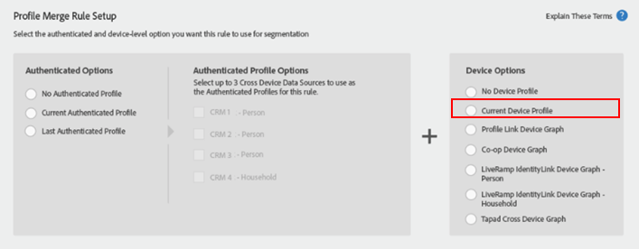

# 配置式合併規則與設備圖形的重要注意事項 {#important-considerations-for-profile-merge-rules-with-device-graphs}

請避免 [!UICONTROL Profile Merge Rules] 對幾乎不 [!UICONTROL Device Graph] 會或沒有即時區段人口的區段使用。

>[!IMPORTANT]
>
>如果設 [!UICONTROL Profile Merge Rule] 定不正確，匯出至批次目的地的區段人口可能會明顯低於預期。

使用「 [描述檔合併規則」與「裝置圖形」的區段，只有在建立區段後，才會針對](../../features/profile-merge-rules/merge-rule-targeting-options.md#device-graph-options) Audience Manager邊緣伺服器上即時顯示的裝置進行評估。

請記住， [!UICONTROL Profile Merge Rule] 具有 [!UICONTROL Device Graph] 的設備選項選擇了下列設備選項之一，如下所示。

即時符合區段資格的裝置，會以區段的 [即時人口族群來測量](../../features/segments/segment-builder-data.md#segment-populations)。

即時區段人數較少，即使符合區段資格的裝置很少能即時檢視。 為獲得最佳效能，只有很少到沒有即時人口的區段，應使用 [!UICONTROL Profile Merge Rule] 一組集 *[!UICONTROL Current Device]*&#x200B;來評估，如下圖。

設定要 [!UICONTROL Profile Merge Rule] 評估的設 *[!UICONTROL Current Device]* 定可確保所有裝置（不只是即時顯示的裝置）都能評估區段。 符合區段資格的所有裝置皆由區段總人口定義，如下所示。

