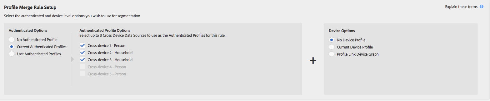
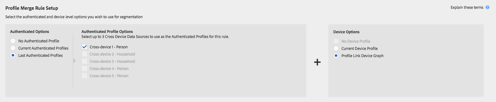

# 描述檔合併規則與裝置取消區段程式 {#profile-merge-rules-and-device-un-segmentation-processes}

取消區段會說明將裝置設定檔從區段中取消篩選和移除的程式。 您從區段移除裝置描述檔的能力取決於用來建立裝置的裝置選項 [!UICONTROL Profile Merge Rule]。

## 可用裝置選項 {#device-options}

當您建立或編 [!UICONTROL Device Options] 輯時，區 [!UICONTROL Profile Merge Rules Setup] 段中會提供提醒 [!UICONTROL Profile Merge Rule]。

## 目前的裝置設定檔選項與裝置取消分段 {#current-device-profile-options}

**[!UICONTROL Current Device Profile]** 是的預設設備配置檔案選 [!UICONTROL Profile Merge Rule]項。 [!DNL Audience Manager] 可在您使用選項時，從區段移除 [!UICONTROL Profile Merge Rule] 裝置設 **[!UICONTROL Current Device Profile]** 定檔。 在這些情況下，當發生下列情況時，會發生取消分段：

* 裝置設定檔已停用120天。 每週資料清除程式會從您的區段中移除非作用中的裝置描述檔。
* 裝置不再符合區段的資格，因為裝置描述檔的更新或變更會使區段失去資格。 當區段限定條件變更，或您套用運算子至區段規則，或指定使用小於／等於設定的時 [!DNL AND NOT] 近和頻率  ，就會發生此情況。 「立即跨裝置抑制」說 [明檔案中說明了使用案例](../../features/profile-merge-rules/instant-cross-device-suppression.md) 。

<!-- 

  Audience Manager can remove a device profile from a segment when your  Profile Merge Rule uses the <b> Current Device Profile</b> option. Under these conditions, unsegmentation happens when: 
 

 
 <ul id="ul_596501272A224228BD330DD56E01D973"> 
  <li id="li_E4FA1A5C722748CD82AE3A49FCBE86F6">The device profile has been inactive for 120-days. A weekly data cleanup process removes inactive device profiles from your segments. </li> 
  <li id="li_DB0CCD28425048D5B35309B8C2C384F9">The device no longer qualifies for a segment because updates or changes to the device profile disqualify it. This happens when segment qualification criteria change, or you apply an AND NOT operator to a segment rule, or specify <a href="../../features/segments/recency-and-frequency.md"> recency and frequency</a> conditions that use the less than/equal to settings. </li> 
 </ul> 
 

  

 -->

## 無設備選項和設備取消分段 {#no-device-option}

[!DNL Audience Manager] 可在您使用+選項時，從區段移除 [!UICONTROL Profile Merge Rule] 跨裝 **[!UICONTROL No Device Profile]** 置 **[!UICONTROL Current Authenticated]** ID。 在這些情況下，當跨裝置ID不再符合區段資格時，會發生取消區段的情況，因為跨裝置描述檔的更新或變更會使區段不符資格。 當區段限定條件變更，或您套用運算子至區段規則，或指定使用小於／等於設定的時 [!UICONTROL AND NOT] 近和頻率  ，就會發生此情況。 「立即跨裝置抑制」說 [明檔案中說明了使用案例](../../features/profile-merge-rules/instant-cross-device-suppression.md) 。

## 裝置圖形選項與裝置取消分段 {#device-graph-options-unsegmentation}

[!DNL Audience Manager] 可在您使用裝置圖形選項時，從區段移除 [!UICONTROL Profile Merge Rule] 多個裝置描述檔。 當裝置圖表中裝置的合併描述檔不再符合區段資格時，會發生取消分段，因為此合併描述檔的更新或變更會使其不符合區段資格。 當區段限定條件變更，或您套用運算子至區段規則，或指定使用小於／等於設定的時 [!UICONTROL AND NOT] 近和頻率  ，就會發生此情況。 「立即跨裝置抑制」說 [明檔案中說明了使用案例](../../features/profile-merge-rules/instant-cross-device-suppression.md) 。

>[!NOTE]
>
>**在使用裝置圖形來評估區段時** , [!DNL Audience Manager] 四個裝置的區段評估和取消資格限制可合併多達四 [!UICONTROL Profile Merge Rule] 個裝置。 [!DNL Audience Manager] 評估當 *前設備和最後一次即時查看的另外三台設備*。 如果發出未分段信號，則當前設備和即時顯示的另外三個設備將從目標的分段中刪除。 例如，在六裝置叢集中，最多會合併、評估四個裝置，並符合區段的資格。 同樣地，最多可合併、評估和取消分段四個裝置。

<!-- 

Currently,  Audience Manager <i>cannot </i> remove a device profile from a segment when your  Profile Merge Rule uses a device graph option. This applies to rules created with these  Device Options settings: 
 

 
 <ul id="ul_0923834C984F464E9AB12FF5A8773214"> 
  <li id="li_731F67B7A07342988B13D7F91ECA5A9E">Profile Link Device Graph. </li> 
  <li id="li_D1EFC6F124124E64A0732DD060F788BE">The  Adobe device graph. </li> 
  <li id="li_CFD4189D4488432D92732532D23B30C7">Other third-party device graph options available that are available to you. </li> 
 </ul> 
 

 Unlike the previous case above, using the AND NOT operator or less than/equal to settings won't remove all of the devices from a segment profile. However, you can unsegment device profiles if you create simple segment rules and apply unsegment logic in the destination that receives your data. The following sections walks you through different unsegmentation use cases. 

 -->

<!-- 

This workaround shows you how to unsegment with Boolean  AND NOT logic when your  Profile Merge Rule uses a device graph option. This procedure uses separate, simple segments mapped to the same destination. In this case, you apply AND NOT logic on the destination rather than creating rules in Segment Builder. To set up unsegment rules for this use case: 
 

 
 <ol id="ol_677F0F9E6CB640079D9021DE66819916"> 
  <li id="li_95F898FDFB2D4F5395201FEA2E60A3AF">Create separate, single-trait segments as shown in the following example. 
 
 </li> 
  <li id="li_3A9F6D8B3CBB4F65B9A06EEC3B265158">Map the segments to the same destination. In this case, we're sending these to  Media Optimizer. </li> 
  <li id="li_092BB5887D0D4EE4B09F4B1C6703D454">Set AND NOT logic on the destination ( Media Optimizer) rather than in  Audience Manager. 
 
 </li> 
 </ol> 
 

 If you're not using  Media Optimizer, apply AND NOT logic on whatever destination receives these segments. 

 -->

<!-- 

This workaround shows you how to unsegment with the < = (less than/equal to) recency and frequency settings when your  Profile Merge Rule uses a device graph option. To set up unsegment rules for this use case: 
 

 
 <ol id="ol_DCBEE004B9FE40A881E4EC17FAEA50C2"> 
  <li id="li_DB8C1B6D5C5546E68769902A4F367966">Create a segment that contains a single trait and apply a > = (greater than/equal to) recency and frequency rule to the trait. 
 
 </li> 
  <li id="li_0DC50960D83B4B27A40F0BC76B944E0B">Map the segment to a destination. In this case, we're sending the segment to  Media Optimizer. </li> 
  <li id="li_FC23194A9FE54296914393F8067A6672">Set NOT logic on the destination ( Media Optimizer) rather than in  Audience Manager. Use NOT logic to exclude all devices that qualify for this segment from your campaign. 
 
 </li> 
 </ol> 
 

 If you're not using  Media Optimizer, apply NOT logic on whatever destination receives these segments. 

 -->

>[!MORE_LIKE_THIS]
>
>* [描述檔合併規則與裝置圖表常見問答集](../../faq/faq-profile-merge.md)
>* [即時跨裝置隱藏功能](../../features/profile-merge-rules/instant-cross-device-suppression.md)
>* [配置式合併規則與設備圖形的重要注意事項](../../features/profile-merge-rules/considerations-pmr-device-graph.md)

