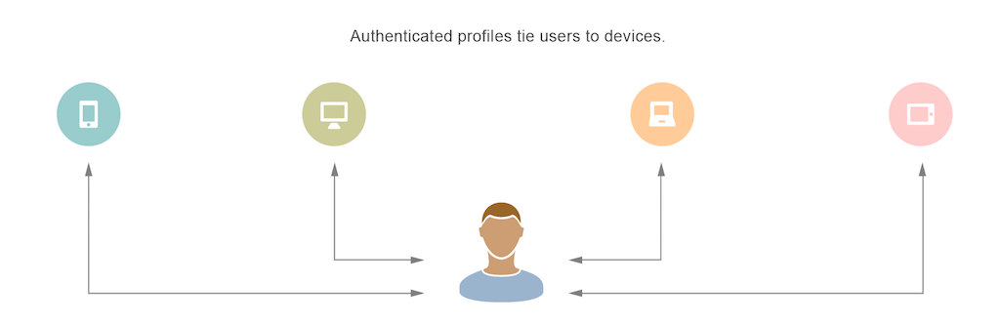

# [!UICONTROL Profile Merge Rules] 概述 {#profile-merge-rules-overview}

您可 [!UICONTROL Profile Merge Rules] 以控制哪些資料集用於細分，並可以跨多種裝置精確鎖定使用者。

>[!VIDEO](https://video.tv.adobe.com/v/28974)

## 使用匿名和已驗證的設定檔來收集和定位資料 {#data-collection-targeting}

通常，受眾細分和定位依賴於從裝置上所有使用者收集到的資料。 基於裝置層級資料的資料收集和定位有一些缺點。 例如，您無法區分共用裝置的多個使用者，或是跨多個裝置精確定位使用者。 以裝置為中心的資料收集已不足以用於數位行銷宣傳或跨裝置定位。

[!UICONTROL Profile Merge Rules] 從根本上改變 [!DNL Audience Manager] 了收集資料和群體使用者以進行定位的方式。 它可讓您使用2種不同的描述檔類型、裝置描述檔和已驗證 [的描述檔](../../reference/visitor-authentication-states.md)。

| 描述檔類型 | 說明 |
|---|---|
| [!UICONTROL Device Profile] | 系 [!UICONTROL device profile] 結至指定裝置的ID，例如 [!UICONTROL cookie] ID或行動裝置ID。   其功能包括:<ul><li>[!UICONTROL Rule-based traits] 當用戶未通過驗證時實現。</li><li>[!UICONTROL Onboarded traits] 系結至裝置ID，例如 [!UICONTROL cookie-based]協力廠商資料。</li></ul> |
| [!UICONTROL Authenticated Profile] | 系 [!UICONTROL authenticated profile] 結至某人登入您網站時傳入的使用者ID。  其功能包括:<ul><li>[!UICONTROL Rule-based traits] 當使用者經過驗證時，跨裝置收集。</li><li>[!UICONTROL Onboarded traits] 在連結至相同使用者ID的離線檔案中。</li></ul> |

這些不同的描述檔可控制您用於區段的資料。 例如，透過驗證的 [設定檔](../../reference/visitor-authentication-states.md)，您可以針對單一使用 [!UICONTROL segments] 者，根據來自多個裝置的資料建立精確的資料。 這表示您可以跨多種裝置為客戶提供一致的品牌體驗。 [!DNL Audience Manager] 透過將個人用於線上活動的不同裝置對應至其已驗證的個人檔案，來達成此 [目的](../../reference/visitor-authentication-states.md)。 這些映射稱為 [!UICONTROL Profile Link Device Graph]。

## 優勢 {#advantages}

您 [!UICONTROL Profile Merge Rules] 可以：

* 根據已驗證的 [個人檔案](../../reference/visitor-authentication-states.md)、匿名個人檔案或兩者的組合來定位使用者。
* 跨裝置鎖定特定客戶。
* 根據確定性資料建立裝置圖表。
* 根據不同的描述檔，微 [!UICONTROL segments] 調您的資料。
* 進一步瞭解您的受眾。
