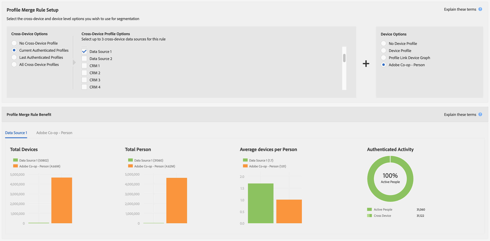

# 設定檔合併規則的報表量度 {#report-metrics-for-profile-merge-rules}

[!UICONTROL Profile Merge Rule]量度提供驗證您網站之使用者和裝置的相關資料。 當您建立合併規則或從[!UICONTROL Profile Merge Rule Reports]儀表板按一下現有規則時，[!UICONTROL Profile Merge Rules]中的資料和圖形會動態更新。 這些量度可包含來自其他協力廠商裝置圖表來源的裝置圖表。

## 合併規則量度 {#merge-rule-metrics}

合併規則使用您可在[!DNL Audience Manager]中存取的協力廠商裝置圖表資料時，報表會以並排長條圖傳回資料。 這可讓您比較已驗證的第一方資料與協力廠商裝置圖表提供的跨裝置資料。 此資料每天都會更新。

<table id="table_A7FB2F9804F84AC8A6DD05C0E6EE7555"> 
 <thead> 
  <tr> 
   <th colname="col1" class="entry"> 量度 </th> 
   <th colname="col2" class="entry"> 說明 </th> 
  </tr> 
 </thead>
 <tbody> 
  <tr> 
   <td colname="col1"> 
 <b>已驗證的活動</b> 
 </td> 
   <td colname="col2"> 
顯示： 
 
    <ul id="ul_7F7373919A4A49028EF4BF7B28D9F8E9"> 
     <li id="li_FE2F93C496D64ED8928B3E522C9585EA"> 使用中的人員：過去60天中驗證您網站的人數。 </li> 
     <li id="li_60CFD26EE68B442683C0ED5FED1A79C8"> 跨裝置：在選取的<a href="merge-rules-start.md#create-data-source">已驗證設定檔</a>的<a href="https://experienceleague.adobe.com/docs/audience-manager/user-guide/features/data-sources/manage-datasources.html">資料Source</a>中，針對資料來源存在的存留期，儲存的<a href="merge-rule-definitions.md">個跨裝置ID</a>總數。 </li> 
     <li id="li_F2F07B6A326C4A18B79A0CF2C47D9677">  %使用中的人員：將個使用中的人員顯示為%。 </li> 
    </ul> 
 已驗證的活動可讓您依活動、磁碟區和百分比比較資料來源。 它可以協助您尋找擁有大量人員且活躍使用者比例較高的資料來源。 或者，您也可以在比較資料來源與高比例活躍使用者與總對象人數中找到價值。 例如，有時候，總存留期數低而活動數高的資料來源，會比總存留期數高而活動數低的資料來源更有價值。 
 
 
注意： 已驗證的活動量度僅包含設定檔連結資料。 此報表不包含裝置圖表資料。 
 
 </td> 
  </tr> 
  <tr> 
   <td colname="col1"> 
 每個人<b>個平均裝置</b> 
 </td> 
   <td colname="col2"> 
 顯示已針對選取的資料來源驗證您網站的訪客所使用的平均裝置數。 
 </td> 
  </tr> 
  <tr> 
   <td colname="col1"> 
 總共<b>部裝置</b> 
 </td> 
   <td colname="col2"> 
顯示使用者已針對選取的資料來源，用於驗證您網站的裝置總數。 
 </td> 
  </tr> 
  <tr> 
   <td colname="col1"> 
 總共<b>人</b> 
 </td> 
   <td colname="col2"> 
顯示已針對選取的資料來源確定識別的總人數。 
 </td> 
  </tr> 
 </tbody> 
</table>

## 裝置圖表量度 {#device-graph-metrics}

[!UICONTROL Merge Rules]報表也會針對選取的資料來源與裝置圖表，顯示造訪過您網站的總人數與裝置數的資料。 這些量度會根據預先設定的時間間隔（回顧期間）傳回資料，此時間間隔會因您在建立規則時選取的裝置選項而異。 下表列出每個裝置圖表選項的報表間隔。

<table id="table_038983EBC71F4A55BBCA99212AC5DEE6"> 
 <thead> 
  <tr> 
   <th colname="col1" class="entry"> 裝置圖表選項 </th> 
   <th colname="col2" class="entry"> 報表回顧間隔 </th> 
  </tr>
 </thead>
 <tbody> 
  <tr> 
   <td colname="col1"> 
設定檔連結 
 </td> 
   <td colname="col2"> 
 
     <ul id="ul_B2FF2341573840549FFB96579F537082"> 
      <li id="li_B37323C2F2434F41B407500AC5C15447">總人數：60天 </li> 
      <li id="li_08D911224A60418BBB3CFB4E70CE73D4">裝置總數：120天 </li> 
     </ul> 
 </td> 
  </tr> 
  <tr> 
   <td colname="col1"> 
 LiveRamp 
 </td> 
   <td colname="col2"> 
 
     <ul id="ul_2772F3AD7E1440789B635794ECDE8DFB"> 
      <li id="li_1432363829D64615B1D349A3722D6268">總人數：180天 </li> 
      <li id="li_D5C0E3CE92524B54BBD36C73A326292B">裝置總數：180天 </li> 
     </ul> 
 </td> 
  </tr> 
  <tr> 
   <td colname="col1"> 
 Tapad 
 </td> 
   <td colname="col2"> 
 
     <ul id="ul_274529DB58E6442E95C6AD89BECB1362"> 
      <li id="li_67102211A72A4E47AACFE5E369793C17">總人數：60天 </li> 
      <li id="li_3E8F3DA6A7B5487895A626674DA363A5">60天裝置總數 </li> 
     </ul> 
 </td> 
  </tr> 
 </tbody> 
</table>

## 範例報告 {#sample-reports}

### 標準設定檔連結報表

標準[!UICONTROL Profile Link]報表看起來類似下列範例。 使用多個資料來源的合併規則（最多3個）會針對每個資料來源以個別索引標籤顯示圖表。 此合併規則不包含[!UICONTROL external device graph]資料。

### 包含裝置圖表資料的設定檔連結報表

包含來自協力廠商裝置圖表的裝置圖表資料的[!UICONTROL Profile Link Device Graph]報告會以並排長條圖顯示[!UICONTROL Profile Link]和裝置圖表資料。 將這些圖表彼此相鄰，可讓您評估使用外部裝置圖表相較於單獨使用[!UICONTROL Profile Link]的好處。 使用多個資料來源的合併規則（最多3個）會針對每個資料來源以個別索引標籤顯示圖表。 提醒您，[!UICONTROL Authenticated Activity]圖表和量度沒有傳回[!DNL Adobe]裝置圖表或其他您在[!DNL Audience Manager]中可能可以存取的協力廠商裝置圖表的資料。

## 設定檔連結趨勢圖 {#profile-link-trend}

除了其他資料視覺效果外，[!UICONTROL Profile Link]報表還包含線圖。 折線圖可顯示設定檔規則隨時間變化的趨勢。 當您從[!UICONTROL Profile Merge Rules]登陸頁面( **[!UICONTROL Audience Data > Profile Merge Rules]**)按一下規則時，可以使用趨勢圖（和其他報表）。 如果您是協力廠商裝置圖表的成員，且在[!DNL Audience Manager]中擁有存取權，這些圖表會包含裝置圖表資料。 按一下趨勢線可檢視基礎資料。

>[!MORELIKETHIS]
>
>* [設定檔合併規則常見問題集](../../faq/faq-profile-merge.md)
