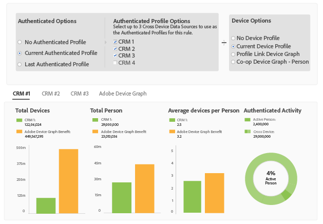

# Report Metrics for Profile Merge Rules {#report-metrics-for-profile-merge-rules}

[!UICONTROL Profile Link] 度量提供驗證您網站之人員和裝置的相關資料。The data and graphs in [!UICONTROL Profile Link] update dynamically as you create a merge rules or when you click an existing rule from the [!UICONTROL Profile Merge Rules] dashboard. These metrics can include device graph from the [!DNL Adobe Experience Cloud Device Co-op] or other third-party device graph sources.

## Merge Rule Metrics {#merge-rule-metrics}

Reports return data in side-by-side bar graphs when your merge rules use data from the [Adobe Experience Cloud Device Co-op](https://marketing.adobe.com/resources/help/en_US/mcdc/) or other, third-party device graphs you may have access to in [!DNL Audience Manager]. This lets you compare your authenticated, first-party data with cross-device data provided by the [!UICONTROL Experience Cloud Device Co-op] or another, third-party device graph. For information about data returned by the [!UICONTROL Device Co-op], see [The Device Graph: Internal Processes and Output](https://marketing.adobe.com/resources/help/en_US/mcdc/mcdc-processes.html). 此資料每日更新。

<table id="table_A7FB2F9804F84AC8A6DD05C0E6EE7555"> 
 <thead> 
  <tr> 
   <th colname="col1" class="entry"> 量度 </th> 
   <th colname="col2" class="entry"> 說明 </th> 
  </tr> 
 </thead>
 <tbody> 
  <tr> 
   <td colname="col1"> 
 <b> 已驗證的活動</b> 
 </td> 
   <td colname="col2"> 
顯示： 
 
    <ul id="ul_7F7373919A4A49028EF4BF7B28D9F8E9"> 
     <li id="li_FE2F93C496D64ED8928B3E522C9585EA">  活動中的人員：過去60天內已對您的網站進行驗證的人數。 </li> 
     <li id="li_60CFD26EE68B442683C0ED5FED1A79C8">  跨裝置：資料來源 <a href="../../features/profile-merge-rules/merge-rules-start.md#create-data-source"> 存在時</a> 所選 <a href="../../features/profile-merge-rules/merge-rule-definitions.md"> 之驗證設定檔</a> 的資料來源中儲存的跨裝置ID總數。 </li> 
     <li id="li_F2F07B6A326C4A18B79A0CF2C47D9677">  %「活動中人員」：將  「活動中人員 」顯示為%。 </li> 
    </ul> 
  驗證活動 可讓您依活動、數量和百分比比較資料來源。它可以幫助您找到有許多人和高百分比活躍使用者的資料來源。或者，您可以找出比較高比例的活動使用者與總觀眾規模比較的值。例如，有時擁有低存留總存數和高活動的資料來源，其價值較高存留結果和低活動數的資料源更有價值。 
 
 
Note: The  Authenticated Activity metrics contain  Profile Link data only. This report does not include  Device Graph data. 
 
 </td> 
  </tr> 
  <tr> 
   <td colname="col1"> 
 <b> 每人平均裝置</b> 
 </td> 
   <td colname="col2"> 
 顯示已針對選取的資料來源驗證到您網站的訪客使用的裝置平均數。 
 </td> 
  </tr> 
  <tr> 
   <td colname="col1"> 
 <b> 總裝置</b> 
 </td> 
   <td colname="col2"> 
顯示訪客在選取的資料來源上用來驗證網站的裝置總數。 
 </td> 
  </tr> 
  <tr> 
   <td colname="col1"> 
 <b> 總人數</b> 
 </td> 
   <td colname="col2"> 
顯示已對選定資料來源決定的總人數。 
 </td> 
  </tr> 
 </tbody> 
</table>

## Device Graph Metrics {#device-graph-metrics}

[!UICONTROL Merge Rules] 該報表也顯示在選取的資料來源和裝置圖表中瀏覽您網站的總人數和裝置的總人數。這些度量會根據預先設定的時間間隔(回顧時段)傳回資料，視您在建立規則時選取的裝置選項而定。下表列出每個裝置圖表選項的這些報告間隔。

<table id="table_038983EBC71F4A55BBCA99212AC5DEE6"> 
 <thead> 
  <tr> 
   <th colname="col1" class="entry"> 裝置圖形選項 </th> 
   <th colname="col2" class="entry"> 報表回顧間隔 </th> 
  </tr>
 </thead>
 <tbody> 
  <tr> 
   <td colname="col1"> 
 個人資料連結 
 </td> 
   <td colname="col2"> 
 
     <ul id="ul_B2FF2341573840549FFB96579F537082"> 
      <li id="li_B37323C2F2434F41B407500AC5C15447">總人數：60天 </li> 
      <li id="li_08D911224A60418BBB3CFB4E70CE73D4">總裝置：120天 </li> 
     </ul> 
 </td> 
  </tr> 
  <tr> 
   <td colname="col1"> 
 Co-op裝置圖表 
 </td> 
   <td colname="col2"> 
 
     <ul id="ul_64AD1DD89DF64703B70B973A463BA020"> 
      <li id="li_D7D3A3871F434CBFA71BE8929EB41648">總人數：180天 </li> 
      <li id="li_125D387986B2463EB310203CE5857EDA">總裝置：180天 </li> 
     </ul> 
 </td> 
  </tr> 
  <tr> 
   <td colname="col1"> 
 LiverAp 
 </td> 
   <td colname="col2"> 
 
     <ul id="ul_2772F3AD7E1440789B635794ECDE8DFB"> 
      <li id="li_1432363829D64615B1D349A3722D6268">總人數：180天 </li> 
      <li id="li_D5C0E3CE92524B54BBD36C73A326292B">總裝置：180天 </li> 
     </ul> 
 </td> 
  </tr> 
  <tr> 
   <td colname="col1"> 
 tapad 
 </td> 
   <td colname="col2"> 
 
     <ul id="ul_274529DB58E6442E95C6AD89BECB1362"> 
      <li id="li_67102211A72A4E47AACFE5E369793C17">總人數：60天 </li> 
      <li id="li_3E8F3DA6A7B5487895A626674DA363A5">裝置總計60天 </li> 
     </ul> 
 </td> 
  </tr> 
 </tbody> 
</table>

## Sample Reports {#sample-reports}

### 標準描述檔連結報表

A standard [!UICONTROL Profile Link] report looks like the following example. 合併使用多個資料來源(最多個)的規則，會顯示每個資料來源中不同標籤的圖形。This merge rule does not include [!UICONTROL Device Co-op] data.

### 使用裝置圖表資料的描述檔連結報表

[!UICONTROL Profile Link] 一種報表，其中包含來自 [!UICONTROL Adobe Experience Cloud Device Co-op] 或第三方裝置圖表的裝置圖表資料，以及 [!UICONTROL Profile Link] 並排橫條圖的裝置圖表資料。Placing these graphs adjacent to each other lets you evaluate the benefits of using the [!UICONTROL Experience Cloud Device Co-op] compared to [!UICONTROL Profile Link] by itself. 合併使用多個資料來源(最多個)的規則，會顯示每個資料來源中不同標籤的圖形。As a reminder, the [!UICONTROL Authenticated Activity] graph and metrics do not return data from the [!DNL Adobe] device graph or other, third-party device graphs you may have access to in [!DNL Audience Manager].

## Profile Link Trend Graphs {#profile-link-trend}

In addition to the other data visualizations, [!UICONTROL Profile Link] reports include a line graph. 折線圖旨在顯示您的描述檔規則隨時間變化的趨勢。Trend graphs (and the other reports) are available when you click a rule from the [!UICONTROL Profile Merge Rules] landing page ( **[!UICONTROL Audience Data > Profile Merge Rules]**). These graphs include device graph data if you&#39;re a member of the [!UICONTROL Device Co-op] or other, third-party device graphs you may have access to in [!DNL Audience Manager]. 按一下趨勢線以查看基礎資料。

>[!MORE_贊_ this]
>
>* [個人檔案合併規則常見問答集](../../faq/faq-profile-merge.md)

