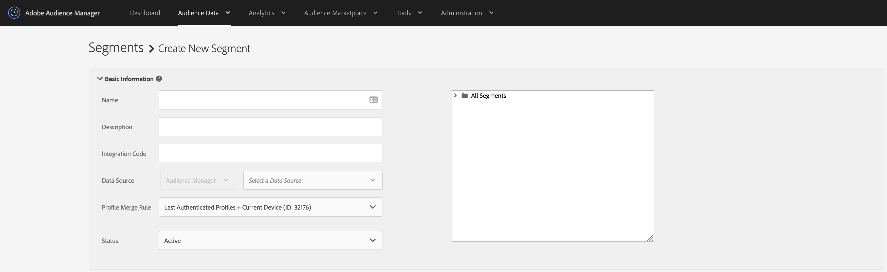
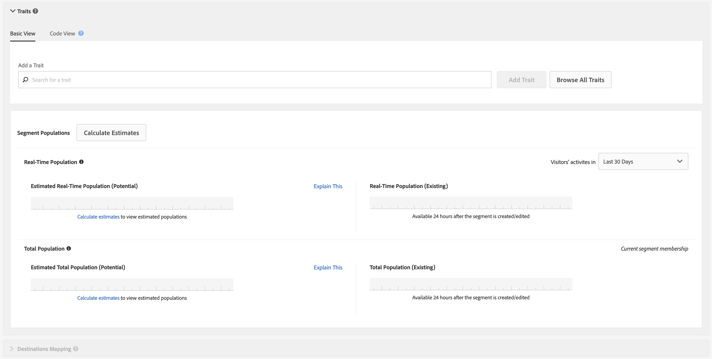
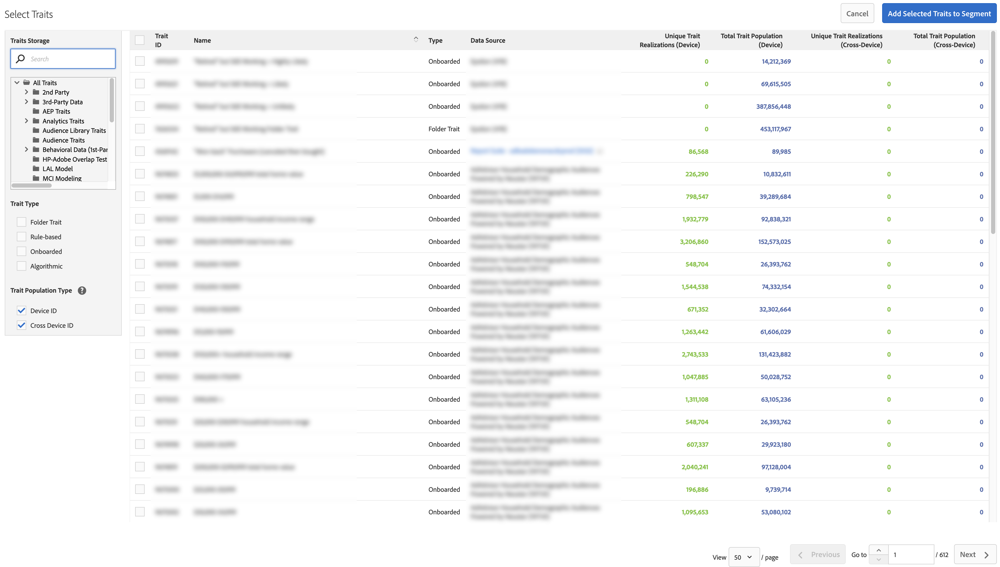
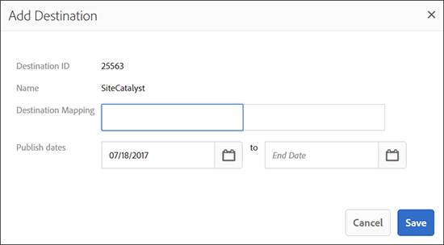
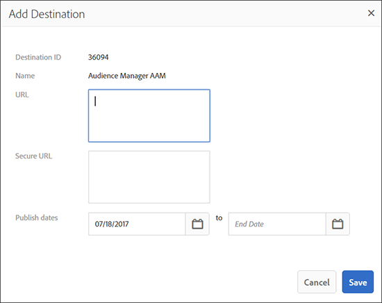
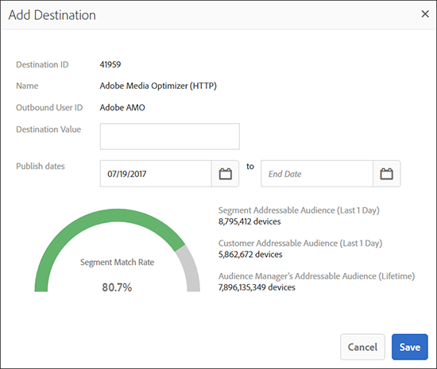

# [!UICONTROL Segment Builder] {#segment-builder}

說明在[!UICONTROL Segment Builder]中建立區段的必要和選用步驟。

## 影片示範

從觀看[在Audience Manager中建立區段](https://images-tv.adobe.com/avp/vr/b7f88801-efe0-4786-9d58-554db16b34eb/81b6f004-cec0-452c-9b35-dabdc69ae3b4/9dc8a1d4-350d-46c3-90a6-5197dfb76f40_20180130023449.854x480at800_h264.mp4)影片開始。 影片會逐步說明區段的建立程式。 如需詳細資訊，請閱讀以下各節。

## 建立[!UICONTROL Segment] {#create-segment}

### 區段產生器區段

<!-- t_create_segment.xml -->

[!UICONTROL Segment Builder]包含3個不同的區段： [!UICONTROL Basic Information]、[!UICONTROL Traits]和[!UICONTROL Destinations Mapping]。 若要建立[!UICONTROL segment]，請完成[!UICONTROL Basic Information]和[!UICONTROL Traits]區段中的必填欄位。 [!UICONTROL Destinations Mapping]設定是選用的。 如需其他說明，請參閱下列指示。

1. 在[基本資訊](../../features/segments/segment-builder.md#segment-builder-controls-basics)區段中：

   

   * 為[!UICONTROL segment]命名。 [!UICONTROL segment]名稱的長度上限為255個字元。
   * 設定[!UICONTROL segment]狀態（預設為「作用中」）。
   * 選擇[!UICONTROL data source]。 使用第一個下拉式功能表，在Audience Manager [!UICONTROL data sources]、Adobe Analytics報表套裝或兩者之間篩選。 然後，使用第二個下拉式功能表選擇您的[!UICONTROL data source]。 如果您未使用Adobe Analytics報表套裝，[!UICONTROL data source]型別選擇器會停用，且僅預設為Audience Manager資料來源。
   * 選取要用於[!UICONTROL segment]資格的[!UICONTROL profile merge rule]。
   * 將[!UICONTROL segment]指派至儲存資料夾。

1. 在[特徵](../../features/segments/segment-builder.md#segment-builder-controls-traits)區段中：
   
   * 搜尋您想要新增至區段的[!UICONTROL trait]，然後按一下&#x200B;**[!UICONTROL Add Trait]**。 新增其他[!UICONTROL trait]以建立[!UICONTROL trait]群組。
   * 按一下&#x200B;**[!UICONTROL Browse All Traits]**&#x200B;以開啟[!UICONTROL Advanced Search]強制回應視窗。 依名稱、識別碼、說明或[!UICONTROL data source]搜尋[!UICONTROL traits]。 在搜尋時按一下資料夾，將結果限制在該資料夾及其子資料夾中。 您也可以依[!UICONTROL trait type] （[!UICONTROL Folder Trait]、[!UICONTROL Rule-based]、[!UICONTROL Onboarded]和[!UICONTROL Algorithmic]）或母體型別（[裝置ID](../../reference/ids-in-aam.md)和[跨裝置ID](../../reference/ids-in-aam.md)）篩選[!UICONTROL traits]。
     
   * 按一下並拖曳[!UICONTROL traits]以建立個別的群組。
   * 在群組之間暫留，以使用布林值[!UICONTROL AND]、[!UICONTROL OR]、[!UICONTROL AND NOT]設定關聯性。
   * 將滑鼠停留在時鐘圖示上，將[造訪間隔和頻率](../../features/segments/recency-and-frequency.md)規則新增至[!UICONTROL trait]。
   * 新增或移除[!UICONTROL traits]時檢視區段母體資料。 按一下&#x200B;**[!UICONTROL Calculate Estimates]**&#x200B;以檢視（或重新整理）預估的母體數目。 深入瞭解[!UICONTROL Segment Builder]中的[區段母體資料](../../features/segments/segment-builder-data.md#segment-populations)。
   * 完成時，按一下&#x200B;**[!UICONTROL Save]**。

1. *（選擇性）*&#x200B;將[!UICONTROL segment]對應到[目的地對應](../../features/segments/segment-builder.md#segment-builder-controls-destinations)區段中的[!UICONTROL destination]：
   * 搜尋[!UICONTROL destination]並按一下&#x200B;**[!UICONTROL Add Destination]**。 請注意，[!UICONTROL destination]必須先存在，您才能將其新增至[!UICONTROL segment]。
   * 完成時，按一下&#x200B;**[!UICONTROL Save]**。

請觀看下方的影片，詳細瞭解跨裝置量度的運作方式。

>[!VIDEO](https://video.tv.adobe.com/v/33445)

## [!UICONTROL Segment Builder]控制項： [!UICONTROL Basic Information]區段 {#segment-builder-controls-basics}

在[!UICONTROL Segment Builder]中，[!UICONTROL the Basic Information]設定可讓您建立新特徵或編輯現有特徵。 若要建立新的[!UICONTROL segment]，請提供名稱、[!UICONTROL data source]並選取儲存資料夾。 所有其他欄位都是選用的。 完成後，移至[!UICONTROL Traits]區段。

<!-- r_segment_basic_info_section.xml -->

<!--

<table id="table_39DA4BC9470448B48F6654F2774EE0D5"> 
 <thead> 
  <tr> 
   <th colname="col1" class="entry"> Field </th> 
   <th colname="col2" class="entry"> Description </th> 
  </tr> 
 </thead>
 <tbody> 
  <tr> 
   <td colname="col1"> <b>Name</b> </td> 
   <td colname="col2"> 
Give the segment a short, logical name that describes its function or purpose. Avoid abbreviations and special characters. The maximum length of a segment name is 255 characters. 
 </td> 
  </tr> 
  <tr> 
   <td colname="col1"> <b>Description</b> </td> 
   <td colname="col2"> 
A field for additional descriptive information about the segment. 
 </td> 
  </tr> 
  <tr> 
   <td colname="col1"> <b>Integration Code</b> </td> 
   <td colname="col2"> 
A field for a user-defined ID or other company-specific information. 
 </td> 
  </tr> 
  <tr> 
   <td colname="col1"> <b>Data Source</b> </td> 
   <td colname="col2"> 
Associates the segment with a specific data provider. 
Use the first drop-down menu to filter between Audience Manager data sources, Adobe Analytics report suites, or both. Then, use the second drop-down menu to choose your data source.

 If you are not using Adobe Analytics report suites, the data source type selector is disabled and defaulted to Audience Manager data sources only.

 </td> 
  </tr> 
  <tr> 
   <td colname="col1"><b>Profile Merge Rule</b> </td> 
   <td colname="col2"> 
Selects the Profile Merge Rule to use for segment qualification. 
 </td> 
  </tr> 
  <tr> 
   <td colname="col1"> <b>Status</b> </td> 
   <td colname="col2"> 
Activates or deactivates the segment (active by default). 
 </td> 
  </tr> 
  <tr> 
   <td colname="col1"> <b>Folder Storage</b> </td> 
   <td colname="col2"> 
Determines which storage folder the segment belongs to. 
 </td> 
  </tr> 
 </tbody> 
</table>

-->

| 欄位 | 說明 |
|---------|----------|
| **[!UICONTROL Name]** | 為區段提供一個簡短的邏輯名稱，用於描述其功能或用途。 避免使用縮寫和特殊字元。 區段名稱的最大長度為255個字元。 |
| **[!UICONTROL Description]** | 有關區段的其他描述性資訊的欄位。 |
| **[!UICONTROL Integration Code]** | 使用者定義的ID或其他公司專屬資訊的欄位。 |
| **[!UICONTROL Data Source]** | 將區段與特定資料提供者建立關聯。  使用第一個下拉式功能表，在Audience Manager資料來源、Adobe Analytics報表套裝或兩者之間篩選。 然後，使用第二個下拉式選單來選擇資料來源。  如果您未使用Adobe Analytics報表套裝，資料來源型別選擇器會停用，並僅預設為Audience Manager資料來源。 |
| **[!UICONTROL Profile Merge Rule]** | 選取要用於區段資格的設定檔合併規則。 |
| **[!UICONTROL Status]** | 啟動或停用區段（預設為啟用）。 |
| **資料夾儲存空間** | 決定區段所屬的儲存資料夾。 |

## [!UICONTROL Segment Builder]控制項： [!UICONTROL Traits]區段 {#segment-builder-controls-traits}

在[!UICONTROL Segment Builder]中，[!UICONTROL Traits]區段可讓您管理[!UICONTROL segment]中的[!UICONTROL traits]、建立[!UICONTROL trait]群組，以及設定資格條件。 若要將[!UICONTROL trait]新增至[!UICONTROL segment]，請在搜尋欄位中輸入[!UICONTROL trait]名稱，然後按一下[!UICONTROL Add Trait]。 儲存[!UICONTROL trait] （如果完成）或移至[!UICONTROL Destinations Mapping]。

<!-- r_segment_traits_section.xml-->

**必要條件：**&#x200B;完成[!UICONTROL Basic Information]區段中的必要欄位。

| 欄位 | 說明 |
|--- |--- |
| **[!UICONTROL Basic View]** | 本節提供視覺化控制項，可讓您： <ul><li>建置新專案並管理現有的[!UICONTROL segments]。</li><li>從[!UICONTROL segment]移除[!UICONTROL traits]。</li><li>將最多50個（最多） [!UICONTROL traits]新增至[!UICONTROL segment]。</li><li>拖放[!UICONTROL traits]以建立新群組。</li><li>在[!UICONTROL segment]中檢視[!UICONTROL traits]和[!UICONTROL trait]群組。</li><li>使用布林運算式、比較運運算元和時近/頻率設定來設定資格條件。</li></ul> |
| **[!UICONTROL Code View]** | Opens a development environment that lets you create and manage [!UICONTROL traits], groups, and qualification requirements with code instead of the visual interface. The code view is useful if your [!UICONTROL segments]: <ul><li>Contain more than 50 [!UICONTROL traits] in an individual [!UICONTROL segment]. Note: [!UICONTROL Segments] are limited to 5000 [!UICONTROL traits] (maximum).</li><li>Contain many [!UICONTROL trait] groups.</li><li>Have complex qualification requirements.</li></ul> |
| 搜尋 | Helps you find [!UICONTROL traits] to add to a [!UICONTROL segment]. |
| Real and Estimated [!UICONTROL Segment] Size Data | 請參閱[區段產生器的特徵和區段母體資料](segment-builder-data.md)。 |

## Remove [!UICONTROL Traits] from a [!UICONTROL Segment] {#remove-traits}

Managing the [!UICONTROL traits] in your [!UICONTROL segments] is an important part of keeping [!UICONTROL segments] viable. Follow these steps if you need to remove [!UICONTROL traits] from a [!UICONTROL segment].

To remove [!UICONTROL traits] from a [!UICONTROL segment]:

1. 移至&#x200B;**[!UICONTROL Audience Data > Segments]**。 Scroll through the list or use the search feature to find the [!UICONTROL segment] you want to work with.
2. Click the [!UICONTROL segment] name to open the [!UICONTROL segment] details screen.
3. Click **Edit** to open [!UICONTROL Segment Builder] and then click **Traits** to open the [!UICONTROL traits] panel.
4. Hover over the [!UICONTROL trait] you want to delete and then click the X. This action immediately removes the [!UICONTROL trait] from your [!UICONTROL segment].

## [!UICONTROL Segment Builder]控制項： [!UICONTROL Destinations Mappings]區段 {#segment-builder-controls-destinations}

In [!UICONTROL Segment Builder], the optional [!UICONTROL Destinations Mapping] section lets you send [!UICONTROL segment] data to a third-party [!DNL cookie], [!DNL URL], or [!UICONTROL server-to-server destination]. To add a [!UICONTROL destination], search (or browse) for a [!UICONTROL destination], provide [!UICONTROL destination] specific information, and click **[!UICONTROL Add Destination]**.

<!-- r_segment_destinations_map.xml -->

### 先決條件

Complete the required fields in the [!UICONTROL Basic Information] and [!UICONTROL Traits] sections. Also, the destination must already exist.

### [!UICONTROL Destination Mappings] Search Tools

The **[!UICONTROL Destination Mappings]** panel contains search tools as described in the table below.

| 搜尋類型 | 說明 |
|---|---|
| **[!UICONTROL Search by Destination Name]** | Lets you search for a specific [!UICONTROL destination] by name. 若要搜尋，請開始輸入。 欄位將根據您的搜尋字詞自動完成。 完成時，按一下&#x200B;**[!UICONTROL Add Destination]**。 |
| **[!UICONTROL Browse All Destinations]** | 瀏覽可供您使用的&#x200B;*所有* [!UICONTROL destinations]清單。 從快顯清單中選取[!UICONTROL destinations]並新增至您的[!UICONTROL segment]。 |

## [!UICONTROL Destination Mappings]彈出式視窗中的欄位 {#fields-in-dest-mappings}

在[!UICONTROL Segment Builder]中，在您選取[!UICONTROL destination]之後，[!UICONTROL Add Destination]對話方塊就會顯示。 此視窗顯示有關[!UICONTROL destination]的靜態資訊，以及根據[!UICONTROL destination]型別而變化的欄位。 在空白欄位中提供設定[!UICONTROL destination mapping]的必要資訊。

>[!NOTE]
>
>出版日期為選用。 當空白時，目的地會變成使用中且永不過期。

<!-- r_add_mappings_pop.xml -->

### [!UICONTROL Cookie Destination]欄位

在[!UICONTROL Destination Mapping]欄位中，指定用來傳送資料至[!UICONTROL destination]的機碼值組。 在第一個欄位中輸入索引鍵，並在第二個欄位中輸入值。 您的[!UICONTROL cookie destination] Pop看起來可能類似這樣：

### [!UICONTROL URL Destination]欄位

在[!UICONTROL URL]和[!UICONTROL Secure URL]欄位中，指定用來傳送資料給[!UICONTROL destination]的完整標準或安全位址。

### [!UICONTROL Server-to-Server Destination]欄位

在[!UICONTROL Destination Value]欄位中，指定用來傳送資料給[!UICONTROL destination]的值（機碼值組的一部分）。

>[!MORELIKETHIS]
>
>* [建立Cookie目的地](../../features/destinations/create-cookie-destination.md)
>* [建立URL目的地](../../features/destinations/create-url-destination.md)
