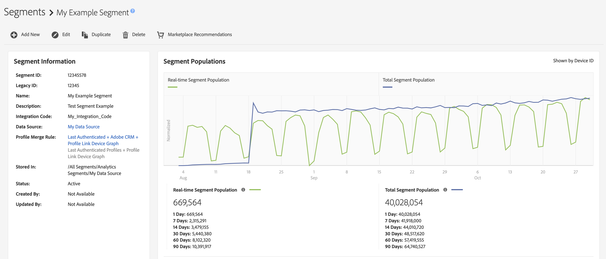

# 區段詳細資料頁面{#segment-summary-view}

個別區段的詳細資訊頁面提供區段詳細資訊的概觀，例如區段名稱、ID、效能量度、定義區段的規則以及目的地對應。 若要檢視這些詳細資訊，請前往&#x200B;**[!UICONTROL Audience Data]** > **[!UICONTROL Segments]**，然後按一下您要使用之區段的名稱。

## 區段管理工具{#segment-management-tools}

區段詳細資訊頁面頂端會托管可用來管理區段的工具：

1. **[!UICONTROL Add New]**:使用此選項來啟動 [!UICONTROL Segment Builder] 和建立新區段。
2. **[!UICONTROL Edit]**:使用此選項可更改當前段的配置。
3. **[!UICONTROL Duplicate]**:使用此選項可建立目前區段的復本。
4. **[!UICONTROL Delete]**:使用此選項可從您的Audience Manager帳戶中移除目前的區段。
5. **[!UICONTROL Marketplace Recommendations]**:使用此選項，可從您未訂閱的資料摘要中，找到與 [!UICONTROL Audience Marketplace] 您正在檢視的類似區段。請參閱[資料購買者Audience Marketplace](../audience-marketplace/marketplace-data-buyers/marketplace-data-buyers.md)以了解如何導覽Marketplace並尋找類似區段。

## 區段資訊 {#basics}

在區段管理工具下方，您可以找到下列區段資訊：

1. **[!UICONTROL Basic Information]:** 顯示建立區段時指定的必要和選用詳細資料。如需這些欄位含義的詳細概觀，請參閱[區段產生器](segment-builder.md)。
2. **[!UICONTROL Segment Graph]:** 以圖形顯示固定1、7、14、30、60和90天間隔的效能資料。我們會在[個別文章](../../features/segments/segment-builder-data.md)中說明區段母體數。

   

3. **[!UICONTROL Identity Type Breakdown ]:** 報表會計算連結至符合區段資格的裝置的跨裝置ID和/或外部裝置圖表ID數量，以顯示符合區段資格的人員或家庭數量(如 [!UICONTROL Total Segment Population]所示)。此報表中顯示的跨裝置ID和外部裝置圖表ID，可用來將設定檔與區段所使用的設定檔合併規則合併。 只有在您在區段使用的設定檔合併規則中選取了跨裝置資料來源或外部裝置圖表時，才會顯示此報表。

   

   >[!NOTE]
   >
   >Audience Manager只會在您有符合區段資格的跨裝置ID時顯示[!UICONTROL Identity Type Breakdown]報表。

   觀看以下影片以了解[!UICONTROL Identity Type Breakdown]的概觀。
   >[!VIDEO](https://video.tv.adobe.com/v/27977/)

4. **[!UICONTROL Segment Rules]:** 列出區段中的特徵以及資格規則。
5. **[!UICONTROL Destination Mappings]:** 列出區段的目標對應。
6. **[!UICONTROL Management Tools]:** 可讓您建立、編輯、原制和刪除區段的控制項。
