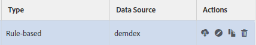

# Managing Trait Rules {#managing-trait-rules}

In [!UICONTROL Trait Builder], the [!UICONTROL Expression Builder] lets you create and test rules that establish audience qualification requirements. Rules consist of key-value pairs such as `color == blue` or `price > 100`. 比較運算子建立鍵和值之間的關係。[!DNL Boolean] 運算式決定規則群組之間的關係。

<!-- c_tb_rules.xml -->

## 主要信號規則功能說明

1. **[!UICONTROL Expression Builder]****[!UICONTROL Code View]** 或標籤提供特徵中規則的概述。**[!UICONTROL Expression Builder]** 此標籤可讓您使用欄位和下拉式選單建立規則。The **[!UICONTROL Code View]** lets you create rules by manually writing those expressions as code. The illustration above shows a simple trait composed of a signal that evaluates data for a qualifying condition where a product key equals a specific value, in this case `color == "blue"`.

1. 此區段中的欄位和控制項可讓您從索引鍵值配對建立訊號，並使用比較運算子設定兩者之間的關係。必須有索引鍵、運算子和值。
1. The [!UICONTROL Data Explorer Options] allow you to backfill trait realizations for your signals.
   >[!NOTE]
   >
   >This option is only available for [!UICONTROL Data Explorer] customers. 如需詳細資訊，請洽詢您的Adobe顧問。
1. This section shows you an estimation of trait realizations for the past 7 days, for the signals defined in the [!UICONTROL Expression Builder], for backfilled and non-backfilled traits.
   >[!NOTE]
   >
   >This option is only available for [!UICONTROL Data Explorer] customers. 如需詳細資訊，請洽詢您的Adobe顧問。
1. The test fields let you validate combinations of signal rules or the [!DNL URL]s that you want to use when sending data to Audience Manager.

## Create a Trait Rule {#create-trait-rule}

規則(或運算式)由個別或索引鍵值配對組成。比較運算子會設定索引鍵值配對之間的關係。To create a rule,provide a key, a value, select an operator, and click **[!UICONTROL Add Rule]**.

<!-- t_tb_create_rules.xml -->

Complete the required fields in the **[!UICONTROL Basic Information]** section *before* creating trait rules.

1. Expand the **[!UICONTROL Trait Expression]** section and enter a key and value name. This creates a *`signal`*.
   >[!NOTE]
   >
   >Include the `c_` prefix (or any other naming convention) for key variable if your event calls send data to [!DNL Audience Manager] using that syntax.
1. Select a [comparison operator](../../features/traits/trait-comparison-operators.md) from the **[!UICONTROL Operator]** dropdown. 比較運算子評估訊號中元素之間的關係。
   >[!NOTE]
   >
   >[!DNL Boolean][!UICONTROL OR] 運算元會建立群組 *內* 多個訊號之間的關係，而無法變更。
1. Click **[!UICONTROL Add Rule]**. 儲存的規則會顯示在資料輸入欄位上方的特徵工作區中。

### 範例 {#example-trait-rule}

在下列範例中，使用者已根據產品ID建立新特徵規則。To build this rule, the user provided the key `productkey` linked with an equals operator ( `==`) to the value `2093`.

Clicking **[!UICONTROL Add Rule]** saves and moves the trait into the [!UICONTROL Expression Builder] workspace.

>[!MORE_贊_ this]
>
>* [建立新規則群組](../../features/traits/manage-trait-rules.md#create-rule-group)
>* [在群組之間移動規則](../../features/traits/manage-trait-rules.md#move-rules-between-groups)
>* [刪除特徵規則](../../features/traits/manage-trait-rules.md#delete-trait)

## Create a New Rule Group {#create-rule-group}

此程序說明如何建立新規則群組。

<!-- t_tb_new_rule_group.xml -->

您的特徵必須至少包含兩個規則，才能建立新規則群組。

1. 將游標移至要移動的規則上方，以強調顯示。
1. 將滑鼠指標暫留在反白顯示的規則邊框上。
這樣會自動將規則與其目前群組分隔，並將其移至新群組中。
   >[!NOTE]
   >
   >如果您不小心移動規則，請將規則拖曳至其原始群組。
1. Select a [!DNL Boolean] operator ( [!UICONTROL AND], [!UICONTROL OR], [!UICONTROL AND NOT]) from the drop-down menu to set the relationship between the rule groups.

>[!MORE_贊_ this]
>
>* [建立特徵規則](../../features/traits/manage-trait-rules.md#create-trait-rule)
>* [在群組之間移動規則](../../features/traits/manage-trait-rules.md#move-rules-between-groups)
>* [刪除特徵規則](../../features/traits/manage-trait-rules.md#delete-trait)

## Move Rules Between Groups {#move-rules-between-groups}

若要移動規則，請按一下並拖曳至其他群組。

>[!MORE_贊_ this]
>
>* [建立特徵規則](../../features/traits/manage-trait-rules.md#create-trait-rule)
>* [建立新規則群組](../../features/traits/manage-trait-rules.md#create-rule-group)
>* [刪除特徵規則](../../features/traits/manage-trait-rules.md#delete-trait)

## Edit a Trait {#edit-trait}

此程序說明如何編輯特徵。

<!-- t_tb_edit.xml -->

1. In the [!UICONTROL Traits] dashboard, hover over the **[!UICONTROL Actions]** column for the trait you want to edit. 這會帶出特徵管理圖示。
1. 按一下鉛筆以編輯特徵。

   

## Delete a Trait Rule {#delete-trait}

此程序說明如何刪除特徵規則。

<!-- t_tb_delete_rule.xml -->

1. In the [!UICONTROL Traits] dashboard, hover over the [!UICONTROL Actions] columns for the trait you want to edit and click the pencil icon. 這會帶出特徵管理圖示。
1. Expand the [!UICONTROL Trait Expression] section.
1. 將滑鼠指標暫留在您要刪除的規則上，然後按一下X圖示。規則會立即刪除。