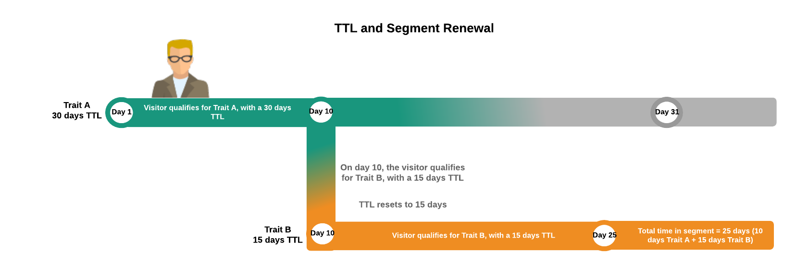

# 區段和特徵存留時間說明 {#segment-time-to-live-explained}

特徵( [!UICONTROL time-to-live] )間隔[!DNL TTL]如何影響區段成員資格。

<!-- segment-ttl-explained.xml -->

## 上線時間

[!DNL TTL] 定義網站訪客在最後一個特徵資格事件後在區段中停留的時間。 [!DNL TTL] 是針對特徵設定而非區段。Visitors fall out of a segment if they do not qualify for a trait before the end of the [!DNL TTL] interval. 新特徵 [!DNL TTL] 的預設值為120天。 設為0天時，特徵不會過期。 [在特徵建立介面的部分中](../../features/traits/create-onboarded-rule-based-traits.md#set-expiration-interval) ，建立或編輯特徵時 [!UICONTROL Advanced Options] ，設定TTL值。

### 1天TTL說明

將TTL計時 [!DNL TTL] 器設為1天時，會從特徵實現後的第二天開始，而不會計算特徵實現日剩餘的時間。

Audience Manager會根 [!DNL TTL] 據下列公式，計算1天 [!DNL TTL] 特徵的有效期：

`24 + (24 - Hour of the day the trait was realized, in UTC)`

* **範例1**: 1:00時，1天 [!DNL UTC]即可發現特徵 [!DNL TTL]。 [!DNL TTL] 將於24 + 24 - 1 = 47小時後到期。
* **範例2**: 23:00,1天 [!DNL UTC]的特質 [!DNL TTL]。 [!DNL TTL] 24 + 24 - 23 = 25小時後到期。

## [!DNL TTL] 和從區段中刪除

如果使用者未在時間間隔內符合其任何特徵的資格，則會從區段中 [!DNL TTL] 掉出。 例如，如果您有1個特徵區段，有30天 [!DNL TTL]，則使用者若未在接下來30天內再次符合該特徵的資格，就會從該區段中退出。

## [!DNL TTL] 和區段續約

若 [!DNL TTL] 使用者符合該區段在時段內的特徵，則會重設，而使用者仍留在區 [!DNL TTL] 段中。 此外，由於大部分區段包含具有其專屬間隔的多個特徵 [!DNL TTL] ，因此使用者可以保留在區段中，並重設 [!DNL TTL] 間隔，只要這些區段仍符合與區段相關的任何特徵的資格。

例如，假設您有由特徵A（30天）和特徵B（15天） [!DNL TTL]組成的區段1 [!DNL TTL]。 假設訪客只符合每個特徵一次的資格，下圖說明續約 [!DNL TTL] 程式和區段內持續時間總計。

## [!DNL Audience Manager] TTL與第三方TTL設定無關

請記住， [!DNL TTL] 您的像素 [!DNL Audience Manager] 上的設定會獨立於協力廠商( [!DNL TTL][!DNL DSP]如、廣告網路等)使用的其他像素上的設定運作。

>[!MORELIKETHIS]
>
>* [設定特徵過期間隔](../../features/traits/create-onboarded-rule-based-traits.md#set-expiration-interval)

