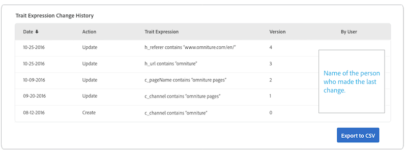

# 「特徵詳細資料」頁 {#trait-details-page}

個別特徵的詳細資料頁面提供特徵詳細資料的概述，例如特徵名稱、ID、效能度量、定義特徵的運算式、其所屬的區段以及特徵稽核記錄檔。 若要檢視這些詳細資訊，請 **[!UICONTROL Audience Data]** 前往> **[!UICONTROL Traits]** 並按一下您要處理之特徵的名稱。

## 特徵管理工具 {#trait-management-tools}

特徵詳細資料頁面的頂端會代管可用於管理特徵的工具：

1. **[!UICONTROL Add New]**:使用這個選項可建立新的規則型、演算法或已登入特徵。
2. **[!UICONTROL Edit]**:使用此選項可變更目前特徵的設定。
3. **[!UICONTROL Delete]**:使用這個選項可從您的Audience Manager帳戶移除目前特徵。
4. **[!UICONTROL Marketplace Recommendations]**:使用此選項，從您未訂閱的資料費用中，尋找與您所 [!UICONTROL Audience Marketplace] 檢視的相似特性。 請參 [閱Audience Marketplace for Data Buyers](../audience-marketplace/marketplace-data-buyers/marketplace-data-buyers.md) ，以瞭解如何導覽Marketplace並尋找類似特性。

## 特徵資訊 {#basics}

此區 [!UICONTROL Trait Information] 段顯示建立特徵時填寫之必填和選填欄位的詳細資訊。 這包括特徵類型、特徵ID、說明、資料來源和其他中繼資料。 這些詳細資訊會依特徵類型（資料夾、已登入或規則型）而有所不同。

## 特徵圖 {#trait-graph}

該 [!UICONTROL Trait Graph] 功能提供您所選特徵的一覽表效能量度。 將游標停留在趨勢線上，即可查看所選特徵的其他資料。

[!UICONTROL Unique Trait Realizations] 代表在特定時間範圍內將此特徵新增至其描述檔的獨特使用者計數。 指 [!UICONTROL Total Trait Population] 出目前符合此特徵的獨特使用者人數。

* 對於規則型特徵，特徵資格會即時發生，因為使用者在瀏覽器中符合特徵資格。
* 對於已登入的特徵，特徵資格會在處理傳入檔案後發生，即傳入檔案 [饋送至Audience Manager](../../faq/faq-inbound-data-ingestion.md) ，也就是特徵資格發生時。
* **[!UICONTROL Unique Trait Realizations]**:在特定時間範圍內將此特徵新增至其描述檔的獨特使用者計數。
* **[!UICONTROL Total Trait Population]**:目前符合此特徵的獨特使用者人數。

   

* **[!UICONTROL Identity Type Breakdown]**:前三個項目以遞減順序顯示擁有符合特徵之最高人口計數的前三個跨裝置資料來源。 第四個項目顯示符合特徵的所有其他 [!DNL DPUUIDs] ([!DNL CRM IDs])來自非前三個跨裝置資料來源的總和。 只有當您在頁面右上方的下拉式選單中選 [!UICONTROL Show Results By] 取「跨裝置ID」時，才會顯示此報表。 預設下拉式選項為 [!UICONTROL Device ID]，不會顯示此報表。

   

   >[!NOTE]
   >
   >Audience Manager僅在您具 [!UICONTROL Identity Type Breakdown] 有符合特徵的跨裝置ID時顯示報表。

   >[!VIDEO](https://video.tv.adobe.com/v/27977/)

## 特徵表達式 {#trait-expression}

該 [!UICONTROL Trait Expression] 區段會顯示使用者必須符合的條件才能符合特徵。 這些規則是在您建立或編 [輯特徵時設定](../../features/traits/about-trait-builder.md)。

## 特徵區段 {#trait-segments}

此區 [!UICONTROL Segments with this Trait] 段會列出所選特徵所屬的所有區段。 您可以按一下區段名稱，以檢視該區段的詳細資訊。

## 特徵審核／歷史記錄 {#trait-audit-history}

對於規則型和已登入的特徵，此處會 [!UICONTROL Trait Expression Change History] 顯示對特徵運算式規則所做的最後10項變更，以及變更的對象。 如果您的特徵有10個以上的變更，請按一 **[!UICONTROL Export to CSV]** 下以下載整個稽核記錄。 稽核記錄檔不適用於資料夾或演算法特徵。

>[!NOTE]
>
>[!UICONTROL Not Available] in [!UICONTROL By User] column表示該使用者的帳戶已刪除。

