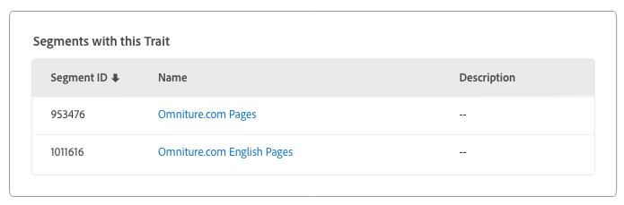

# 特徵詳細資料頁面 {#trait-details-page}

個別特徵的詳細資料頁面提供特徵名稱、ID、效能度量、定義特徵的運算式、定義為特徵的運算式，以及特徵稽核記錄檔。若要詳列這些詳細資訊，請前往 [!UICONTROL Audience Data > Traits] 並按一下您要使用之特徵的名稱。

## 基本資訊 {#basics}

[!UICONTROL Basic Information] 區段顯示您在建立特徵時完成的必填和選填欄位詳細資訊。這包括特徵類型、特徵ID、說明、資料來源和其他中繼資料等項目。這些詳細資料會依特徵類型(資料夾、已登錄或規則型)而有所不同。

## 特徵圖 {#trait-graph}

提供 [!UICONTROL Trait Graph] 您所選特徵的一目瞭然效能度量。將游標停留在趨勢線上，以查看所選特徵的其他資料。

[!UICONTROL Unique Trait Realizations] 代表在指定時間範圍內將此特徵新增至其描述檔的獨特使用者計數。這 [!UICONTROL Total Trait Population] 表示目前符合此特徵的獨特使用者人數。

* 對於規則型特徵，特徵資格會即時發生，因為使用者可以在其瀏覽器中取得特徵。
* 對於已登錄的特性，特徵資格會在傳入的檔案處理後發生，即傳入的檔案 [被送入Audience Manager](../../faq/faq-inbound-data-ingestion.md) ，而這就是特徵資格的發生時機。
* **獨特特徵實作**：在指定時間範圍內將此特徵新增至其描述檔的獨特使用者數。
* **特徵總數**：目前符合此特徵的獨特使用者人數。

   

* **身分類型劃分**：前三個項目會以遞減順序顯示前三個具有特徵特徵的前三個跨裝置資料來源。第四個項目顯示適用於特徵的所有其他 [!DNL DPUUIDs] ([!DNL CRM IDs])在不屬於前三個資料來源之跨裝置資料來源的總和。只有當您在頁面右上方 [!UICONTROL Show Results By] 的下拉式選單中選取跨裝置ID時，才會顯示此報告。預設下拉清單選項 [!UICONTROL Device ID]不會顯示。

   

## 特徵運算式 {#trait-expression}

[!UICONTROL Trait Expression] 本節顯示使用者必須符合特徵才能符合特徵的標準。[建立或編輯特徵](../../features/traits/about-trait-builder.md)時，會設定這些規則。

## 特徵區段 {#trait-segments}

[!UICONTROL Segments with this Trait] 區段列出所選特徵所屬的所有區段。您可以按一下區段名稱，查看該區段的詳細資料。

## 特徵稽核/歷史記錄 {#trait-audit-history}

對於規則型和已登錄的特徵，顯示 [!UICONTROL Trait Expression Change History] 對特徵運算式規則及其執行者所做的最近10項變更。如果您的特徵超過10項變更，請按一下 **[!UICONTROL Export to CSV]** 以下載整個稽核記錄檔。稽核記錄無法用於資料夾或演算法特性。

>[!NOTE]
>
>[!UICONTROL Not Available][!UICONTROL By User] 代表該使用者已刪除該帳戶。

