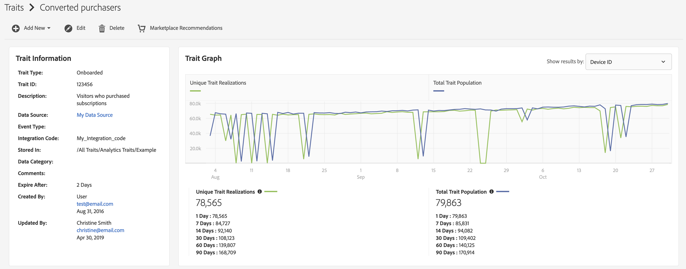

# [!UICONTROL Trait] 詳細資訊頁 {#trait-details-page}

個人的詳細資訊頁面 [!UICONTROL trait] 提供了 [!UICONTROL trait] 詳細資訊，如 [!UICONTROL trait] 名稱、ID、效能度量、定義 [!UICONTROL trait]、它所屬的段，以及 [!UICONTROL trait] 審核日誌。 要查看這些詳細資訊，請轉至 **[!UICONTROL Audience Data]** > **[!UICONTROL Traits]** 並按一下 [!UICONTROL trait] 你想一起工作。

## [!UICONTROL Trait] 管理工具 {#trait-management-tools}

頂部 [!UICONTROL trait] 「詳細資訊」頁承載了可用於管理 [!UICONTROL traits]:

1. **[!UICONTROL Add New]**:使用此選項建立新 [!UICONTROL rule-based]。 [!UICONTROL algorithmic]或 [!UICONTROL onboarded traits]。
2. **[!UICONTROL Edit]**:使用此選項可更改當前配置 [!UICONTROL trait]。
3. **[!UICONTROL Delete]**:使用此選項刪除當前 [!UICONTROL trait] 你的Audience Manager賬戶。
4. **[!UICONTROL Marketplace Recommendations]**:使用此選項查找類似 [!UICONTROL traits] 到你看的那個 [!UICONTROL Audience Marketplace] 您未訂閱的資料費用。 請參閱 [Audience Marketplace資料購買者](../audience-marketplace/marketplace-data-buyers/marketplace-data-buyers.md) 學習如何導航 [!UICONTROL Marketplace] 找到相似的特徵。

## [!UICONTROL Trait] 資訊 {#basics}

的 [!UICONTROL Trait Information] 部分顯示有關生成時完成的必需欄位和可選欄位的詳細資訊 [!UICONTROL trait]。 這包括 [!UICONTROL trait] 類型 [!UICONTROL trait] ID，描述， [!UICONTROL data source]、和其他元資料。 這些詳細資訊因 [!UICONTROL trait] 類型([!UICONTROL folder]。 [!UICONTROL onboarded]或 [!UICONTROL rule-based])。

## [!UICONTROL Trait Graph] {#trait-graph}

的 [!UICONTROL Trait Graph] 提供所選效能指標的概覽 [!UICONTROL trait]。 將游標置於趨勢線上，以查看所選資料的其他資料 [!UICONTROL trait]。

[!UICONTROL Unique Trait Realizations] 表示添加此項的唯一用戶數 [!UICONTROL trait] 在給定時間範圍內記錄。 的 [!UICONTROL Total Trait Population] 指示當前為此限定的唯一用戶數 [!UICONTROL trait]。

對於 [!UICONTROL rule-based traits]。 [!UICONTROL trait] 資格認證是即時的，因為用戶有資格獲得 [!UICONTROL trait] 瀏覽器。

對於 [!UICONTROL onboarded traits]。 [!UICONTROL trait] 在處理入站檔案（即入站檔案）後進行限定 [餵入Audience Manager](../../faq/faq-inbound-data-ingestion.md) 那時 [!UICONTROL trait] 資格發生。

的 [!UICONTROL Trait Graph] 顯示以下資訊：

* **[!UICONTROL Show results by]**
   * **[!UICONTROL Cross-Device ID]**:選擇此選項可查看結果 [!UICONTROL traits] 正在為已驗證的配置檔案收集資料。 選擇此選項時，您只能看到 [!UICONTROL Cross-Device ID] 報告，而且在 [!UICONTROL Device ID] 報告。
   * **[!UICONTROL Device ID]**:選擇此選項可查看結果 [!UICONTROL traits] 正在收集設備配置檔案的資料。 選擇此選項時，您只能看到 [!UICONTROL Device ID] 報告，而且在 [!UICONTROL Cross-Device ID] 報告。

      

* **[!UICONTROL Unique Trait Realizations]**:添加此項的唯一用戶計數 [!UICONTROL trait] 在給定時間範圍內記錄。
* **[!UICONTROL Total Trait Population]**:當前符合此條件的唯一用戶數 [!UICONTROL trait]。

* **[!UICONTROL Identity Type Breakdown]**:前三個條目顯示前三個 [!UICONTROL cross-device data sources] 人口數量最高，符合 [!UICONTROL trait]，按降序排列。 第四個條目顯示所有其他條目的總和 [!DNL DPUUIDs] ([!DNL CRM IDs]) [!UICONTROL trait]，也請參見Wiki頁。 [!UICONTROL cross-device data sources] 不在前三名。 僅當您選擇 [!UICONTROL Cross-device ID] 的 [!UICONTROL Show Results By] 下拉菜單。 預設下拉選項為 [!UICONTROL Device ID]，其中不顯示此報告。

   

   >[!NOTE]
   >
   >Audience Manager僅顯示 [!UICONTROL Identity Type Breakdown] 報告 [!UICONTROL cross-device] 符合的ID [!UICONTROL trait]。

   >[!VIDEO](https://video.tv.adobe.com/v/27977/)

## [!UICONTROL Trait] 運算式 {#trait-expression}

的 [!UICONTROL Trait Expression] 部分顯示用戶必須滿足的條件以符合 [!UICONTROL trait]。 這些規則是在您 [建立或編輯特徵](../../features/traits/about-trait-builder.md)。

## [!UICONTROL Trait] 區段 {#trait-segments}

的 [!UICONTROL Segments with this Trait] 部分列出選定的所有段 [!UICONTROL trait] 屬於。 可按一下段名稱以查看有關該段的詳細資訊。

## [!UICONTROL Trait] 審核/歷史記錄日誌 {#trait-audit-history}

對於 [!UICONTROL rule-based] 和 [!UICONTROL onboarded traits]，也請參見Wiki頁。 [!UICONTROL Trait Expression Change History] 顯示您對 [!UICONTROL trait] 表達式規則，以及誰制定了規則。 如果 [!UICONTROL trait] 有10多個更改，請按一下 **[!UICONTROL Export to CSV]** 下載整個審核日誌。 審核日誌不可用於 [!UICONTROL folder] 或 [!UICONTROL algorithmic traits]。

>[!NOTE]
>
>[!UICONTROL Not Available] 的 [!UICONTROL By User] column表示該用戶的帳戶已被刪除。

