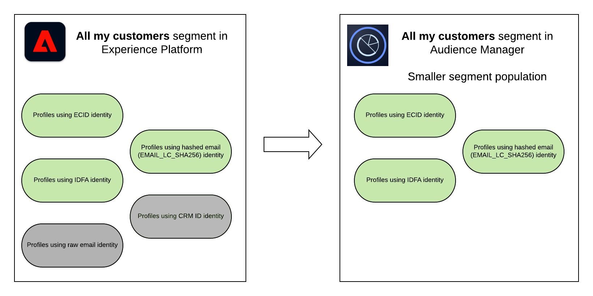

# Experience Platform分部與Audience Manager及其他Experience Cloud解決方案分享

>[!NOTE]
>
> 請與Adobe銷售代表聯繫以解鎖對此功能的訪問權限。

## 概述 {#overview}

Audience Manager和Adobe Experience Platform之間的受眾共用功能允許您將Audience Manager特徵和片段與Adobe Experience Platform共用，反之亦然。 你需要 [[!DNL Audience Manager Connector]](https://experienceleague.adobe.com/docs/experience-platform/sources/connectors/adobe-applications/audience-manager.html) 讓觀眾在Audience Manager和Adobe Experience Platform之間共用。

您可以使用Experience Platform中的Audience Manager特徵和段，將Audience Manager資料添加到客戶配置檔案中並從Experience Platform中獲益 [分段服務](https://www.adobe.io/apis/experienceplatform/home/profile-identity-segmentation/profile-identity-segmentation-services.html#!api-specification/markdown/narrative/technical_overview/segmentation/segmentation-overview.md)。

在Audience Manager中，可以將Experience Platform段用於資料管理平台使用案例，例如：
* 添加 [第三方資料](/help/using/overview/data-types-collected.md#third-party-data) 你的部門；
* [算法建模](/help/using/features/algorithmic-models/understanding-models.md);
* 將段激活到Experience Platform中尚不支援的目標 [目標目錄](https://experienceleague.adobe.com/docs/experience-platform/rtcdp/destinations/destinations-cat/destinations-catalog.html)。

此外，您的Experience Platform段將通過以下方式共用到其他Experience Cloud解決方案： [核心服務](https://experienceleague.adobe.com/docs/core-services/interface/experience-cloud.html)。

>[!IMPORTANT]
>
> * 您需要Audience Manager許可證才能啟用上述資料管理平台使用案例。
> * 你 *不需要* 通過核心服務整合與Adobe Advertising Cloud,Adobe Target,Marketo和其他Experience Cloud解決方案共用Experience Platform分部的Audience Manager許可證。

有關觀眾共用使用案例的概述，請參閱下表：

| **使用個案** | **Adobe Experience Platform** | **Audience Manager** | **核心服務** |
|---------|----------|---------|---------|
| **受眾共用** | <ul><li>使用Audience Manager資料豐富客戶配置檔案</li><li>在Audience Manager分割中使用Experience Platform資料</li></ul> | <ul><li>將第三方資料添加到段</li><li>算法建模</li><li>激活到其他目標</li></ul> | 在其他Experience Platform解決方案(如Adobe Target、Advertising Cloud或Marketo)中使用Experience Cloud段。 |

{style=&quot;table-layout:auto&quot;&quot;

## Audience Manager片段與Adobe Experience Platform性狀 {#aam-segments-traits-in-aep}

您的Audience Manager特徵和段在Experience Platform中顯示為 **觀眾** 的子菜單。 有關Audience Manager段和Experience Platform特徵的詳細資訊，請參閱：

* [分段服務概述](https://experienceleague.adobe.com/docs/experience-platform/segmentation/home.html#audiences)
* [Experience Platform段生成器使用手冊](https://experienceleague.adobe.com/docs/experience-platform/segmentation/ui/overview.html#audiences)
* [Audience Manager連接器](https://experienceleague.adobe.com/docs/experience-platform/sources/connectors/adobe-applications/audience-manager.html)

## Adobe Experience PlatformAudience Manager {#aep-segments-in-aam}

在Experience Platform中建立的段在Audience Manager介面中以信號、特徵和段的形式顯示，具有以下合成規則：

* 信號：對於每個Experience Platform段，您應看到格式中的信號 `segID = segment ID`。
* 特徵：特徵規則是Experience Platform段的ID。
* 段：該段由上述特性組成。

### 信號 {#aep-segments-as-aam-signals}

選擇 **[!UICONTROL Audience Data > Signals > General Online Data]** 搜索 `SegId` 來發現來自Experience Platform的信號。 您可以使用此螢幕進行調試，以檢查是否正確設定了Experience Platform和Audience Manager之間的整合。

### 特徵 {#aep-segments-as-aam-traits}

Audience Manager自動建立名為 **Experience Platform特徵** 你的特質儲備。

可以在段中與其他特徵一起使用自動建立的特徵。 例如，您可以將從Experience Platform段建立的特徵與通過 [Audience Marketplace](/help/using/features/audience-marketplace/audience-marketplace.md)。

有關從Experience Platform段自動建立的特徵的示例，請參閱以下螢幕抓圖：

| 物料編號 | 名稱 | 說明 |
|---------|----------|---------|
| 1 | [!UICONTROL Trait Type] | 從Experience Platform片段中產生的特徵是作為Audience Manager中的附著特徵產生的。 |
| 2 | [!UICONTROL Data Source] | 已自動建立。 從Experience Platform段自動建立的所有特徵和段都儲存在資料源中 **[!UICONTROL Adobe Experience Platform Audience Sharing]**。 |
| 3 | [!UICONTROL Integration Code] | 整合代碼與Experience Platform中的段ID對應。 |
| 4 | [!UICONTROL Trait Expression] | 特質表達是 `segID = segment ID in Experience Platform`。 |
| 5 | [!UICONTROL Segments with this Trait] | 自動建立的段，該段使用此特性作為其組合。 |

{style=&quot;table-layout:auto&quot;&quot;

### 區段 {#aep-segments-as-aam-segments}

Audience Manager自動建立名為 **Experience Platform段** 在段儲存中。

有關從Experience Platform段自動建立的段的示例，請參閱以下螢幕快照：

| 物料編號 | 名稱 | 說明 |
|---------|----------|---------|
| 1 | [!UICONTROL Integration Code] | 整合代碼與Experience Platform中的段ID對應。 |
| 2 | [!UICONTROL Data Source] | 已自動建立。 從Experience Platform段自動建立的所有特徵和段都儲存在資料源中 **[!DNL Adobe Experience Platform Audience Sharing]**。 |
| 3 | [!UICONTROL Profile Merge Rule] | **[!UICONTROL External Merge Policy]** 指示自動建立的段遵循在Experience Platform中設定的合併策略。 |
| 4 | [!UICONTROL Segment Rule] | 該段由 [Traits節](#aep-segments-as-aam-traits)。 |

{style=&quot;table-layout:auto&quot;&quot;

## Audience Manager資料導出控制支援Experience Platform {#aam-data-export-control-in-aep}

為了在Experience Platform中強制實現資料使用合規性，必須為所有適用的資料集和欄位提供適當的 [資料使用標籤](https://experienceleague.adobe.com/docs/experience-platform/data-governance/labels/overview.html)。 另外， [資料使用策略](https://experienceleague.adobe.com/docs/experience-platform/data-governance/policies/overview.html) 必須啟用針對這些標籤的特定市場營銷操作，如 [資料使用標籤和強制(DULE)框架](https://experienceleague.adobe.com/docs/experience-platform/data-governance/home.html#dule-framework)。

在Audience Manager和Experience Platform之間的受眾共用過程中，已應用於Audience Manager分部的任何資料導出控制都會轉換為Experience Platform資料治理所確認的等同標籤和市場營銷操作，反之亦然。

>[!NOTE]
>
>有關資料導出控制的更一般資訊，請參閱 [資料導出控制文檔](https://experienceleague.adobe.com/docs/audience-manager/user-guide/features/data-export-controls.html)。
>
>本文檔提供了有關特定Audience Manager資料導出控制項如何映射到平台中的資料使用標籤和市場營銷操作的參考。

### 資料導出控制項到資料使用標籤

下表概述了特定資料導出控制項如何映射到已識別的資料用法標籤：

| 資料導出控制 | 資料使用標籤 |
| --- | --- |
| 不能與個人身份資訊一起使用 | C3:資料不能與直接可識別資訊組合或以其他方式使用 |
| 無法用於異地廣告目標 | C5:資料不能用於基於興趣的內容或廣告的跨站點目標 |
| 不能用於現場廣告定位 | C6:資料不能用於現場廣告目標 |
| 無法用於現場個性化 | C7:資料不能用於內容的現場目標 |

{style=&quot;table-layout:auto&quot;&quot;

### 將資料導出控制到市場營銷活動

下表概述了特定資料導出標籤如何映射到已識別的市場營銷操作：

| 資料導出標籤 | 營銷活動 |
| --- | --- |
| 此目標可以啟用與個人身份資訊(PII)的組合 | 與PII結合 |
| 此目標可用於非現場廣告目標 | 跨站點目標 |
| 此目標可用於現場廣告定位 | 現場廣告 |
| 此目標可用於現場和個性化 | 現場個性化 |

{style=&quot;table-layout:auto&quot;&quot;

## 瞭解Audience Manager和Experience Platform之間的段群差異 {#aep-aam-segment-population-differences}

段編號可能因Audience Manager段和Experience Platform段而異。 雖然類似或相同受眾的分段數應接近，但人口差異可能是由於下列因素造成的。

### Experience Platform中的段評估

Audience Manager每天更新介面中的報告編號一次。 此更新的時間很少與Experience Platform中的段評估時間一致。

### 配置檔案合併規則與合併策略之間的差異

[[!UICONTROL Profile Merge Rules]](/help/using/features/profile-merge-rules/merge-rules-overview.md) Audience Manager和 [[!UICONTROL Merge Policies]](https://experienceleague.adobe.com/docs/experience-platform/profile/ui/merge-policies.html) 在Experience Platform中，工作方式不同，每個用戶的標識圖也不同。 因此，預計各分子群體之間會存在一些差異。

>[!NOTE]
>
> 當共用從Experience Platform到Audience Manager的段時，您的平台組織 [預設合併策略](https://experienceleague.adobe.com/docs/experience-platform/profile/merge-policies/overview.html?lang=en#default-merge-policy) 優先於 [段使用的合併策略](https://experienceleague.adobe.com/docs/experience-platform/segmentation/ui/segment-builder.html?lang=en#merge-policies) 與Audience Manager共用。 例如，如果共用段的合併策略允許 [ID拼接](https://experienceleague.adobe.com/docs/experience-platform/profile/merge-policies/ui-guide.html?lang=en#configure)，但組織的預設合併策略不會，這可能會導致平台和Audience Manager之間的人口差異。

### Experience Platform

Adobe Experience Platform與Audience Manager的融合有若干標準 [標識命名空間](https://experienceleague.adobe.com/docs/experience-platform/identity/namespaces.html#identity-types) 對於所有客戶：ECID、IDFA、GAID、散列電子郵件地址(EMAIL_LC_SHA256)、AdCloud ID。 如果您的Experience Platform段將其中任何一個用作限定配置檔案的主要標識，則配置檔案將計入Audience Manager特徵和段。

>[!NOTE]
>
> 在Experience Platform中與身份鎖住原始電子郵件的觀眾從不出現在Audience Manager中。

例如，如果您有一個Experience Platform段「所有我的客戶」，並且限定的配置檔案將是CRM ID、ECID、IDFA、原始和散列的電子郵件地址，則Audience Manager中的相應段將僅包括ECID、IDFA和散列的電子郵件地址的配置檔案。 在Audience Manager的部分人口將小於在Experience Platform的部分人口。

<!--

If you created a data source in Audience Manager for the CRM IDs in Experience Platform, then the qualified profiles keyed off those CRM IDs would appear in Audience Manager and the segment population in Audience Manager would increase.

-->

>[!MORELIKETHIS]
>
>* [分段服務概述](https://experienceleague.adobe.com/docs/experience-platform/segmentation/home.html#audiences)
>* [Experience Platform段生成器使用手冊](https://experienceleague.adobe.com/docs/experience-platform/segmentation/ui/overview.html#audiences)
>* [Audience Manager連接器](https://experienceleague.adobe.com/docs/experience-platform/sources/connectors/adobe-applications/audience-manager.html)

