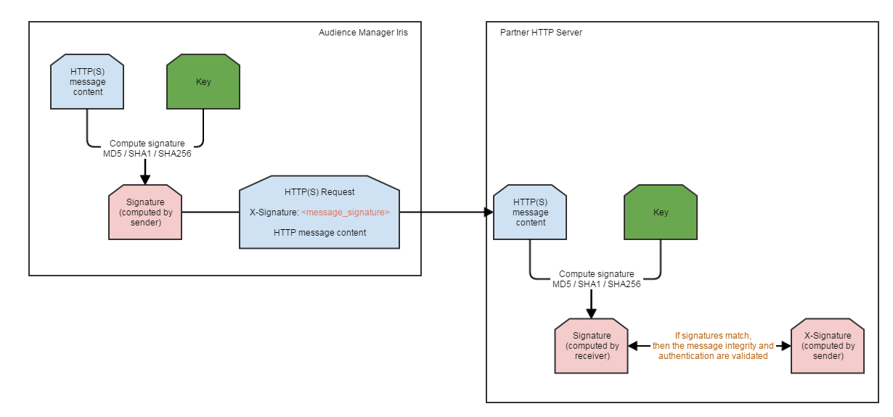

# 數位簽署的 `HTTP(S)` 請求 {#digitally-signed-http-requests}

Audience manager需要 `HTTP(S)` 以數位方式簽署伺服器對伺服器要求，以取得有效性。 本檔案說明如何使用私密金 `HTTP(S)` 鑰簽署要求。

## 概述 {#overview}

<!-- digitally_signed_http_requests.xml -->

使用您提供的私密金鑰並與共 [!DNL Audience Manager]用，我們可以數位簽署 `HTTP(S)`[IRIS](../../../reference/system-components/components-data-action.md#iris) 和HTTP(S)伺服器之間傳送的請求。 這可確保：

* **真實性**:只有具有私密金鑰的傳送者([!UICONTROL IRIS])才能傳送有 `HTTP(S)` 效訊息給合作夥伴。
* **消息完整性**:使用這種方法，即使 `HTTP`是這樣，您也能免受中間攻擊中的人的攻擊，而資訊會被扭曲。

[!UICONTROL IRIS] 已內建支援在無停機情況下旋轉密鑰，如下方「旋轉私 [密密鑰](../../../integration/receiving-audience-data/real-time-outbound-transfers/digitally-signed-http-requests.md#rotate-private-key) 」部分所示。

## 您需要提供的資訊 {#info-to-provide}

若為即 `HTTP(S)` 時伺服器對伺服器目標，請連絡您的顧問並 [!DNL Audience Manager] 指定：

* 用來簽署請求的金鑰。
* 將保存生 `HTTP(S)` 成簽名的標題的名稱（下方標題中的X-Signature）。
* 可選：用於簽名的雜湊類型(md5、sha1、sha256)。

```
* Connected to partner.website.com (127.0.0.1) port 80 (#0)
> POST /webpage HTTP/1.1
> Host: partner.host.com
> Accept: */*
> Content-Type: application/json
> Content-Length: 20
> X-Signature: +wFdR/afZNoVqtGl8/e1KJ4ykPU=
POST message content
```

## How it works {#how-it-works}

1. [!UICONTROL IRIS] 建立要 `HTTP(S)` 發送給合作夥伴的消息。
1. [!UICONTROL IRIS] 根據該訊息和該合作伙 `HTTP(S)` 伴所傳送的私密金鑰建立簽名。
1. [!UICONTROL IRIS] 將請求 `HTTP(S)` 發送給合作夥伴。 此消息包含簽名和實際消息，如上例所示。
1. 合作夥伴伺服器會接收 `HTTP(S)` 請求。 它讀取消息正文和從中接收的簽名 [!UICONTROL IRIS]。
1. 合作夥伴伺服器根據收到的消息正文和私鑰重新計算簽名。 請參 [閱下方的How to calculate the signature](../../../integration/receiving-audience-data/real-time-outbound-transfers/digitally-signed-http-requests.md#calculate-signature) section，瞭解如何達成此目標。
1. 比較在合作夥伴伺服器（接收者）上建立的簽名與從（傳送者）收 [!UICONTROL IRIS] 到的簽名。
1. 如果簽名匹配，則驗證 **真實性****和消息** 完整性。 只有擁有私密金鑰的傳送者才能傳送有效的簽名（真實性）。 此外，中間人無法修改消息並生成新的有效簽名，因為他們沒有私鑰（消息完整性）。



## 如何計算簽名 {#calculate-signature}

[!DNL HMAC] （基於散列的消息驗證代碼）是消息簽名 [!UICONTROL IRIS] 的方法。 基本上每個程式設計語言都提供實作和程式庫。 [!DNL HMAC] 沒有已知的分機攻擊。 請參閱下列范 [!DNL Java] 例：

```
// Message to be signed.
// For GET type HTTP(S) destinations, the message used for signing will be the REQUEST_PATH + QUERY_STRING
// For POST type HTTP(S) destinations, the message used for signing will be the REQUEST_BODY.
// String getData = "/from-aam-s2s?sids=1,2,3";
String postData = "POST message content";
// Algorithm used. Currently supported: HmacSHA1, HmacSHA256, HmacMD5.
String algorithm = "HmacSHA1";
// Private key shared between the partner and Adobe Audience Manager.
String key = "sample_partner_private_key";
  
// Perform signing.
SecretKeySpec signingKey = new SecretKeySpec(key.getBytes(), algorithm);
Mac mac = Mac.getInstance(algorithm);
mac.init(signingKey);
byte[] result = mac.doFinal(postData.getBytes());
  
String signature = Base64.encodeBase64String(result).trim(); 
// signature = +wFdR/afZNoVqtGl8/e1KJ4ykPU=
```

散列實施的RFC [!DNL HMAC] 是 [https://www.ietf.org/rfc/rfc2104.txt](https://www.ietf.org/rfc/rfc2104.txt)。 測試網站： [https://asecuritysite.com/encryption/hmac](https://asecuritysite.com/encryption/hmac) (請注意，您必須將 [十六進位編碼轉](https://tomeko.net/online_tools/hex_to_base64.php?lang=en) 換為base64)。

## 旋轉私密金鑰 {#rotate-private-key}

出於安全考慮，建議定期旋轉私密金鑰。 由您決定私密金鑰和旋轉期間。 為了在零停機時實現密鑰輪替，支援 [!UICONTROL IRIS] 添加多個簽名標頭。 一個標題將包含舊金鑰產生的簽名，另一個標題將包含使用新私密金鑰產生的簽名。 請參閱以下步驟：

1. 合作夥伴會將新的私密金鑰通訊給 [!DNL Adobe Audience Manager]您。
1. [!UICONTROL IRIS] 將開始傳送兩個簽名標題（一個使用舊金鑰，另一個使用新金鑰）。
1. 在您開始收到兩個標題後，可以選擇捨棄舊金鑰，只查看新簽名。
1. 舊金鑰會從中移除， [!DNL Audience Manager] 且只 [!UICONTROL IRIS] 會傳送新的簽名標題。 鍵已旋轉。

## 用於簽署的資料 {#data-signing}

對於 `GET` 類型目標，用於簽署的訊息將是 *REQUEST_PATH + QUERY STRING* (例如 */from-aam-s2s?sids=1,2,3*)。 IRIS不會考慮主機名稱或標題 `HTTP(S)` -這些名稱可沿路徑修改／設定錯誤，或報告錯誤。

對於 `POST` 類型目標，用於簽署的訊息是 *REQUEST BODY*。 同樣地，標題或其他請求參數也會被忽略。
