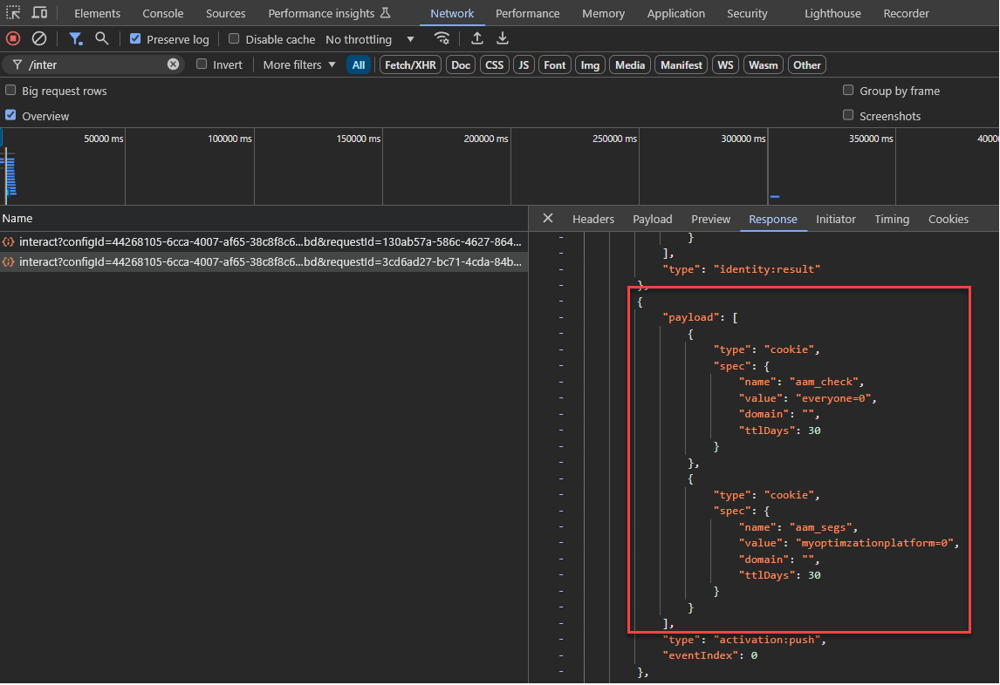

# 將您的Audience Manager資料收集程式庫從AppMeasurement更新為Web SDK

## 目標對象 {#intended-audience}

此頁面適用於使用[!DNL AppMeasurement] JavaScript資料庫將Web資料傳送至Audience Manager的Audience Manager和Adobe Analytics客戶。

請參閱下表，瞭解移轉至Web SDK的步驟指南（視您目前的資料收集方法而定）。

| 您現有的資料收集方法 | 網頁SDK移轉指示 |
|---------|----------|
| 具有AudienceManagement模組的[!DNL AppMeasurement] JavaScript資料庫 | 請依照本指南的指示操作。 |
| [!DNL Audience Manager] [標籤延伸模組](https://experienceleague.adobe.com/en/docs/experience-platform/tags/extensions/client/audience-manager/overview) | 依照[中的指示將您的資料收集程式庫從Audience Manager標籤擴充功能更新為Web SDK標籤擴充功能](dil-extension-to-web-sdk.md)。 |
| [!DNL AppMeasurement] JavaScript資料庫+獨立[!DNL Audience Manager] [DIL資料庫](../dil/dil-overview.md) | 依照[中的指示將您的資料收集程式庫從Audience Manager標籤擴充功能更新為Web SDK標籤擴充功能](dil-extension-to-web-sdk.md)。 |

## 移轉概述 {#overview}

從[!DNL AppMeasurement]移轉至[Web SDK](https://experienceleague.adobe.com/en/docs/experience-platform/web-sdk/home)主要是Adobe Analytics移轉。 針對Audience Manager客戶，此移轉作業也包含Audience Manager。 兩者必須一起移轉。 如果您主要使用Audience Manager，請務必讓Analytics團隊參與此移轉。

如果您使用[!DNL AppMeasurement]進行Audience Manager資料收集，目前您正使用[!DNL Server-side Forwarding (SSF)]方法將分析資料傳送至Audience Manager。 在此設定中，Analytics資料收集請求會轉送至Audience Manager，後者也會處理頁面的Audience Manager回應。

這是多年的標準方法，很可能是您目前的設定。 如果您的[!DNL AppMeasurement]程式庫包含`AudienceManagement`模組，而您的資料收集呼叫在要求(`/b/ss/examplereportsuite/10/`)中包含`/10/`路徑，則本指南適用於您。

## 伺服器端轉送(SSF)與Web SDK資料流程 {#data-flows}

瞭解Analytics與Audience Manager在移至Web SDK (和Edge Network)時的資料流程差異，對於下列指示至關重要。

透過伺服器端轉送，Analytics區域資料收集節點會收集資料，將其轉換為Audience Manager接受的訊號，傳送至Audience Manager，並將Audience Manager回應傳回至頁面。 [!DNL AppMeasurement]程式庫中的[!DNL AudienceManagement]模組接著會處理回應（例如，卸除Cookie、傳送URL目的地）。 此程式稱為伺服器端轉送，因為Analytics會使用Adobe伺服器將資料轉送至Audience Manager。

透過Web SDK，Edge Network會以不同動作將資料傳送至Analytics和Audience Manager。 Web SDK是單一資料庫，可將資料傳送至所有解決方案，而Edge Network會將與解決方案無關的資料點轉換為解決方案專用格式。

在這個新的資料流程中，所有資料都會傳送到Edge Network [資料串流](https://experienceleague.adobe.com/en/docs/experience-platform/datastreams/overview)，您可以[設定](https://experienceleague.adobe.com/en/docs/experience-platform/datastreams/configure)，視需要傳送資料到Adobe解決方案。 若為Audience Manager，在資料流上啟用Audience Manager服務會將[!DNL XDM]和Analytics資料轉換為Audience Manager接受的訊號。 Edge Network也會將Audience Manager回應傳回至頁面，其中Web SDK會處理回應，類似於[!DNL AppMeasurement]和[!DNL AudienceManagement]模組的處理方式。

## 標籤與非標籤移轉 {#tags-vs-non-tags}

無論您是使用具有[!DNL AppMeasurement]擴充功能的標籤、其他標籤管理系統中的[!DNL AppMeasurement]資料庫，或直接在頁面上放置[!DNL AppMeasurement]，將Audience Manager移轉至Web SDK的步驟均相同。 由於Audience Manager移轉取決於Analytics移轉，因此從[!DNL AppMeasurement]移轉至Web SDK的步驟會在Analytics移轉期間決定。

該資訊包含在[標籤](https://experienceleague.adobe.com/en/docs/analytics/implementation/aep-edge/web-sdk/analytics-extension-to-web-sdk)或[JavaScript](https://experienceleague.adobe.com/en/docs/analytics/implementation/aep-edge/web-sdk/appmeasurement-to-web-sdk)型實作的Analytics檔案中。

## XDM和`data.__adobe.`節點 {#xdm-data-nodes}

[網頁SDK](https://experienceleague.adobe.com/en/docs/experience-platform/web-sdk/home)的主要功能之一，是將資料傳送至[Real-Time Customer Data Platform (RTCDP)](https://experienceleague.adobe.com/en/docs/experience-platform/rtcdp/home)。 為達成此目的，同時仍收集其他Experience Cloud解決方案的資料，而不需要完全重新實作，解決方案特定資料會在資料收集伺服器呼叫中加以區隔。 此呼叫使用名為[體驗資料模型(XDM)](https://experienceleague.adobe.com/en/docs/experience-platform/xdm/home)的標準化JSON結構描述

與解決方案無關的元素（例如關於瀏覽器和裝置的資訊），會以預先確定的XDM結構傳送至Edge Network。 Edge Network會將此資料轉換為解決方案專用格式。 不過，Target、Analytics和Audience Manager專屬的資料會儲存在XDM裝載內的專用`data.__adobe`節點中。

例如：

* Analytics變數`s.eVar1`在XDM承載中呈現為`data.__adobe.analytics.evar1`。
* 與客戶忠誠度狀態相關的Target引數會儲存為`data.__adobe.target.loyaltyStatus`。

`__adobe`節點中的資料會傳送至個別解決方案(例如Analytics和Audience Manager)，而不會傳送至Experience Platform，即使資料流中已啟用Experience Platform服務亦然。 這表示您可以保留Analytics和Audience Manager的目前設定，同時還能彈性地將任何必要的資料元素對應到XDM結構描述元素，以在Experience Platform中使用[資料收集的資料準備](https://experienceleague.adobe.com/en/docs/experience-platform/datastreams/data-prep)的即時使用案例。

例如，在結帳期間用於報告購物車內容的Analytics `s.products`字串仍可以原始格式傳送給Analytics和Audience Manager。 同時，您可以使用此字串的元素，針對Experience Platform使用案例建立更直覺式的XDM購物車結構描述。

由於大多數Audience Manager實作都仰賴轉送至Audience Manager的Analytics資料，因此您的許多Audience Manager特徵運算式可能會以Analytics變數（`c_evar#`、`c_prop#`和`c_events`）為基礎。 為避免在移轉期間使用XDM格式重建特徵運算式，Edge Network預設會設定為將`data.__adobe.analytics`節點中找到的任何Analytics變數轉換為Audience Manager訊號。 類似的轉換程式會在伺服器端轉送工作流程中進行。

Edge Network可以執行此轉換，因為來自頁面的單一資料收集呼叫會傳送到單一資料流，以饋送多個Adobe解決方案。 因此，大部分從[!DNL AppMeasurement]移轉至Analytics和Audience Manager的Web SDK時，都會主要使用`data.__adobe.analytics`節點。

Edge Network會將XDM裝載和封包標題中的裝置和瀏覽器資料轉換為Audience Manager訊號。 這可讓您繼續在Audience Manager特徵運算式中使用`h_`和`d_`平台金鑰。

## `data.__adobe.audiencemanager`節點 {#data-note}

`data.__adobe.audiencemanager`節點用於不依賴Analytics的Audience Manager實作。 它儲存先前透過[Audience Manager資料庫](../dil/dil-overview.md)傳送的自訂DIL金鑰/值組，如[標籤延伸功能移轉指南](dil-extension-to-web-sdk.md)所述。

雖然本指南概述的移轉不需要`data.__adobe.audiencemanager`節點，但此處說明的新資料流程可讓資料傳送至Audience Manager，而不需在Analytics中記錄。

如果您需要傳送自訂索引鍵/值組至Audience Manager，而不將其納入Analytics，則可使用`data.__adobe.audiencemanager`節點。 此節點中的任何資料集都會附加至資料收集伺服器呼叫中Audience Manager轉換的Analytics資料。

## 此實作路徑的優缺點

使用此移轉方法的優缺點。 請仔細權衡每個選項，決定哪種方式最適合您的組織。

| 優勢 | 缺點 |
| --- | --- |
| <ul><li>**使用您現有的實作**：雖然此方法需要一些實作變更，但它不需要從頭開始的全新實作。 您可以使用現有的資料層和程式碼，只需對實作邏輯進行最低限度的變更。</li><li>**不需要結構描述**：對於移轉至Web SDK的這個階段，您不需要XDM結構描述。 相反地，您可以填入`data`物件，這會直接將資料傳送到Audience Manager。 一旦移轉至Web SDK完成，您就可以為貴組織建立結構描述，並使用資料流對應來填入適用的XDM欄位。 如果移轉流程的這個階段需要結構描述，貴組織將被強制使用Audience Manager XDM結構描述。 使用此結構描述會使您的組織未來更難以使用您自己的結構描述。</li></ul> | <ul><li>**實作技術債**：由於此方法使用您現有實作的修改形式，因此可能更難追蹤實作邏輯，並在日後需要時執行變更。</li><li>**需要對應才能將資料傳送至Platform**：當您的組織準備好使用Real-Time CDP時，您必須將資料傳送至Adobe Experience Platform中的資料集。 此動作要求`data`物件中的每個欄位必須是資料流對應工具中的專案，以將其指派給XDM結構描述欄位。 此工作流程只需對應一次，不需要變更實作。 不過，這是在XDM物件中傳送資料時不需要的額外步驟。</li></ul> |

Adobe建議在下列情況下使用此實施路徑：

* 您已有使用Adobe Analytics AppMeasurement JavaScript資料庫的實作。 如果您有使用Audience Manager標籤擴充功能的實作，請改為遵循[從Audience Manager標籤擴充功能移轉至Web SDK標籤擴充功能](dil-extension-to-web-sdk.md)。
* 您打算在未來使用Real-Time CDP，但不想從頭開始使用Web SDK實作來取代Audience Manager實作。 使用Web SDK從頭開始取代實作的替代方案需要您盡最大努力，因為您需要重新建置所有Audience Manager特徵，以尋找XDM格式資料。 不過，這也是最可行的長期實作架構。 如果您的組織願意徹底實施網頁SDK，請參閱[網頁SDK檔案](https://experienceleague.adobe.com/en/docs/experience-platform/web-sdk/home)，而非使用本指南，以取得詳細資訊。

## 移轉至Web SDK所需的步驟

請依照下列步驟，將您的資料收集整合移轉至Web SDK。

+++**1. 規劃Analytics移轉**。

請與您的Analytics團隊合作，遵循[標籤](https://experienceleague.adobe.com/en/docs/analytics/implementation/aep-edge/web-sdk/analytics-extension-to-web-sdk)或[JavaScript](https://experienceleague.adobe.com/en/docs/analytics/implementation/aep-edge/web-sdk/appmeasurement-to-web-sdk)型實作中的Analytics移轉步驟。 在您規劃Analytics移轉後，請返回本指南並繼續Audience Manager步驟，以決定您需要針對Audience Manager執行的操作，好讓Analytics和Audience Manager移轉可同時部署。

+++

+++**2.將Audience Manager服務新增至資料流**

將Audience Manager服務新增至您在步驟1提及的Analytics移轉中使用的資料流。

1. 導覽至[experience.adobe.com](https://experience.adobe.com)並使用您的認證登入。
1. 使用右上方的首頁或產品選擇器來導覽至&#x200B;**[!UICONTROL Data Collection]**。
1. 在左側導覽中，選取&#x200B;**[!UICONTROL Datastreams]**。
1. 選取您在步驟1的Analytics移轉過程中建立的資料串流。
1. 選取&#x200B;**[!UICONTROL Add Service]**。
1. 在服務下拉式功能表中，選取&#x200B;**[!UICONTROL Audience Manager]**。
1. 檢查&#x200B;**[!UICONTROL Cookie Destinations Enabled]**&#x200B;和&#x200B;**[!UICONTROL URL Destinations Enabled]**&#x200B;選項。 這些選項可讓Edge Network將這些Audience Manager目的地型別傳回頁面。
1. 確定&#x200B;**[!UICONTROL Enable XDM Flattened Fields]**&#x200B;已停用。 此選項會停用Analytics變數自動轉換為Audience Manager訊號的功能。 此選項旨在為在Edge Network自動將Analytics資料轉換為Audience Manager訊號之前移轉至Web SDK的使用者維持回溯相容性。

   >[!NOTE]
   >
   >若要在啟用&#x200B;**[!UICONTROL Enabled XDM Flattened Fields]**&#x200B;選項的情況下移轉至Web SDK，需要更新Audience Manager中格式化為XDM的任何資料，以及使用prop、eVar或事件的所有Audience Manager特徵，以尋找XDM格式的資料。 Adobe建議停用此選項。

    {style="border:1px solid lightslategray"}

1. 選取&#x200B;**[!UICONTROL Save]**&#x200B;以儲存資料流組態。

您的資料流現在已準備好接收資料並傳遞給Audience Manager。 請記下資料串流ID，因為在程式碼中設定網頁SDK時需要此ID。

+++

+++**3.啟用協力廠商ID同步並設定Audience Manager容器識別碼**

1. 導覽至[experience.adobe.com](https://experience.adobe.com)並使用您的認證登入。
1. 使用右上方的首頁或產品選擇器來導覽至&#x200B;**[!UICONTROL Data Collection]**。
1. 在左側導覽中，選取&#x200B;**[!UICONTROL Datastreams]**。
1. 選取您在步驟1的Analytics移轉過程中建立的資料串流。
1. 選取資料流設定頁面右上角的&#x200B;**[!UICONTROL Edit]**。
1. 展開&#x200B;**[!UICONTROL Advanced Options]**&#x200B;下拉式功能表，並啟用&#x200B;**[!UICONTROL Third Party ID Sync]**&#x200B;功能（如果尚未啟用）。 此選項會通知Edge Network傳回Audience Manager與Experience Platform資料合作夥伴的合作夥伴ID同步。

    {style="border:1px solid lightslategray"}

1. 在大多數情況下，您可以將&#x200B;**[!UICONTROL Third Party ID Sync Container ID]**&#x200B;欄位保留空白。 它將預設為`0`。 不過，如果您偏好確保使用正確的容器ID，請遵循下列步驟：
   * 以無痕模式或私密模式開啟瀏覽器視窗，並導覽至屬於移轉一部分的頁面。
   * 使用瀏覽器的開發人員工具來篩選`dpm.demdex.net/id`的網路呼叫。 此呼叫只會在首次造訪的第一個頁面上觸發，因此需要無痕瀏覽器或私人瀏覽器。
   * 檢視請求的裝載。 如果`d_nsid`引數不是零，請將其複製到&#x200B;**[!UICONTROL Third Party ID Sync Container ID]**&#x200B;欄位。

1. 選取&#x200B;**[!UICONTROL Save]**。

您的資料流現在已準備好將資料傳送至Audience Manager，並將Audience Manager回應傳遞至Web SDK。

+++

+++**4.將客戶ID新增至身分對應**

大多數Audience Manager實作會在跨裝置個人化案例中使用[設定檔合併規則](../features/profile-merge-rules/merge-rules-overview.md)，並協助根據訪客的驗證狀態（登入或登出）控制訪客可以符合的區段。 設定檔合併規則要求客戶擁有的識別碼（CRM ID、帳號等）在驗證後每次資料收集呼叫時傳送至Audience Manager。 先前，訪客ID服務([!DNL visitor.js])的`setCustomerIDs`函式是用來將客戶ID附加至每個Analytics資料收集呼叫，然後再轉送至Audience Manager。

透過Web SDK，這些身分現在需要使用名為[IdentityMap](https://experienceleague.adobe.com/en/docs/experience-platform/xdm/field-groups/profile/identitymap)的特殊XDM建構傳送至Edge Network。

若要在身分對應中正確傳遞身分，必須瞭解[身分名稱空間](https://experienceleague.adobe.com/zh-hant/docs/experience-platform/identity/features/namespaces)，並仔細考慮要傳遞哪些身分，尤其是在將資料傳送至Experience Platform沙箱時。 [本文章](https://experienceleague.adobe.com/en/docs/experience-cloud-kcs/kbarticles/ka-21305)概述這些考量事項和指示。

決定要傳遞的身分以及傳遞時間後，請遵循標籤內使用[!UICONTROL Identity map] **[!UICONTROL Identity map]** [資料元素](https://experienceleague.adobe.com/en/docs/experience-platform/tags/extensions/client/web-sdk/data-element-types#identity-map)的指南，或如[身分資料概觀](https://experienceleague.adobe.com/en/docs/experience-platform/web-sdk/identity/overview)中所述手動設定，以符合您的Web SDK部署策略。

+++

+++**5.（選用）設定第一方`aam_uuid` Cookie**

許多年的標準作法是將Audience Manager UUID （第三方Demdex Cookie中的值）放在通常名為`aam_uuid`的第一方Cookie中。

若要設定Cookie，您必須在設定`audienceManagementModule`時，於Analytics標籤擴充功能之&#x200B;**[!UICONTROL Unique User ID Cookie]**&#x200B;區段的&#x200B;**[!UICONTROL Name]**&#x200B;欄位或`uuidCookie`欄位中輸入Cookie名稱。 雖然程式碼中通常會設定，但Cookie很少使用，因為Audience Manager UUID值是廣告平台使用的裝置專屬跨網域識別碼，且很少提供做為第一方識別碼的值。

如果您發現實作需要此`aam_uuid` Cookie才能在移轉至Web SDK後繼續設定，您可以使用兩種方式擷取Audience Manager UUID。

1. 來自[Edge Network互動端點](https://developer.adobe.com/data-collection-apis/docs/endpoints/interact/)的每個回應都包含具有`id`個節點的承載。 `CORE`名稱空間承載的`id`節點包含Audience Manager UUID。

2. 使用Web SDK的[getIdentity](https://experienceleague.adobe.com/en/docs/experience-platform/web-sdk/commands/getidentity)命令來擷取它。 使用檔案中列出的`CORE`名稱空間，並從回應中的`identity.CORE`欄位擷取值。

不論使用何種方法擷取Audience Manager UUID，開發團隊都必須剖析回應、擷取UUID並設定Cookie。 無法透過網頁SDK自動設定此Cookie。

+++

## 在Analytics報表套裝管理器UI中設定伺服器端轉送和Audience Analytics {#configure-ssf-analytics}

如果您熟悉Analytics [伺服器端轉送](https://experienceleague.adobe.com/en/docs/analytics/admin/admin-tools/manage-report-suites/edit-report-suite/report-suite-general/server-side-forwarding/ssf)功能，可能會想知道：「*是否應在Analytics報表套裝管理員UI中停用伺服器端轉送設定，以防止將Analytics資料傳送至Audience Manager兩次？*」。

答案是否定的，您不可以停用此設定，原因如下：

1. 在資料流上啟用Audience Manager服務時，Edge Network會將`cm.ssf`變數附加至傳送給Analytics的所有資料收集請求。 這麼做也會防止Analytics資料傳送至Audience Manager。 當資料流上啟用Assurance服務時，用於驗證Analytics移轉的任何Audience Manager記錄都會顯示`cm.ssf=1`變數。 如需詳細資訊，請參閱伺服器端轉送的[Analytics和GDPR法規遵循頁面](https://experienceleague.adobe.com/en/docs/analytics/admin/admin-tools/manage-report-suites/edit-report-suite/report-suite-general/server-side-forwarding/ssf-gdpr)。

1. 此設定也會啟用[!DNL Audience Analytics]整合的資料流。 如[Audience Analytics概觀](https://experienceleague.adobe.com/en/docs/analytics/integration/audience-analytics/mc-audiences-aam)中所述，此整合需要伺服器端轉送，因為對Analytics資料收集伺服器的Audience Manager回應會在處理前新增至Analytics點選。 Edge Network中也會發生類似的程式。 啟用伺服器端轉送時，Edge Network會將必要區段從Audience Manager回應新增至傳送至Analytics的資料。

總而言之，此設定必須保持啟用，以便Audience Analytics可繼續在Web SDK實作中運作，而且沒有任何資料會在Audience Manager中重複計算。

## 驗證移轉 {#validation}

現在，所有Adobe解決方案都透過單一Web SDK呼叫提供服務，驗證步驟會因Web SDK提供的解決方案而異。

如果Adobe Target或Adobe Journey Optimizer （包括[!DNL Decisioning]）屬於實作所服務的解決方案棧疊的一部分，則您將在頁面上擁有對Edge Network的多個網路呼叫。 其中有些是用來擷取個人化和選件，有些是用來收集資料和製作報表。

無論您的實作為何，以下一般原則適用於驗證資料是否透過Web SDK正確流進或流出Audience Manager。

1. 第一頁首次訪客的第一個網路呼叫將前往`adobedc.demdex.net`網域和`/interact`端點。 您可以開啟網頁瀏覽器上的[開發人員]索引標籤，按一下[網路]索引標籤，然後篩選`/interact`，以檢視Web SDK所發出的網路呼叫。
還有其他型別的Web SDK呼叫，但只有`interact`個呼叫會將資料傳送至Edge Network，並從取得回應裝載。

   

1. 第一個網路呼叫的回應有多個負載。 其中一個裝載節點包含數個型別`url`的子節點。 這`url`個節點是過去由[!DNL Visitor ID]服務引發的第三方ID同步。 在您的容器中設定的每個協力廠商ID同步應該有一個`url`節點（請參閱上述步驟3）。

   

   此外，您可以依`demdex`篩選，並發現裝載中參照的每個URL都引發其自己的ID同步網路要求，就像[!DNL Visitor ID]服務一樣。 這些ID同步只應在首次訪客的第一個頁面上引發，而且之後每14天才引發一次。

1. 用於Analytics和Audience Manager資料收集的任何後續`/interact`請求都應在承載中包含`data.__adobe.analytics`節點。

   

   依賴這些Analytics變數的Audience Manager特徵，以及使用`h_`或`d_`平台金鑰的特徵應繼續填入。

   >[!TIP]
   >
   >您可能想要使用規則運算式建立測試特徵，該特徵只有在收集Web SDK資料時才能表達。 由於沒有開發Audience Manager環境，並且多個網站可能會將資料傳送至相同的Audience Manager執行個體，因此只檢視整體母體計數可能無法提供您所需的驗證。

1. 在傳遞Analytics變數的相同`/interact`呼叫中，可以在回應的裝載節點中找到任何Cookie或URL目的地。 URL目的地會位於型別為`url`的裝載（就像在第三方ID同步中一樣），而Cookie目的地會位於型別為`cookie`的裝載。

   

   您也應確定Cookie已放入瀏覽器的Cookie儲存空間中。

   >[!TIP]
   >
   >與先前的驗證步驟類似，為應傳回Cookie目的地的區段授予資格是確保資料進出於Audience Manager的一種特定方式。

1. 如果您需要透過「身分對應」傳遞其他客戶ID，請在網站中驗證，並確保在要求裝載的「身分對應」節點中傳遞身分及其相關引數。

   

   >[!TIP]
   >
   >如果Adobe Target是其中一個接收解決方案，且有Target活動依賴Audience Manager區段，而需要傳遞正確的身分，請確定身分對應是在用於擷取個人化的`/interact`呼叫中傳遞，而不只是資料收集呼叫中傳遞。 擷取區段資訊時，Adobe Target將在對Audience Manager的伺服器端呼叫中使用這些身分識別。

