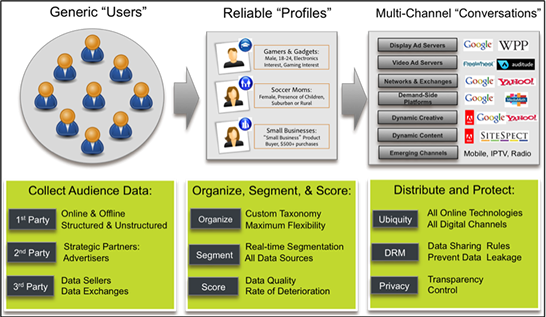

# Audience Manager Overview {#audience-manager-overview}

Audience Manager可幫助您整合受眾資料資產，讓您輕鬆收集有關網站訪客的商業相關資訊、建立可行銷的細分，並將針對性廣告和內容提供給適當的受眾。此外，Audience Manager還提供強大的資料收集、控制和保護功能，提供簡單的標籤部署和管理功能。

借助Audience Manager，您不會系結至資料賣方、交換或需求端平台。此外，Audience Manager對於我們合作夥伴的資料資產來說，完全不受限制。借由存取多個資料來源，Audience Manager可讓數位出版業者使用各種第三方資料以及我們的私人資料合作社。與我們的合作夥伴解決方案團隊洽談，瞭解如何針對目標受眾做出明智且準確的決策。

## History and Background {#history-and-background}

Audience Manager於2008年推出Demdex。Adobe Systems於2011年被Adobe Systems收購，後來更名為Audience Manager。

<!-- 

c_history_and_background.xml

 -->

## History {#history}

Since 2008, Audience Manager (formerly, [!UICONTROL Demdex]) has been a pioneer in the on-line audience management market. Audience Manager服務支援動態、多通道的線上資料策略。我們的平台和服務廣受多種不同產業的使用，包括汽車製造商(AutoTrade)、航空公司(美國航空公司)和金融服務公司(American Express)。Audience Manager使用企業級技術提供規模、穩定性、分析和效能，以協助您的企業成功上線。Audience Manager與Adobe Experience Cloud整合，幫助您在數位位址可定址管道中集中管理、管理和採取行動。

## Audience Manager and its Data Management Platform (DMP) {#aam-dmp}

Audience Manager可協助您管理資料管線。我們的服務是一種催化劑，可將一般使用者和原始資料訊號轉化為用於多管道行銷舉措的實際受眾區段。此外，Audience Manager還提供標籤管理和受眾分析工具，同時滿足客戶和消費者的隱私和資料安全性需求。

