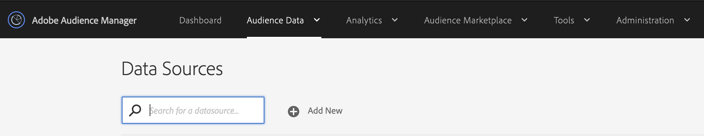

# Audience Manager中的協助功能 {#accessibility}

## 概述 {#overview}

可接受性是指讓軟體產品可使用的一系列功能，讓視覺、聽覺、認知、運動或其他各種殘障人士盡可能少的努力。

Adobe是協助工具的業界領導者，鼓勵開發人員製作可供所有使用者存取的豐富精彩內容，以支援建立出色的網頁體驗。 如需Adobe對協助工具承諾的詳細資訊，請參閱 [Adobe協助工具](https://www.adobe.com/accessibility.html)。

軟體產品中最常見的協助功能包括：鍵盤導覽、語義結構、前景元素與背景元素的充分對比、輔助技術支援、清晰元素標籤等。

為了讓每 [!DNL Audience Manager] 個人都能更輕鬆使用，我們開發了支援多種協助功能。

## 鍵盤導覽 {#keyboard-navigation}

[!DNL Audience Manager] 支援完整的鍵盤協助功能：

* 鍵 `Tab` 和箭頭會在使用者介面的個別元素之間移動。

   

* 和 `Return` 鍵 `Space` 會啟動選取的項目。

## 可訪問表排序 {#table-sorting}

在透過索引鍵導覽時，表格標 `Tab` 題是可選取的，而且您可以按一下來變更排序順序 `Space`。

## 支援協助技術 {#assistive-technologies}

通過使用語義代碼和 [ARIA](https://www.w3.org/WAI/standards-guidelines/aria/)[!DNL Audience Manager] ，用戶介面中的交互元素包括相應的標籤、可訪問的名稱和角色，這些元素標識了它們的目的和當前狀態。

這可確保輔助技術（例如螢幕閱讀器）可向使用者讀出標籤和其他資訊，讓使用者輕鬆與應用程式控制項互動。

Audience Manager使用者介面中的所有互動元素都包含對應的標籤。 這可確保輔助技術（例如螢幕閱讀器）能夠向用戶讀出標籤。

## 顏色與對比 {#colors-contrast}

使 [!DNL Audience Manager] 用者介面致力於提供應用程式足夠的對比，以確保視覺或色彩不足的使用者可存取的檢視體驗。

例如，載入畫麵包含白色模態方塊內的載入微調按鈕，全都在深灰色覆蓋的上方。

## 進一步閱讀 {#further-reading}

[!DNL Audience Manager] 致力於提供日益普及的協助功能，讓產品更容易讓每個人使用。

若要進一步瞭解我們的協助工具改進和合規性狀態，請參閱協助工具符合性報表。

此外，我們鼓勵您使用 [Adobe協助工具意見表](https://www.adobe.com/accessibility/feedback.html) ，傳送您遇到的改進建議和協助工具問題。 我們非常樂意考慮您的意見並加以改進 [!DNL Audience Manager]。