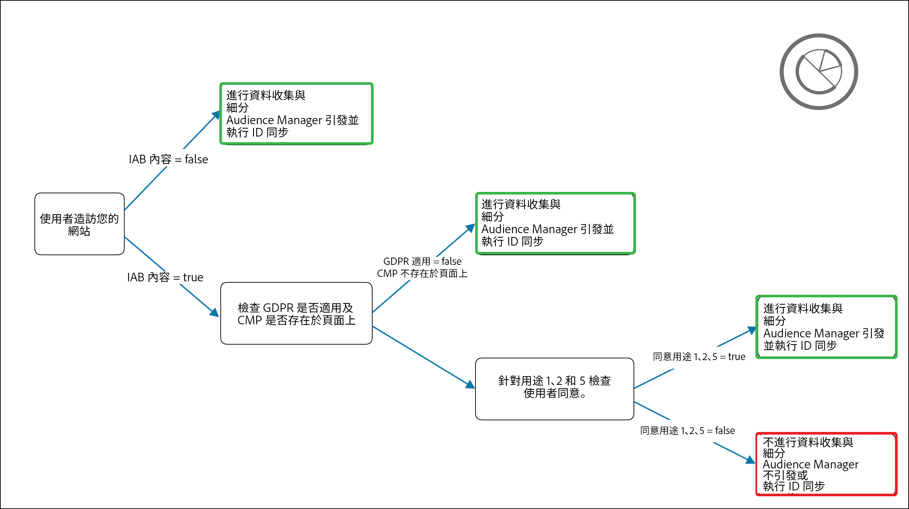

# 適用 IAB TCF 的 Audience Manager 增效模組 {#aam-iab-plugin}

## 概述

您可能對使用者承擔的隱私權義務中的一個重要方面，是針對個人資料的使用方式（即「用途」）及其使用者（即「公司」），取得並傳遞使用者選擇。

Adobe 可讓您透過[選擇加入功能](https://docs.adobe.com/content/help/en/id-service/using/implementation/opt-in-service/optin-overview.html)和 [IAB 透明與同意架構 (TCF)](https://iabtechlab.com/standards/gdpr-transparency-and-consent-framework/)，管理使用者的隱私權選擇，並與使用者針對該選擇溝通。

本文說明支援 IAB TCF 的 Audience Manager 使用案例，講解如何在 Audience Manager 中實作 IAB TCF 支援。

>[!IMPORTANT]
>
>Audience Manager已在 [IAB TCF中註冊](https://iabeurope.eu/tcf-for-vendors/) ，廠商ID為565。

IAB TCF的Audience Manager外掛程式運用 [Opt-in功能](https://docs.adobe.com/content/help/en/id-service/using/implementation/opt-in-service/iab.html)，而 [Adobe Experience Platform Identity Service(ECID)程式庫也是其一部分](https://docs.adobe.com/content/help/en/id-service/using/home.html) 。

## 範圍和限制 {#scope-and-limitations}

身為使用Audience Manager的發佈者或廣告商，您可以依據IAB TCF，將使用者選擇傳達給Audience Manager。

>[!IMPORTANT]
>
>IAB TCF規定僅適用於位於歐洲經濟區的訪客。

Audience Manager可協助您尊重使用者的隱私權選擇，並提供您簡單的方式，讓您與所有合作夥伴溝通這些選擇。

目前，Audience Manager不支援：

* 行動裝置工作流程；
* 附加同意書至區段出口。

## 必備條件 {#prerequisites}

>[!IMPORTANT]
>
>Audience Manager支援IAB TCF v2.0。
>
>IAB TCF v1.1支援將於2020年8月15日終止。
>
> 想要繼續使用Audience Manager Plug-in for IAB TCF進行許可管理的客戶，應升級至最新版 [ECID](https://github.com/Adobe-Marketing-Cloud/id-service/releases) ，以取得持續支援。
>
> 升級至最新 [ECID版本後](https://github.com/Adobe-Marketing-Cloud/id-service/releases) ，將不再支援IAB TCF v1.1同意字串，因此請務必在升級至最新ECID版本之前更新CMP。

您必須符合下列必要條件，才能搭配Audience Manager使用IAB TCF的Audience Manager外掛程式：

1. 您必須使用Adobe Experience Platform Identity Service(ECID)第5版或更新版本。 [下載我們](https://github.com/Adobe-Marketing-Cloud/id-service/releases) 最新的ECID版本。
2. 您必須使用Audience Manager資料整合庫(DIL)9.0版或更新版本，可從此處 [下載](https://github.com/Adobe-Marketing-Cloud/dil/releases)。 閱讀Audience Manager文 [件中的DIL相關資訊](../..//dil/dil-overview.md)。 我們建議使 [用Adobe Launch](https://docs.adobe.com/content/help/en/launch/using/extensions-ref/adobe-extension/adobe-audience-manager-extension.html) ，以便針對Audience Manager進行最簡單的DIL實作。
3. 或者，如果您使用伺服器端轉送(SSF)將資料匯入Audience Manager，則必須升級至最新版的AppMeasurement。 使用Analytics代碼管理 [器下載AppMeasurement](https://docs.adobe.com/content/help/en/analytics/admin/admin-tools/code-manager-admin.html)。
4. 您必須使用與IAB TCF v2.0整合併已向IAB TCF註冊的「同意管理平台」(CMP)，不論是商業版或您自己的版本。 請參見在IAB框架 [中註冊的CMP的清單](https://iabeurope.eu/cmp-list/)。

>[!WARNING]
>
>如果您使用不支援IAB TCF v.2.0的「同意管理平台」(CMP),Audience Manager會自動以ID同步方式傳送參數，即使您的訪客是在歐盟地區亦然。 `gdpr=0` 要確定您的GDPR驗證是否處於活動狀態，建議您向許可管理平台(CMP)確認它們支援IAB TCF v2.0。

## 建議及實施方式 {#recommendations}

若要在Audience Manager中啟用IAB TCF支援，請閱讀我們的檔案，了 [解如何使用選擇加入設定IAB](https://docs.adobe.com/content/help/en/id-service/using/implementation/opt-in-service/iab.html)。

最簡單的方式是使用 [Adobe Experience Platform Launch](https://docs.adobe.com/content/help/en/launch/using/overview.html) ，在您的屬性上新增ECID選擇加入。 Read the documentation for the [ECID Opt-in extension](https://docs.adobe.com/content/help/en/launch/using/extensions-ref/adobe-extension/id-service-extension/overview.html) to learn how to set up the Launch extension.

## 使用IAB架構時的使用者選擇工作流程 {#user-choice-workflow}

在造訪Web屬性時，您的使用者可以提供其資料供發佈者及發佈者使用之第三方廠商使用的選擇。

用戶以同意和合法利益的形 *式為IAB目的* ，將自己的選擇提供給在全球供應商清單中註冊 *的第三方供應商*** 。

下圖代表CMP對話方塊的範例，顯示給網站的首次訪客。 請記住，根據客戶實作，此對話方塊看起來會大不相同。


IAB歐洲透明度與同意框架政策涵蓋了IAB TCF v2.0中包含的各種目的與權限的詳 [細資訊](https://iabeurope.eu/iab-europe-transparency-consent-framework-policies/#A_Purposes)。

用戶可以出於多種目的和供應商的考慮，授予其許可或合法利益（如果可用）。 例如，用戶可以授予其在設備上儲存資訊、開發和改進產品的許可，並授予其對CMP展示的所有第三方供應商的許可。

或者，在另一個例子中，它們可以出於所有目的給予其同意或合法利益，但僅授予《議定書》/《公約》締約方會議所展示的少數供應商的同意或合法利益。

當使用者選擇其隱私權選項後，使用者選擇會記錄在IAB TC字串中。 IAB TC字串會儲存已核准用途與廠商的組合，以及其他中繼資料資訊(如需詳細資訊，請參閱 [IAB頁面](https://github.com/InteractiveAdvertisingBureau/GDPR-Transparency-and-Consent-Framework/blob/master/TCFv2/IAB%20Tech%20Lab%20-%20Consent%20string%20and%20vendor%20list%20formats%20v2.md#about-the-transparency--consent-string-tc-string) )。

在IAB TCF中註冊的每家廠商都會評估IAB TC字串，並根據使用者的隱私權選擇做出決策。 請記住，使用者的隱私權選擇在所有註冊IAB TCF的廠商中都有效。

## Audience Manager所需的用途 {#aam-standard-purposes}

Audience Manager會根據下列用途評估儲存在IAB TC字串中的使用者選擇，這些用途在 [IAB歐洲透明度與同意架構政策中定義](https://iabeurope.eu/iab-europe-transparency-consent-framework-policies/#A_Purposes)。 此外，您也可以在全域廠商清單中 [找到用途](https://vendorlist.consensu.org/vendorlist.json)。

* **目的1**: 在裝置上儲存及／或存取資訊；
* **目的十**: 開發和改進產品；
* **特別目的1**: 確保安全性、防止詐欺和除錯。

>[!IMPORTANT]
>
>Audience Manager需要通過目的1和目的10的同意，加上廠商的同意，才能部署Cookie並啟始或遵循ID同步。
>
>根據 [IAB法規](https://iabeurope.eu/iab-europe-transparency-consent-framework-policies/#Special_Purpose_1__Ensure_security_prevent_fraud_and_debug_),「特殊用途1」（確保安全性、防止欺詐和除錯）一律同意，且使用者無法反對。

## Audience Manager的行為取決於使用者是否授與同意 {#aam-behavior-consent}

Audience Manager的運作方式不同，視IAB TC字串是否包含使用者同意（儲存和／或存取裝置上的資訊，以及開發和改善產品）而定。

我們也會檢查您在Audience Manager中使用的所有目的地的使用者同意，只要這些目的地已向IAB TCF註冊。

| 當您的使用者 *提供同意*,Audience Manager會： | 當您的使用者拒 *絕* ,Audience Manager會： |
|---|---|
| <ul><li>執行您要求的所有Audience Manager使用案例。</li><li>以ID同步傳達對第三方的同意(在ID同步呼叫 `gdpr = 1` 中傳遞同意字串和 `gdpr_consent` 同意字串)。</li><li>評估並接受從廣告伺服器像素傳遞的同意。</li><li>接受合作夥伴發起的ID同步。</li></ul> | <ul><li>不在實例中儲存任何新用戶資料。 這包括合作夥伴ID、訊號、特徵或像素資料。</li><li>不啟動第三方ID同步。</li><li>不遵守合作夥伴啟動的ID同步。</li><li>將使用者排除在進一步的資料收集之外。</li></ul> |

## 發行者使用案例 {#publisher-use-case}

透過實作IAB TCF的Audience Manager外掛程式，您不需要透過Adobe或其他協力廠商的不同機制，在您的網頁屬性上維護許可管理的自訂代碼。 使用案例在影像和下列步驟中說明。 從影像左側開始：

1. 使用者瀏覽您的其中一個Web屬性。 只要您使用最新版的ECID和DIL程式庫(請參閱 [Presequires](/help/using/overview/data-security-and-privacy/aam-iab-plugin.md#prerequisites))，就會觸發選擇加入流程。
2. Audience Manager會檢查IAB流程是否套用(`isIabContext=true`)。 請參 [閱Recommendations及如何實作](aam-iab-plugin.md#recommendations)。
3. Audience Manager會檢查GDPR是否適用(`gdpr = 1`)，以及您的Web屬性上是否有已向IAB TCF註冊的CMP。 例如，這適用於從歐盟造訪的使用者。 請注意，您身為發行者，有責任設定GDPR旗標。
4. 如果適用GDPR,Audience Manager會檢查在參數中傳遞的IAB TC字串，以取 `gdpr_consent` 得必要的同意。 Audience Manager需要獲得許可，才能在裝置上儲存和／或存取資訊([IAB TCF用途1](https://iabeurope.eu/iab-europe-transparency-consent-framework-policies/#A_Purposes))、開發和改善產品([IAB TCF用途10](https://iabeurope.eu/iab-europe-transparency-consent-framework-policies/#A_Purposes))，以及Audience Manager供應商同意儲存、處理或啟用資料。
5. 如果IAB TC字串存在且包含必要的同意，Audience Manager會將IAB TC字串傳遞至我們的資 [料收集伺服器](../../reference/system-components/components-data-collection.md) (DCS)。
6. Audience Manager會在瀏覽器上設 [定Demdex Cookie](https://docs.adobe.com/content/help/en/core-services/interface/ec-cookies/cookies-am.html) ，以回應，並啟動並接受協力廠商ID同步。
7. 或者，如果在步驟4中傳遞的IAB TC字串不包含所有必要的權限，Audience Manager不會收集、處理或啟動任何使用者資料，也不會執行或啟動ID同步。 此外，它還會從您所使用的目的地中剔除使用者。

>[!IMPORTANT]
>
>如果您與需要IAB TCF參數的Audience Manager目標合作夥伴合作，但您的網站上沒有支援IAB TCF的CMP，則Audience Manager會以ID同步 `gdpr=0` 方式傳送。 這表示GDPR不適用於這些使用者。
>
> 如果不需要，您應啟用Audience Manager中的IAB TCF功能，將適當的IAB TC字串傳送給目標合作夥伴。




## 廣告商使用案例 {#advertiser-use-case}

Audience Manager會根據IAB TCF評估並接受在 [像素呼叫中](../../integration/sending-audience-data/real-time-data-integration/pixel-based-data-transfer.md)，傳遞的同意。

像素可由Audience Manager客戶放在其合作夥伴頁面上，或置於廣告伺服器中以納入廣告回應。 在第一種情況下，您的合作夥伴必須以程式設計方式擷取許可參數，並在引發之前將其新增至像素。 在第二種情況中，廣告伺服器會將其從供應端平台(SSP)或發行者廣告伺服器接收的同意參數附加至所有像素，這種情況較為常見，並於下文詳細說明。

Audience Manager使用兩個參數在像素呼叫中傳遞使用者同意：

* `gdpr` 可以是0（GDPR不適用）或1（GDPR適用）;
* `gdpr_consent` 是URL安全的base64編碼的GDPR同意字串(請參閱 [規格](https://github.com/InteractiveAdvertisingBureau/GDPR-Transparency-and-Consent-Framework/blob/master/TCFv2/IAB%20Tech%20Lab%20-%20Consent%20string%20and%20vendor%20list%20formats%20v2.md#about-the-transparency--consent-string-tc-string))。 印象像素的範例呼叫，其中兩個參數可能如下所示：

```
http://yourcompany.demdex.net/event?d_event=imp&gdpr=1&gdpr_consent=consentstring&d_src=datasource_id&d_site=siteID&d_creative=creative_id&d_adgroup=adgroup_id&d_placement=placement_id
```

使用案例在影像和下列步驟中說明。 從影像左側開始：

1. 透過廣告伺服器，您的使用者會獲得印象。 這會轉換為對 [我們的資料收集](../../integration/media-data-integration/impression-data-pixels.md) 伺服器(DCS)進行像素呼叫。
2. Audience Manager會檢查GDPR標幟是否適用。 如果沒有，Audience Manager會將傳入像素呼叫中的資料和變 `gdpr` 數 `gdpr_consent` 儲存在像素中。
3. 如果IAB TC字串存在且包含必要的權限，Audience Manager會將傳入和變數的資料儲存在 `gdpr` 像素 `gdpr_consent` 呼叫中。
4. 如果IAB TC字串遺失或缺乏必要的權限，Audience Manager會捨棄像素呼叫中傳入和變 `gdpr` 數 `gdpr_consent` 中的資料。


## 支援IAB TCF的啟動合作夥伴 {#aam-activation-partners}

IAB TCF的Audience Manager外掛程式可讓您將IAB TC字串轉寄給啟動合作夥伴，同時尊重使用者的隱私權選擇。 如需啟動合作夥伴支援IAB TCF的詳細資訊，請參閱我 [們的裝置型目的地清單](/help/using/features/destinations/device-based-destinations-list.md)。

## 將同意附加至傳送至URL目的地的URL

與IAB TCF v2.0整合的Audience Manager支援附加同意書至傳送至與IAB TCF v2.0整合的 [URL目的地](../../features/destinations/create-url-destination.md) 。 不過，Audience Manager不會自動執行此程式，以避免中斷特定URL格式。

想要附加同意給傳送至URL目的地之資料的客戶，必須手動將 `${GDPR}` 和 `${GDPR_CONSENT_XXXX}` 巨集新增至其URL格式，以 `XXXX` 取代目標合作夥伴ID。

範例: `http://yourdomain.com?gdpr=${GDPR}&gdpr_consent=${GDPR_CONSENT_1234}`.

有關受 [支援目標宏的詳細資訊](../../features/destinations/destination-macros.md) ，請參閱定義的目標宏。

## 跨裝置同意管理

當您的網站訪客未提供適當的權限時，IAB TCF的Audience Manager外掛程式會自動選出請求中顯示的ID。 如果請求包含 [跨裝置ID(CRM ID)](../../reference/ids-in-aam.md),Audience Manager會選取該ID，以及連結至該跨裝置ID(CRM ID)的 [最後一個裝置](../../reference/ids-in-aam.md)。

## 測試您的IAB實作 {#test-iab-implementation}

若要測試您是否已正確實作IAB TCF的Audience Manager外掛程式，請閱讀「驗證選擇加入服務的使用案例4」 [](https://docs.adobe.com/content/help/en/id-service/using/implementation/opt-in-service/testing-optin-and-iab-plugin.html#section-64331998954d4892960dcecd744a6d88)。

## IAB和Audience Manager中的選擇退出。 優先順序。 {#iab-and-optout}

您的使用者可以選擇另一個隱私權選項，即選擇退出所有資料收集。 Adobe會在您的隱私權選擇頁面中提供使用者 [進行這項](https://www.adobe.com/privacy/opt-out.html#customeruse) 。

Audience Manager可處理我們檔案中個別文 [章的退出要求](data-privacy-requests.md#opt-out-requests)。

>[!IMPORTANT]
>
>在拒絕同意後選擇退出所有資料收集的使用者，無法選擇返回。

>[!NOTE]
>
>**優先順序** -如果您的使用者使用全域退出工具退出資料收集，如上述連結所述，優先順序優先於選擇加入和IAB驗證。

## 其他資源 {#additional-resources}

* [Adobe Experience Platform Identity Service選擇加入](https://docs.adobe.com/content/help/en/id-service/using/implementation/opt-in-service/optin-overview.html)
* [IAB歐洲GDPR透明度與同意框架](https://iabtechlab.com/standards/gdpr-transparency-and-consent-framework/)
* [IAB歐洲GDPR透明度和許可框架技術規格](https://github.com/InteractiveAdvertisingBureau/GDPR-Transparency-and-Consent-Framework/blob/master/Consent%20string%20and%20vendor%20list%20formats%20v1.1%20Final.md)
* [IAB TCF plugin —— 視訊展示](https://helpx.adobe.com/audience-manager/kt/using/iab-tcf-support-audience-manager-technical-video-implement.html)