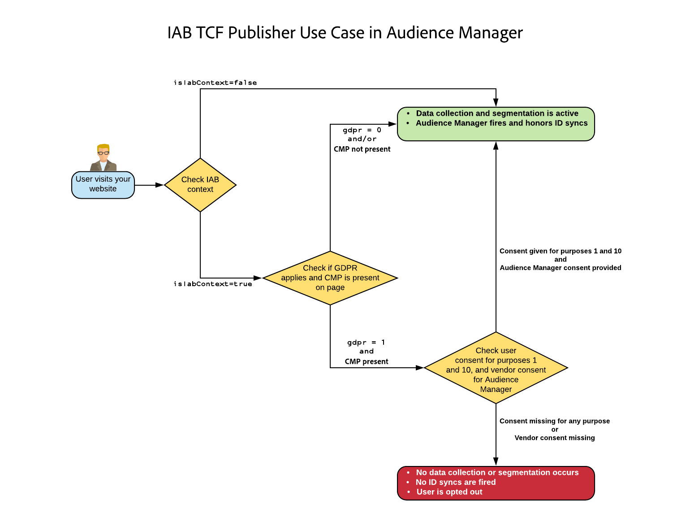

# [!DNL Audience Manager Plug-in for IAB TCF] {#aam-iab-plugin}

## 概述

您可能對使用者承擔的隱私權義務中的一個重要方面，是針對個人資料的使用方式（即「用途」）及其使用者（即「公司」），取得並傳遞使用者選擇。

Adobe 可讓您透過[選擇加入功能](https://docs.adobe.com/content/help/zh-Hant/id-service/using/implementation/opt-in-service/optin-overview.translate.html)和 [IAB 透明與同意架構 (TCF)](https://iabtechlab.com/standards/gdpr-transparency-and-consent-framework/)，管理使用者的隱私權選擇，並與使用者針對該選擇溝通。

本文說明支援 IAB TCF 的 Audience Manager 使用案例，講解如何在 Audience Manager 中實作 IAB TCF 支援。

>[!IMPORTANT]
>
>Audience Manager is registered in the [IAB TCF](https://iabeurope.eu/tcf-for-vendors/) with the vendor ID 565.

適用於 IAB TCF 的 Audience Manager 外掛程式採用[選擇加入功能](https://docs.adobe.com/content/help/zh-Hant/id-service/using/implementation/opt-in-service/iab.html)，而這又是 [ Experience Platform Identity Service (ECID)](https://docs.adobe.com/content/help/zh-Hant/id-service/using/home.translate.html) 程式庫的一部分。

## 範圍和限制 {#scope-and-limitations}

身為使用 Audience Manager 的發佈商或廣告商，您可以依據 IAB TCF 向 Audience Manager 傳達使用者的選擇。

>[!IMPORTANT]
>
>IAB TCF規定僅適用於位於歐洲經濟區的訪客。

Audience Manager可協助您尊重使用者的隱私權選擇，並提供您簡單的方式，讓您與所有合作夥伴溝通這些選擇。

目前 Audience Manager 不支援：

* 行動裝置工作流程；
* 附加同意書至區段出口。

## 升級為 [!DNL IAB TCF v2.0] {#upgrading}

將實施從 [!DNL Audience Manager Plug-in for IAB TCF] v1. [!DNL IAB TCF] 1升級至 [!DNL IAB TCF][!DNL IAB TCF] v2.0或首次啟用v2.0的客戶，應依照下述先決條件和實施的相同准則。

## 必要條件 {#prerequisites}

>[!IMPORTANT]
>
>Audience Manager支援IAB TCF v2.0。
>
>IAB TCF v1.1支援將於2020年8月15日終止。
>
> 想要繼續使用Audience Manager Plug-in for IAB TCF進行許可管理的客戶，應升級至最新版 [ECID](https://github.com/Adobe-Marketing-Cloud/id-service/releases) ，以取得持續支援。
>
> 升級至最新 [ECID版本後](https://github.com/Adobe-Marketing-Cloud/id-service/releases) ，將不再支援IAB TCF v1.1同意字串，因此請務必在升級至最新ECID版本之前更新CMP。

您必須符合下列必要條件，才能搭配Audience Manager使用IAB TCF的Audience Manager外掛程式：

1. 您必須使用 Adobe Experience Platform Identity Service (ECID) 5 或更新版本。[下載](https://github.com/Adobe-Marketing-Cloud/id-service/releases)最新版 ECID。
2. You must be using Audience Manager [!DNL Data Integration Library] (DIL) version 9.0 or newer, downloadable from [here](https://github.com/Adobe-Marketing-Cloud/dil/releases). 閱讀 [Audience Manager 中的 DIL 文件](../..//dil/dil-overview.md)。我們建議使 [用Adobe Launch](https://docs.adobe.com/content/help/zh-Hant/launch/using/extensions-ref/adobe-extension/adobe-audience-manager-extension.html) ，以便針對Audience Manager進行最簡單的DIL實作。
3. Alternatively, if you use [!DNL Server-Side Forwarding] (SSF) to import data into Audience Manager, you must upgrade to the latest version of AppMeasurement. 使用 [Analytics 代碼管理器](https://docs.adobe.com/content/help/zh-Hant/analytics/admin/admin-tools/code-manager-admin.translate.html)下載 AppMeasurement。
4. 您必須使用與IAB TCF v2.0整合併已向IAB TCF註冊的「同意管理平台」(CMP)，不論是商業版或您自己的版本。 請參閱[在 IAB 框架內註冊的 CMP](https://iabeurope.eu/cmp-list/) 清單。

>[!WARNING]
>
>如果您使用不支援IAB TCF v.2.0的「同意管理平台」(CMP),Audience Manager會自動以ID同步方式傳送參數，即使您的訪客是在歐盟地區亦然。 `gdpr=0` 要確定您的GDPR驗證是否處於活動狀態，建議您向許可管理平台(CMP)確認它們支援IAB TCF v2.0。

## 建議及實作方式 {#recommendations}

若要在 Audience Manager 中啟用 IAB TCF 支援，請參閱[如何透過選擇加入設定 IAB](https://docs.adobe.com/content/help/zh-Hant/id-service/using/implementation/opt-in-service/iab.html) 文件。

最簡單的方式是使用 [Adobe Experience Platform Launch](https://docs.adobe.com/content/help/en/launch/using/overview.html) ，在屬 [!DNL ECID Opt-in] 性上新增。 請參閱 [ECID 選擇加入擴充功能](https://docs.adobe.com/content/help/en/launch/using/extensions-ref/adobe-extension/id-service-extension/overview.html)文件，瞭解如何設定 Launch 擴充功能。

## 使用 IAB 架構時的使用者選擇工作流程 {#user-choice-workflow}

造訪 Web 屬性時，您的使用者可以選擇提供其資料供發佈商及與發佈商合作的第三方廠商使用。

用戶以同意和合法利益的形 *式為IAB目的* ，將自己的選擇提供給在全球供應商清單中註冊 *的第三方供應商*** 。

下圖呈現 CMP 對話方塊的範例，向首度造訪網站的訪客顯示。請記得，此對話方塊的外觀會因為客戶實作不同而有很大差異。


IAB歐洲透明度與同意框架政策涵蓋了IAB TCF v2.0中包含的各種目的與權限的詳 [細資訊](https://iabeurope.eu/iab-europe-transparency-consent-framework-policies/#A_Purposes)。

用戶可以出於多種目的和供應商的考慮，授予其許可或合法利益（如果可用）。 例如，用戶可以授予其在設備上儲存資訊、開發和改進產品的許可，並授予其對CMP展示的所有第三方供應商的許可。

或者，在另一個例子中，它們可以出於所有目的給予其同意或合法利益，但僅授予《議定書》/《公約》締約方會議所展示的少數供應商的同意或合法利益。

當使用者選擇其隱私權選項後，使用者選擇會記錄在IAB TC字串中。 The IAB TC string stores the combination of approved purposes and vendors, along with other metadata information (see the [IAB page](https://github.com/InteractiveAdvertisingBureau/GDPR-Transparency-and-Consent-Framework/blob/master/TCFv2/IAB%20Tech%20Lab%20-%20Consent%20string%20and%20vendor%20list%20formats%20v2.md#about-the-transparency--consent-string-tc-string) for more information).

在IAB TCF中註冊的每家廠商都會評估IAB TC字串，並根據使用者的隱私權選擇做出決策。 請記住，使用者的隱私權選擇在所有註冊IAB TCF的廠商中都有效。

## Audience Manager所需的用途 {#aam-standard-purposes}

Audience Manager會根據下列用途評估儲存在IAB TC字串中的使用者選擇，這些用途在 [IAB歐洲透明度與同意架構政策中定義](https://iabeurope.eu/iab-europe-transparency-consent-framework-policies/#A_Purposes)。 此外，您也可以在全域廠商清單中 [找到用途](https://vendorlist.consensu.org/vendorlist.json)。

* **目的1**: 在裝置上儲存及／或存取資訊；
* **目的十**: 開發和改進產品；
* **特別目的1**: 確保安全性、防止詐欺和除錯。

>[!IMPORTANT]
>
>Audience Manager需要通過目的1和目的10的同意，加上廠商的同意，才能部署Cookie並啟始或遵循ID同步。
>
>根據 [IAB法規](https://iabeurope.eu/iab-europe-transparency-consent-framework-policies/#Special_Purpose_1__Ensure_security_prevent_fraud_and_debug_),「特殊用途1」（確保安全性、防止欺詐和除錯）一律同意，且使用者無法反對。

## Audience Manager 的行為取決於使用者是否授與同意 {#aam-behavior-consent}

Audience Manager的運作方式不同，視IAB TC字串是否包含使用者同意（儲存和／或存取裝置上的資訊，以及開發和改善產品）而定。

我們也會檢查您在Audience Manager中使用的所有目的地的使用者同意，只要這些目的地已向IAB TCF註冊。

| 若您的使用者&#x200B;*提供同意*，則 Audience Manager： | 若您的使用者&#x200B;*拒絕*&#x200B;同意，則 Audience Manager： |
|---|---|
| <ul><li>會執行您請求的所有 Audience Manager 使用案例。</li><li>Conveys consent to third parties in ID syncs (by passing `gdpr = 1` and the consent string as `gdpr_consent` on ID sync calls).</li><li>會評估並遵照從廣告伺服器像素傳遞的同意。</li><li>會執行合作夥伴起始的 ID 同步。</li></ul> | <ul><li>不會在您的例項中儲存任何新使用者資料。這包括合作夥伴 ID、訊號、特徵或像素資料。</li><li>不會起始第三方 ID 同步。</li><li>不會執行合作夥伴起始的 ID 同步。</li><li>將使用者排除在進一步的資料收集之外。</li></ul> |

## 發佈商使用案例 {#publisher-use-case}

透過實作IAB TCF的Audience Manager外掛程式，您不需要透過Adobe或其他協力廠商的不同機制，在您的網頁屬性上維護許可管理的自訂代碼。 下方影像和步驟說明使用案例。從影像左側開始：

1. 使用者造訪您的其中一個 Web 屬性。只要您使用的是最新版 ECID 和 DIL 程式庫 (請參閱[必要條件](/help/using/overview/data-security-and-privacy/aam-iab-plugin.md#prerequisites))，就會觸發選擇加入流程。
2. Audience Manager 會檢查 IAB 流程是否適用 (`isIabContext=true`)。請參閱[建議及實作方式](aam-iab-plugin.md#recommendations)。
3. Audience Manager checks whether GDPR applies (`gdpr = 1`) and whether there is a CMP, registered with IAB TCF, on your web property. 例如，這適用於從歐盟造訪的使用者。 請注意，您身為發行者，有責任設定GDPR旗標。
4. If GDPR applies, Audience Manager checks the IAB TC string, passed in the `gdpr_consent` parameter, for the required consent. Audience Manager需要獲得許可，才能在裝置上儲存和／或存取資訊([IAB TCF用途1](https://iabeurope.eu/iab-europe-transparency-consent-framework-policies/#A_Purposes))、開發和改善產品([IAB TCF用途10](https://iabeurope.eu/iab-europe-transparency-consent-framework-policies/#A_Purposes))，以及Audience Manager供應商同意儲存、處理或啟用資料。
5. If the IAB TC string is present and it contains the required consent, Audience Manager passes the IAB TC string on to our [data collection servers](../../reference/system-components/components-data-collection.md) (DCS).
6. Audience Manager會在瀏覽器上設 [定Demdex Cookie](https://docs.adobe.com/content/help/zh-Hant/core-services/interface/ec-cookies/cookies-am.translate.html) ，以回應，並啟動並接受協力廠商ID同步。
7. 或者，如果在步驟4中傳遞的IAB TC字串不包含所有必要的權限，Audience Manager不會收集、處理或啟動任何使用者資料，也不會執行或啟動ID同步。 此外，它還會從您所使用的目的地中剔除使用者。

>[!IMPORTANT]
>
>如果您與需要IAB TCF參數的Audience Manager目標合作夥伴合作，但您的網站上沒有支援IAB TCF的CMP，則Audience Manager會以ID同步 `gdpr=0` 方式傳送。 這表示GDPR不適用於這些使用者。
>
> 如果不需要，您應啟用Audience Manager中的IAB TCF功能，將適當的IAB TC字串傳送給目標合作夥伴。




## 廣告商使用案例 {#advertiser-use-case}

Audience Manager 會根據 IAB TCF 評估及遵照[像素呼叫](../../integration/sending-audience-data/real-time-data-integration/pixel-based-data-transfer.md)中傳遞的同意。

像素可由Audience Manager客戶放在其合作夥伴頁面上，或置於廣告伺服器中以納入廣告回應。 在第一種情況下，您的合作夥伴必須以程式設計方式擷取同意參數，並在引發之前將其新增至像素中。而第二種情況中，廣告伺服器會將供應端平台 (SSP) 或發佈商廣告伺服器傳來的同意參數附加至所有像素，這種情況較為常見，將於下文詳細說明。

Audience Manager 使用兩個參數在像素呼叫中傳遞使用者同意：

* `gdpr` 可為 0 (GDPR 不適用) 或1 (GDPR 適用)；
* `gdpr_consent` 是 URL 安全 base64 編碼 GDPR 同意字串 (請參閱[規格](https://github.com/InteractiveAdvertisingBureau/GDPR-Transparency-and-Consent-Framework/blob/master/TCFv2/IAB%20Tech%20Lab%20-%20Consent%20string%20and%20vendor%20list%20formats%20v2.md#about-the-transparency--consent-string-tc-string))。曝光像素的範例呼叫，這兩個參數可能如下所示：

```
http://yourcompany.demdex.net/event?d_event=imp&gdpr=1&gdpr_consent=consentstring&d_src=datasource_id&d_site=siteID&d_creative=creative_id&d_adgroup=adgroup_id&d_placement=placement_id
```

下方影像和步驟說明使用案例。從影像左側開始：

1. 系統會透過廣告伺服器向您的使用者顯示一次曝光內容。This translates into a [pixel call](../../integration/media-data-integration/impression-data-pixels.md) to our Data Collection Servers (DCS).
2. Audience Manager 會檢查 GDPR 標幟是否適用。If it doesn&#39;t, Audience Manager stores the data passed in the `gdpr` and `gdpr_consent` variables in pixel calls.
3. If the IAB TC string is present and it contains the required permissions, Audience Manager stores the data passed in the `gdpr` and `gdpr_consent` variables in pixel calls.
4. If the IAB TC string is missing or lacks the required permissions, Audience Manager drops the data passed in the `gdpr` and `gdpr_consent` variables in pixel calls.


## 支援 IAB TCF 的啟用合作夥伴 {#aam-activation-partners}

IAB TCF的Audience Manager外掛程式可讓您將IAB TC字串轉寄給啟動合作夥伴，同時尊重使用者的隱私權選擇。 如需哪些啟用合作夥伴支援 IAB TCF 的詳細資訊，請參閱[以裝置為基礎的目的地清單](/help/using/features/destinations/device-based-destinations-list.md)。

## 將同意附加至傳送至URL目的地的URL

與IAB TCF v2.0整合的Audience Manager支援附加同意書至傳送至與IAB TCF v2.0整合的 [URL目的地](../../features/destinations/create-url-destination.md) 。 不過，Audience Manager不會自動執行此程式，以避免中斷特定URL格式。

想要附加同意給傳送至的資料的客戶， [!DNL URL destinations] 必須手動將 `${GDPR}` 和 `${GDPR_CONSENT_XXXX}` 巨集新增至其URL格式，以目 `XXXX` 標合作夥伴ID取代。

範例: `http://yourdomain.com?gdpr=${GDPR}&gdpr_consent=${GDPR_CONSENT_1234}`.

有關受 [支援目標宏的詳細資訊](../../features/destinations/destination-macros.md) ，請參閱定義的目標宏。

## 跨裝置同意管理

當您的網站訪客未提供適當的權限時，IAB TCF的Audience Manager外掛程式會自動選出請求中顯示的ID。 如果請求包含 [跨裝置ID(CRM ID)](../../reference/ids-in-aam.md),Audience Manager會選取該ID，以及連結至該跨裝置ID(CRM ID)的 [最後一個裝置](../../reference/ids-in-aam.md)。

## 測試您的 IAB 實作 {#test-iab-implementation}

To test that you have correctly implemented the Audience Manager Plug-in for IAB TCF, read [Use Case 4 in Validating Opt-in Service](https://docs.adobe.com/content/help/zh-Hant/id-service/using/implementation/opt-in-service/testing-optin-and-iab-plugin.translate.html#section-64331998954d4892960dcecd744a6d88).

## IAB 和 Audience Manager 中的選擇退出。優先順序。{#iab-and-optout}

使用者可以選擇另一個隱私權選項，即選擇退出所有資料收集。Adobe 會在[您的隱私權選擇](https://www.adobe.com/tw/privacy/opt-out.html)頁面中提供使用者執行此作業的選項。

Audience Manager 處理選擇退出請求的方式，於[文件中的另一篇文章](data-privacy-requests.md#opt-out-requests)中說明。

>[!IMPORTANT]
>
>在拒絕同意後選擇退出所有資料收集的使用者，無法選擇返回。

>[!NOTE]
>
>**優先順序** - 如果您的使用者使用全域選擇退出工具來選擇退出資料收集，如上述連結所述，此選擇優先於選擇加入和 IAB 驗證。

## 其他資源 {#additional-resources}

* [Adobe Experience Platform Identity Service 選擇加入](https://docs.adobe.com/content/help/zh-Hant/id-service/using/implementation/opt-in-service/optin-overview.translate.html)
* [IAB 歐洲 GDPR 資訊公開與同意框架](https://iabtechlab.com/standards/gdpr-transparency-and-consent-framework/)
* [IAB 歐洲 GDPR 資訊公開與同意框架技術規格](https://github.com/InteractiveAdvertisingBureau/GDPR-Transparency-and-Consent-Framework/blob/master/Consent%20string%20and%20vendor%20list%20formats%20v1.1%20Final.md)
* [IAB TCF 外掛程式 - 影片示範](https://helpx.adobe.com/audience-manager/kt/using/iab-tcf-support-audience-manager-technical-video-implement.html)