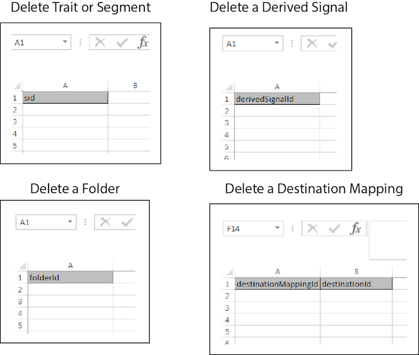

# 大量刪除{#bulk-delete}

大量刪除可讓您透過單一操作移除多個區段、特徵、資料夾、衍生訊號、資料來源、模型和目的地。 請依照這些指示提出大量刪除請求。

>[!IMPORTANT]
>
>大量管理工具並非正式支援的Adobe產品。 客戶服務提供的疑難排解與支援將依個別情況處理。

<!-- 

t_bulk_delete.xml 

 -->

>[!NOTE]
>
>在[ UI中指派的](../../features/administration/administration-overview.md)RBAC群組許可權[!DNL Audience Manager]已在[!UICONTROL Bulk Management Tools]中接受。

>[!NOTE]
>
>如果您的區段已對應至目的地，則大量刪除目的地對應的作業將會失敗。 在嘗試大量刪除目的地之前，請從使用者介面中的該目的地移除您的區段。 此外，特徵和區段資料夾必須空白，您才能將其刪除。

若要刪除多個專案，請開啟[!UICONTROL Bulk Management Tools]工作表並：

1. 按一下「**[!UICONTROL Headers]**」標籤，並複製您要新增之專案的建立標題。
2. 按一下「**[!UICONTROL Delete]**」標籤。
3. 將刪除標題貼入更新工作表的第一列。
4. 在標頭下方的欄中，貼上或輸入您要刪除之物件的ID。
5. 提供必要的[登入資訊](../../reference/bulk-management-tools/bulk-management-intro.md#auth-reqs)並按一下&#x200B;**[!UICONTROL Submit]**。

   工作表會建立[!UICONTROL Results]欄。 [!UICONTROL Results]欄傳回訊息，指出該專案是否已刪除，或是錯誤訊息。
在輸入資料之前，大量更新工作表應該看起來類似下列：

如果大量更新傳回錯誤或失敗，請參閱[大量管理工具的疑難排解](../../reference/bulk-management-tools/bulk-troubleshooting.md)。
