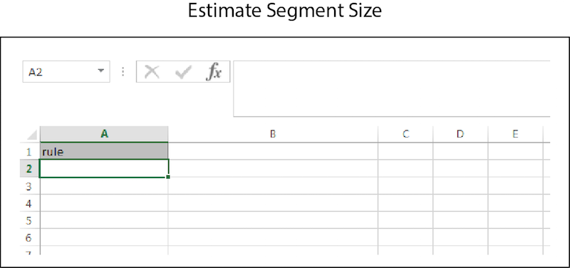

# 大量估計{#bulk-estimates}

大量估計會根據區段規則傳回區段大小資料。 請依照這些指示進行大量估計請求。

<!-- 

t_bulk_estimates.xml

 -->

>[!NOTE]
>
>不 [!UICONTROL Bulk Management Tools] 支 *援* 。 [!DNL Audience Manager]這種工具僅為方便和禮貌而提供。 若是大量變更，我們建議您改 [用Audience Manager API](../../api/rest-api-main/aam-api-getting-started.md) 。 [UI中指派的](../../features/administration/administration-overview.md) RBAC群組權 [!DNL Audience Manager] 限在中接受 [!UICONTROL Bulk Management Tools]。

若要進行大量更新，請開啟工作 [!UICONTROL Bulk Management Tools] 表並：

1. 按一下標 **[!UICONTROL Headers]** 簽並複製頁 [!UICONTROL Estimate Segment Size] 首。
1. Click the **[!UICONTROL Estimate]** tab.
1. 將估計題頭貼上到估計工作表的第一行。
1. 根據標題標籤，貼上或輸入要變更為對應欄的資料。
1. 在工作表工具列中，按一下符合您正在更新之項目的建立按鈕。
此動作會開啟對 [!UICONTROL Account Information] 話方塊。

1. 提供必要 [的登入資訊](../../reference/bulk-management-tools/bulk-management-intro.md#auth-reqs) ，然後按一 **[!UICONTROL Submit]**&#x200B;下。

此動作會在工作表 [!UICONTROL Response] 中建立一欄，其中包含估計的區段大小資料。 在輸入資料之前，您的大量估計工作表看起來應類似下列：

如果您的大量更新傳回錯誤或失敗，請參 [閱批量管理工具疑難排解](../../reference/bulk-management-tools/bulk-troubleshooting.md)。

