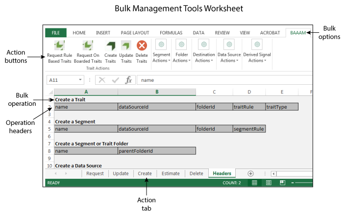
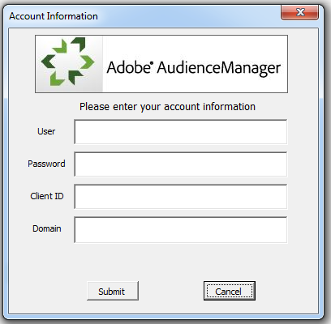

# Getting Started With Bulk Management{#getting-started-with-bulk-management}

大量管理工具可讓您一次建立並管理多個物件。您可以使用大量管理工具處理資料來源、衍生的訊號、目的地、資料夾、區段和特徵。

<!-- 

c_bulk_start.xml

 -->

>[!NOTE]
>
>The [!UICONTROL Bulk Management Tools] *are not* supported by [!DNL Audience Manager]. 此工具的提供目的僅限於方便使用。For bulk changes, we recommend that you work with the [Audience Manager APIs](../../api/rest-api-main/aam-api-getting-started.md) instead. [在UI](../../features/administration/administration-overview.md) 中指派的RBAC群組權限 [!DNL Audience Manager] 會受到尊重 [!UICONTROL Bulk Management Tools]。

## 概述 {#overview}

This feature uses a Microsoft Excel spreadsheet with macros that make secure, authenticated calls to the [!DNL Audience Manager] APIs. API提供可讓您大量變更的方法和服務。您不需要知道如何編寫程式碼或使用我們的API來使用它。工作表包含執行特定批量變更功能的欄標題和標籤。若要進行批量變更，只需將預先定義的標題新增至特定工作表，提供您要大量變更的資訊，然後按一下動作按鈕。工作表和API會為您完成其餘工作。

## 必備條件 {#prereqs}

To use the [!DNL Bulk Management Tools], you need the following:

* Your [!DNL Audience Manager] user name and password. 身為客戶，您應該已擁有這些認證。
* API用戶端ID和秘密金鑰。您的帳戶管理員可以提供您這些資訊。
* [!UICONTROL Bulk Management Tools] 工作表。**[下載工作表](assets/BAAAM_August_2018.xlsm)** 以取得最新版本。

* Microsoft Excel running on [!DNL Windows] or in a [!DNL Microsoft Windows] virtual machine running on [!DNL macOS X]. You must use 32-bit Excel for the [!UICONTROL Bulk Management Tools] to work.

## Actions and operations {#actions-ops}

[!UICONTROL Bulk Management Tools] 工作表包含動作標籤、動作按鈕和 **[!UICONTROL Headers]** 標籤。**[!UICONTROL Headers]** 此標籤包含動作標籤所使用的預先格式化欄標題。動作標籤包含執行您所選大量作業的巨集。若要執行批量操作，請將一組標題複製到適當的動作標籤中，輸入標題資料，然後按一下動作按鈕。

開啓試算表並按一下動作按鈕即可開始使用。

The table below lists the operations you can perform and items you can manipulate with the [!UICONTROL Bulk Management Tools] worksheets.

<table id="table_B9B3E09B692E42BAA52FB32C18B00709"> 
 <thead> 
  <tr> 
   <th colname="col1" class="entry"> 動作 </th> 
   <th colname="col2" class="entry"> 物件 </th> 
  </tr> 
 </thead>
 <tbody> 
  <tr> 
   <td colname="col1"> 
大量動作會顯示在工作表底部的標籤中，並包含： 
 
 
     <ul id="ul_49F46B9E00C045D29E40258EB7BDCFBB"> 
      <li id="li_193C41EA19EF4D738FBA037D2BF9B05C">請求 </li> 
      <li id="li_5BE2E13D839F4958AAA5C01B7EFC5096">更新 </li> 
      <li id="li_4CCCC739795945DF8C89787F9A67EB88">建立 </li> 
      <li id="li_C7D36D2BDF0448CEAF3A5EABE41038E8">估計值 </li> 
      <li id="li_07A3E94326124A3092362D9896EB7732">刪除 </li> 
     </ul> 
 </td> 
   <td colname="col2"> 
The objects you can change in bulk are located under the <b> Headers</b> tab and include: 
 
 
     <ul id="ul_A7A96F2B1B63430B9A1E1184AC5FA8F2"> 
      <li id="li_E3D9E2E190B04BE685337AC6140C371C"> <a href="../../features/datasources-list-and-settings.md#data-sources-list-and-settings"> 資料來源</a> </li> 
      <li id="li_B645385E40684FA28770913EAF18CB2C"> <a href="../../features/derived-signals.md"> 衍生訊號</a> </li> 
      <li id="li_9059F8C4A41A410899BDEFC76D3F5949"> <a href="../../features/destinations/destinations.md"> 目的地</a> </li> 
      <li id="li_BB5A445150754E53AA38C78461326932"> <a href="../../features/traits/trait-storage.md#trait-storage"> 特徵資料夾</a> 和區段資料夾 </li> 
      <li id="li_7A27DBF64E0945CF8AE8C96E8C6EDA09"> <a href="../../features/segments/segments-purpose.md"> 區段</a> </li> 
      <li id="li_A4640A34930040DEA8555EAF0AE2A702"> <a href="../../features/traits/trait-details-page.md"> 特徵</a> </li> 
     </ul> 
 </td> 
  </tr> 
 </tbody> 
</table>

**批量操作範例**

例如，讓我們來看看如何一次建立多個特性。若要在大量作業中建立多個特徵，您可以：

1. Click the **[!UICONTROL Headers]** tab and copy all the labels under the [!UICONTROL Create a Trait] option.

2. Click the **[!UICONTROL Create]** tab and paste the labels starting in row 1, column A.
3. Provide information related to each column header and click **[!UICONTROL Create Traits]**. 此動作提示您登入。Your bulk job runs after you successfully authenticate (see the [authentication requirements](../../reference/bulk-management-tools/bulk-management-intro.md#auth-reqs) below). 請查看工作表的左下角，以瞭解工作狀態通知。

>[!NOTE]
>
>處理大型請求時，工作表可能會停止回應，而且看似非作用中。在這種情況下，只要將它保留一下即可。當批量請求完成時，工作表將會變成回應式。If the worksheet does not respond for a long period of time, see the [troubleshooting section](../../reference/bulk-management-tools/bulk-troubleshooting.md).

## Authentication requirements and options {#auth-reqs}

大量變更需要驗證。當您選取動作時，工作表會提示您登入。由於工作表會進行API呼叫，所以您需要設定它以讀取機密金鑰。**[!UICONTROL Domain]** 此外，此欄位可讓您在測試/測試環境或您的即時生產帳戶中進行大量變更。

**API驗證需求**

若要設定API驗證，您必須：

* 複製並儲存機密金鑰至文字(.txt)檔案。
* 使用您的API用戶端ID命名文字檔案。例如，如果您的用戶端ID是「大量使用者」，請將索引鍵儲存在名為「Bulk-User. txt」的檔案中。
* 將秘密金鑰和工作表一起儲存在同一個檔案夾中。

進行大量變更時，您仍必須輸入使用者名稱、密碼、用戶端ID和網域，但API驗證是自動的。

**網域驗證選項**

網域驗證可讓您選擇測試大量請求，或直接將它們套用至您的生產帳戶。大量變更測試環境不會影響您的生產帳戶。生產變更立即生效。**[!UICONTROL Domain]** 欄位接受下列地址，視您要使用的環境而定：

* 測試: `api-beta.demdex.com`
* 生產: `api.demdex.com`

>[!MORE_贊_ this]
>
>* [下載大量管理工作表](assets/BAAAM_August_2018.xlsm)

