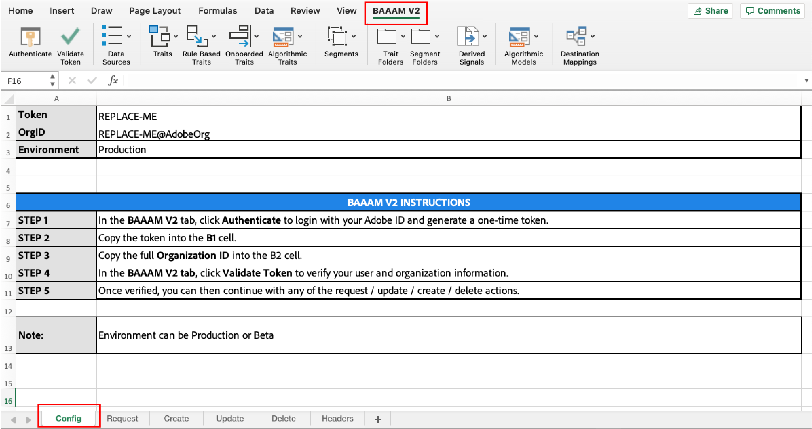

# Getting Started With Bulk Management{#getting-started-with-bulk-management}

批量管理工具可讓您透過單一作業一次建立和管理多個物件。 您可以使用批量管理工具來處理資料來源、衍生訊號、目的地、資料夾、模型、區段和特徵。

<!-- 

c_bulk_start.xml

 -->

>[!NOTE]
>
>不 [!UICONTROL Bulk Management Tools] 支 *援* 。 [!DNL Audience Manager]這種工具僅為方便和禮貌而提供。 若是大量變更，我們建議您改 [用Audience Manager API](../../api/rest-api-main/aam-api-getting-started.md) 。 [UI中指派的](../../features/administration/administration-overview.md) RBAC群組權 [!DNL Audience Manager] 限在中接受 [!UICONTROL Bulk Management Tools]。

## 概述 {#overview}

此功能使用Microsoft excel試算表及巨集，對API進行安全、驗證的 [!DNL Audience Manager] 呼叫。 API提供可讓您大量進行變更的方法與服務。 您不需要知道如何編寫程式碼或使用我們的API來使用它。 工作表包含執行特定批量變更功能的欄標題和標籤。 若要進行大量變更，您只需將預先定義的標題新增至特定工作表、提供您要大量變更的資訊，然後按一下動作按鈕。 工作表和API可為您完成其餘的工作。

## 下載 {#download}

請在此處下載最新的 **[工作表](assets/BAAAM_V2_20191015.xlsm)**。

## 必備條件 {#prereqs}

若要使用 [!DNL Bulk Management Tools]，您需要下列項目：

* 您的登 [!DNL Experience Cloud] 入資訊。 身為客戶，您應已擁有這些認證。
* 工作 [!DNL Bulk Management Tools] 表。 [下載工作表](/help/using/reference/bulk-management-tools/bulk-management-intro.md#download) ，取得最新版本。
* 在或64位 [!DNL macOS] 元上執行Microsoft Excel [!DNL Microsoft Windows]。
* 開啟工作表時，必須 **啟用宏** , [!DNL Bulk Management Tools] 才能使用。

## 驗證需求和選項 {#auth-reqs}

大量變更需要驗證。 您必須先登入，才能執行任何動作。 由於工作表會呼叫API，因此您必須將它設定為在您的使用者帳戶中驗證。

**API驗證需求**

2019年10月發行的第二版批量管理工具簡化了驗證程式。 本版本中的驗證步驟概述如下：

1. 開啟試算表並導覽至「設 **定** 」工作表。
2. 按照工作表中概述的步驟操作。
   
3. 完成這些步驟後，您即獲授權進行大量變更。

進行大量變更時，您仍須確認您已獲得進行變更的授權，但API驗證是自動的。

**網域驗證選項**

網域驗證可讓您測試大量請求或直接將它們套用至生產帳戶。 對測試版環境進行大量變更不會影響您的生產帳戶。 生產變更會立即生效。 批量管理工作表允許您在以下環境中工作：

* Beta
* 生產

## 動作與作業 {#actions-ops}

此工 [!UICONTROL Bulk Management Tools] 作表由驗證按鈕、動作標籤、動作按鈕和標籤 **[!UICONTROL Headers]** 組成。 該選 **[!UICONTROL Headers]** 項卡包含操作頁籤所使用的預格式化列標題。 操作頁籤包含執行所選批量操作的宏。 要執行批量操作，請將一組標題複製到相應的操作頁籤中，輸入標題資料，然後按一下操作按鈕。

驗 [證後](#auth-reqs)，按一下動作按鈕即可開始。

下表列出了您可以執行的操作，以及可以使用工作表操作的 [!UICONTROL Bulk Management Tools] 項目。

<table id="table_B9B3E09B692E42BAA52FB32C18B00709"> 
 <thead> 
  <tr> 
   <th colname="col1" class="entry"> 動作 </th> 
   <th colname="col2" class="entry"> 物件 </th> 
  </tr> 
 </thead>
 <tbody> 
  <tr> 
   <td colname="col1"> 
大量動作會顯示在工作表底部的標籤中，包括： 
 
 
     <ul id="ul_49F46B9E00C045D29E40258EB7BDCFBB"> 
      <li id="li_193C41EA19EF4D738FBA037D2BF9B05C">請求 </li> 
      <li id="li_5BE2E13D839F4958AAA5C01B7EFC5096">更新 </li> 
      <li id="li_4CCCC739795945DF8C89787F9A67EB88">建立 </li> 
      <li id="li_C7D36D2BDF0448CEAF3A5EABE41038E8">估計 </li> 
      <li id="li_07A3E94326124A3092362D9896EB7732">刪除 </li> 
     </ul> 
 </td> 
   <td colname="col2"> 
您可以大量變更的物件位於「標題」標 <b> 簽下</b> ，並包含： 
 
 
     <ul id="ul_A7A96F2B1B63430B9A1E1184AC5FA8F2"> 
      <li id="li_E3D9E2E190B04BE685337AC6140C371C"> <a href="../../features/datasources-list-and-settings.md#data-sources-list-and-settings"> 資料來源</a> </li> 
      <li id="li_B645385E40684FA28770913EAF18CB2C"> <a href="../../features/derived-signals.md"> 衍生信號</a> </li> 
      <li id="li_9059F8C4A41A410899BDEFC76D3F5949"> <a href="../../features/destinations/destinations.md"> 目的地</a> </li> 
      <li> <a href="../../features/algorithmic-models/understanding-models.md"> 型號</a> </li> 
      <li id="li_BB5A445150754E53AA38C78461326932"> <a href="../../features/traits/trait-storage.md#trait-storage"> 特徵資料夾</a> 和區段資料夾 </li> 
      <li id="li_7A27DBF64E0945CF8AE8C96E8C6EDA09"> <a href="../../features/segments/segments-purpose.md"> 區段</a> </li> 
      <li id="li_A4640A34930040DEA8555EAF0AE2A702"> <a href="../../features/traits/trait-details-page.md"> 特徵</a> </li> 
     </ul> 
 </td> 
  </tr> 
 </tbody> 
</table>

**批量操作示例**

例如，讓我們來看看如何一次建立多個特徵。 若要在大量作業中建立多個特徵，您可以：

1. 按一下標 **[!UICONTROL Headers]** 簽並複製選項下的所有標 [!UICONTROL Create a Trait] 簽。

2. 按一下 **[!UICONTROL Create]** 標籤，然後貼上列1，欄A開頭的標籤。
3. 提供與每個欄標題相關的資訊，然後按一下 **[!UICONTROL Create Traits]**。 此動作會提示您確認驗證。 在確認驗證後，您的大量工作就會執行。 檢查工作表左下角的職務狀態通知。

>[!NOTE]
>
>處理大量請求時，工作表可能會停止響應，並且看起來不活動。 在這些情況下，別管它。 當批量請求完成時，工作表會變成回應。 如果工作表長時間沒有響應，請參閱疑難排 [解部分](../../reference/bulk-management-tools/bulk-troubleshooting.md)。

>[!MORE_LIKE_THIS]
>
>* [下載批量管理工作表](assets/BAAAM_August_2018.xlsm)

