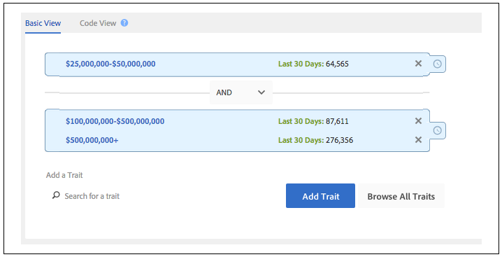
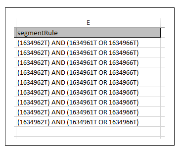

# 建立或更新特徵規則和區段規則{#create-or-update-trait-rules-and-segment-rules}

建立和更新工作表會接受traitRule標題，可讓您在單一作業中套用多個規則。 請依照下列指示進行大量規則要求。

<!-- 

c_bulk_rules.xml 

 -->

>[!NOTE]
>
>[UI中指派的](../../features/administration/administration-overview.md) RBAC群組權 [!DNL Audience Manager] 限在中接受 [!UICONTROL Bulk Management Tools]。

## 使用特徵規則 {#trait-rules}

在您的工作表中，特徵規則欄會傳回並接受由布林運算式、比較運算子和規則運算式組成的規則。 您可以在中建立包含特徵或區段產生器的規 [!DNL Audience Manager] 則，並將它們複製至工作表。 或者，如果您熟悉規則語法，則可直接在工作表中編寫運算式。

## 規則產生器範例 {#rule-builder-example}

讓我們來看一個示例，示範如何使用來 [!UICONTROL Segment Builder] 建立可以批量工作表的規則。 不過，這並不是這些工具的一組逐步指示。 相反，我們將從已建立的簡單規則開始。 如需如何使用規則產生器的指示，請參閱「區 [段產生器](../../features/segments/segment-builder.md) 」 [和「特徵產生器」](../../features/traits/about-trait-builder.md)。

使用視覺化規則產生器，我們建立了具有3個特徵的區段規則和布林運算 [!UICONTROL AND] 子。

按一 **[!UICONTROL Code View]** 下以取得此規則的文字版本。

>[!TIP]
>
>按一 **[!UICONTROL Validate Expression]** 下以檢查規則邏輯。 這有助於防止您上傳無效規則。

將規則貼入工作 [!UICONTROL Bulk Management Tools] 表，並提交您的變更以大量更新區段規則。

## 建立您自己的規則 {#create-rules}

你可以在外面寫自己的規則 [!UICONTROL Rule Builder]。 在開始之前，請務必閱讀涵蓋運算子、運算式和必要變數等內容的檔案。 建議您檢閱下列內容：

* [在特徵產生器中使用比較運算子](../../features/traits/trait-comparison-operators.md)
* [操作順序](../../features/traits/trait-operator-precedence.md)
* [關鍵變數的前置詞要求](../../features/traits/trait-variable-prefixes.md)
* [使用布林值和比較運算子的運算式範例](../../features/traits/trait-expression-samples.md)

