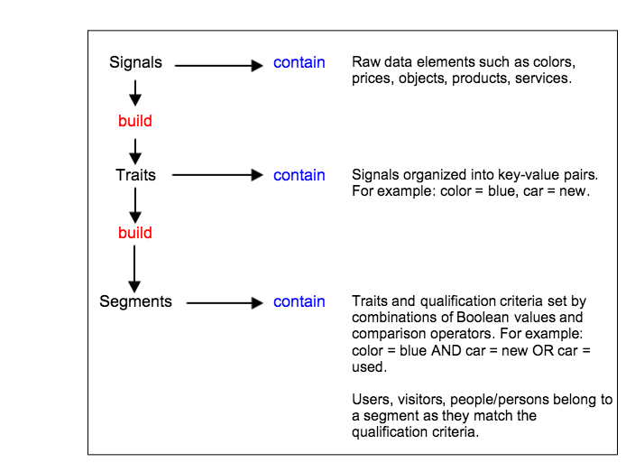

# Signals, Traits, and Segments{#signals-traits-and-segments}

說明Audience Manager區段的元件、用來設定對象資格標準的運算式，以及如何在事件呼叫中傳送資料。

<!-- 

c_signal_trait_segment.xml

 -->

**構圖與用途**

[!DNL Audience Manager] 資料包含訊號、特徵、區段和相關的資格規則。資料元素和規則會結合建立區段。區段可將網站訪客組織為相關群組。The following table defines the three principal components in an [!DNL Audience Manager] segment.

<table id="table_E8373A01C3414C42B4983A59BF0F0669"> 
 <thead> 
  <tr> 
   <th colname="col1" class="entry"> 元素 </th> 
   <th colname="col2" class="entry"> 包含 </th> 
   <th colname="col3" class="entry"> 範例 </th> 
  </tr>
 </thead>
 <tbody> 
  <tr> 
   <td colname="col1"><b>訊號</b> </td> 
   <td colname="col2"> <p>Signals are the smallest data units in <span class="keyword"> Audience Manager</span> and are expressed as <a href="../reference/key-value-pairs-explained.md"> key-value pairs</a>. </p> 
    <ul id="ul_728347E325284B9FA0B4E05DE8CF4570"> 
     <li id="li_89574A3B4A734726AD43405AE6D85FF5">索引鍵是定義資料集的常數(例如，性別、顏色、價格)。 </li> 
     <li id="li_D35601B33EE24EC5857F45D9577254D4">值是與常數相關的變數(例如男性/女性、綠色、100)。 </li> 
    </ul> <p>比較運算子會加入索引鍵值配對，並設定兩者之間的關係。 </p> </td> 
   <td colname="col3"> 
    <ul id="ul_A6D8D30A37C94437A7BF38736C6F8556"> 
     <li id="li_74C87C34FA254783AC0DEBBC69B35AC4"><code> product= camera</code> </li> 
     <li id="li_C1727B9136024E56B60374597A7DCA00"><code> price&gt;1000</code> </li> 
     <li id="li_B2E7798768EE444AB978F3F27B0BC0B5"><code> type=數位SLR</code> </li> 
    </ul> </td> 
  </tr> 
  <tr> 
   <td colname="col1"><b>特性</b> </td> 
   <td colname="col2"> <p>一或多個訊號的組合。 </p> <p>布林運算式和比較運算子可讓您建立特徵資格規則。 </p> <p>透過結合特性和特徵群組，建立精確的資格要求。 </p> </td> 
   <td colname="col3"> <p>從可用的訊號，您可以建立「高階相機瀏覽器」規則，以： </p> <p><code> product= camera AND&gt;1000</code> </p> </td> 
  </tr> 
  <tr> 
   <td colname="col1"><b>區段</b> </td> 
   <td colname="col2"> <p>共用一組共同屬性並符合相關特徵資格的使用者。 </p> <p>布林運算式以及最近/頻度需求，可讓您建立區段資格規則。 </p> <p>使用特徵和區段規則組合，建立精確的資格要求。 </p> </td> 
   <td colname="col3"> <p>從可用的特性和訊號，您可以建立區段規則，以： </p> <p><code> (product= camera AND AND=數位SLR) OR(價格&gt;1000)</code> </p> </td> 
  </tr> 
 </tbody> 
</table>

使用下列圖表，以密切注意訊號、特徵和區段之間的關係。



**使用視覺工具和程式碼編輯器建立特徵和區段規則**

Clients manage traits and segments with visual tools and code editors in the [!DNL Audience Manager] user interface. 視覺化工具可讓您使用搜尋功能、快顯選項、下拉式選單以及拖放功能來建立規則。程式碼編輯器提供進階使用者以程式設計方式開發觀眾分段准則。

**事件呼叫傳送資料至Audience Manager**

An event call sends data from your website to [!DNL Audience Manager]. 此呼叫包含HTTP要求中的訊號、特徵和區段資料。The event itself is everything after the `/event` part of a URL string. As shown in the example below, this process requires only a single event call to pass in multiple variables to [!DNL Audience Manager].

```
https://<domain>/event?product=camera&price>100
```

>[!MORE_贊_ this]
>
>* [區段：目的、構圖和規則](../features/segments/segments-purpose.md)

