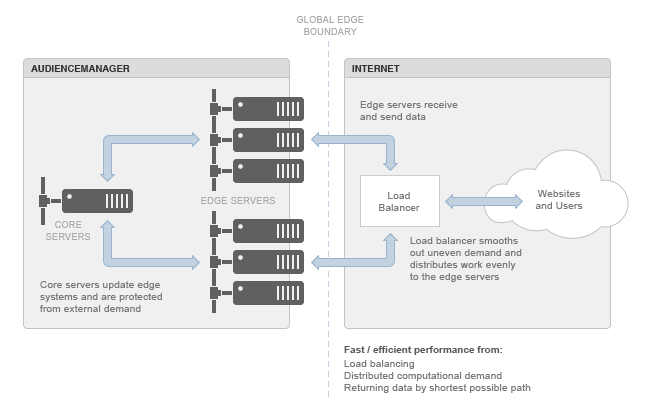

# 瞭解Edge資料中心{#understanding-the-edge-data-center}

Audience manager使用分散式邊緣運算拓撲，以滿足外部來源對我們系統的需求。

## Edge Data Center Basics {#edge-data-center-basics}

<!-- 

c_compedge.xml

 -->

邊緣運算可改善效能，以因應分散的網際網路需求，因為「邊緣」本身是全域邊界。 這表示 [!DNL Audience Manager] 動態將處理置於最接近需求來源的位置，並以最短的路徑傳回資料。 邊緣運算可協助維持網站效能，進而保留您網站的使用者體驗。 邊緣資料中心是移入和移出資料的關鍵閘道 [!DNL Audience Manager]。

邊緣 [!DNL Audience Manager] 資料中心包括：

* **** 核心伺服器：這些是主要的 [!DNL Audience Manager] 系統。 它們會更新並提供資料給邊緣伺服器。

* **** 邊緣伺服器：通常，這些是應用程式和／或網頁伺服器。 他們坐在網際網路 [!DNL Audience Manager] 的邊界。 邊緣伺服器(例如 [!UICONTROL DCS] 或Akamai系統)通常會處理資料和進出的要求 [!DNL Audience Manager]。

* **** 負載平衡器：管理網際網路應用程式中固有的不均衡運算／處理需求。 這些平衡器可防止伺服器群集過載，而其他伺服器則保持空閒。

下圖說明Audience manager邊緣資料中心環境。

## 地理分佈與負載平衡 {#geo-dist-balance}

請參閱資 [!UICONTROL DCS] 料收集 [元件中的章節](../../reference/system-components/components-data-collection.md)。
