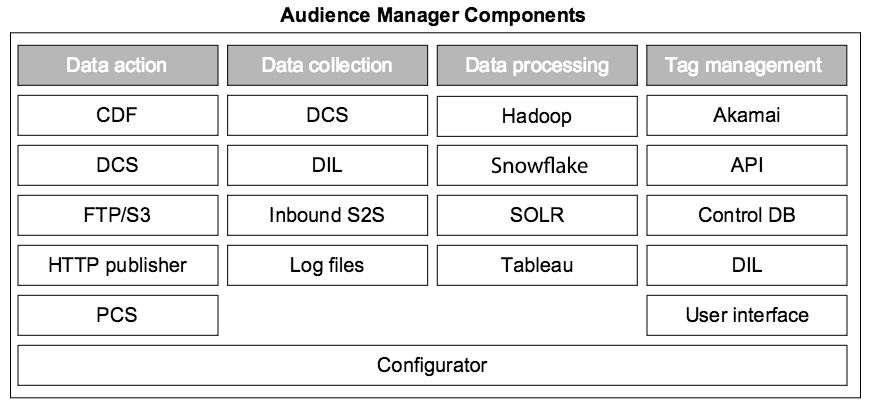

# Audience Manager 系統中的關鍵元件{#key-components-in-the-audience-manager-system}

Audience Manager將其系統和程式分成四個主要類別： 標籤管理、資料收集、資料組織及資料動作能力。

<!-- 

c_compstack.xml

 -->

下圖顯示主要元件以及提供電源的底層技術（硬體和軟體） [!DNL Audience Manager]。 雖然有些程式會執行特定功能，而其他程式則有多種用途的角色，但所有系統都可搭配運作，以協助您管理標籤、收集資料、分析效能、將資訊與其他系統同步，並針對這些資訊採取行動。

