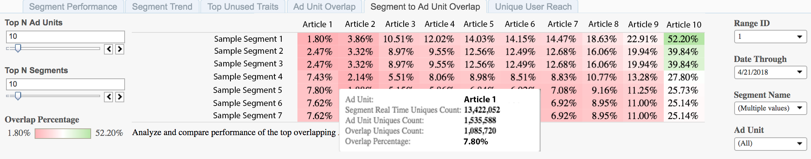

# 區段至廣告單位重疊{#segment-to-ad-unit-overlap}

「區段對廣告單位重疊」報表會顯示為熱圖，反白標示「廣告單位」和Audience Manager區段之間的高與低重疊。

## 使用案例 {#use-cases}

透過報 [!UICONTROL Segment to Ad Unit Overlap] 表，您可以瞭解哪些對象瀏覽了您的Web屬性。 報表會顯示區段成員與您網頁屬 [!DNL Audience Manager] 性訪客數量之間的重疊。 較高的重疊率表示區段的許多成員會造訪您的Web屬性。

## 使用區段來新增單位重疊報表 {#using-the-report}

使用和 **[!UICONTROL Top N Ad Units]** 控 **[!UICONTROL Top N Segments]** 制項來選擇您所要的重疊廣告單位和區段數。 您最多可以為每個項目選取100個項目。

使用 **日範圍****和日期穿透控制項** ，調整您的回顧範圍。 請注意，7天和30天回顧期間僅適用於星期日。

使用和 **[!UICONTROL Segment Name]** 方塊 **[!UICONTROL Ad Unit]** 來篩選任何區段和廣告單位。

>[!IMPORTANT]
>
>啟用時， [!UICONTROL Audience Optimization for Publishers]您必須包含描述性中繼資料 [!UICONTROL Ad Unit IDs]，如 [Import Google Ad Manager（舊稱DFP）Data Files Into Audience Manager的步驟3所述](../../../reporting/audience-optimization-reports/aor-publishers/import-dfp.md)。 執行此動作後，您可確保報表會以Web屬性而非 [!UICONTROL Ad Unit] Web屬性的形式詳細說明 [!UICONTROL Ad Unit ID]。

## 解讀結果 {#interpreting-results}

您 [!UICONTROL Segment to Ad Unit Overlap] 的報表看起來可能類似以下。 將滑鼠指標暫留在任何儲存格上，以取得有關該特定重疊的詳細資訊。 請參閱範例報表下表格中的其他資訊說明。

<table id="table_22340F45B1B94D3796174CB30A60E212"> 
 <thead> 
  <tr> 
   <th colname="col1" class="entry"> 項目 </th> 
   <th colname="col2" class="entry"> 說明 </th> 
  </tr>
 </thead>
 <tbody> 
  <tr> 
   <td colname="col1"> 
 廣告單位  
 </td> 
   <td colname="col2"> 
庫存項目的名稱。 例如，這可以是您的其中一個網站或網站上的文章。 
 </td> 
  </tr> 
  <tr> 
   <td colname="col1"> 
 分段即時獨特值計數 
 </td> 
   <td colname="col2"> 
在指定時間範圍內即時檢視的獨特訪客數量，以及Audience Manager看到區段時符合資格的訪客數量 。 
 </td> 
  </tr> 
  <tr> 
   <td colname="col1"> 
 廣告單位獨特值計數 
 </td> 
   <td colname="col2"> 
此特定廣告單位的訪客數。 此資訊會從Google廣告管理員記錄檔中擷取。 
 </td> 
  </tr> 
  <tr> 
   <td colname="col1"> 
 重疊唯一客戶計數 
 </td> 
   <td colname="col2"> 
您區段中接觸廣告單位項目的成員。 
 </td> 
  </tr> 
  <tr> 
   <td colname="col1"> 
 重疊百分比 
 </td> 
   <td colname="col2"> 
廣告單位和群體人口之間的重疊。 這是「重  疊唯一客戶計數」，表示為「區段即時獨  特客戶」的百分比。 
 </td> 
  </tr> 
 </tbody> 
</table>

