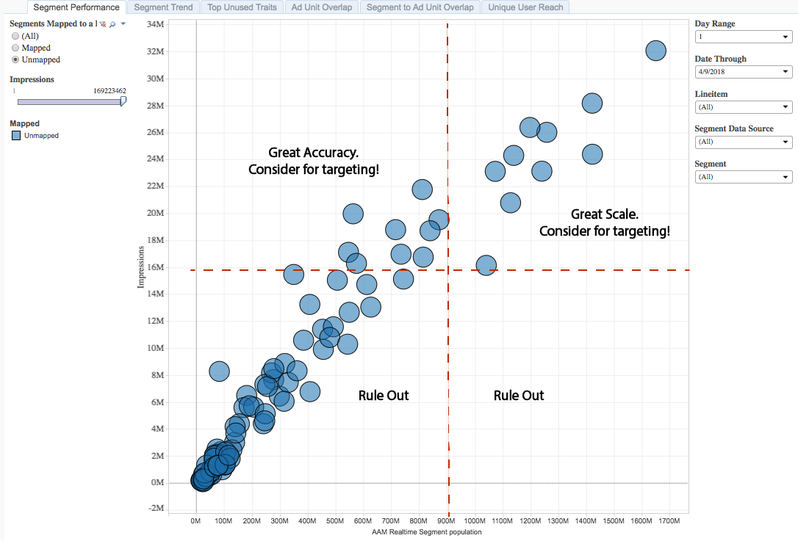

# 區段成效報表{#segment-performance-report}

「區段效能」報表會依曝光次數和即時區段唯一值來比較已對應和未對應的區段。

對應區段是您建立並傳送至目的地以進行定位的區段。 未對應的區段是您已建立但尚未傳送至目的地以進行定位的區段。

在報表內和報表之間比較這些不同的區段類型，可協助您最佳化現有的促銷活動，並找出您可能想要傳送至目的地以鎖定目標的被忽視區段。

## 使用個案 {#use-cases}

使用[!UICONTROL Segment Performance]報表，您可以：

* 識別推動規模或效能的對應受眾區段。
* 根據受眾對過去績效的貢獻，識別要在未來行銷活動中引入的未對應區段。

## 使用區段效能報表{#using-segment-performance-report}

在&#x200B;**[!UICONTROL Mapped]**&#x200B;和&#x200B;**[!UICONTROL Unmapped]**&#x200B;之間切換，以選取已對應或未對應至目的地的區段。 選取&#x200B;**[!UICONTROL All]**&#x200B;以在報表中包含您的所有區段。

使用&#x200B;**日範圍**&#x200B;和&#x200B;**日期至**&#x200B;控制項來調整回顧範圍。 請注意，7天和30天回顧期間僅適用於星期日。

使用&#x200B;**[!UICONTROL Line Item]**&#x200B;下拉框選擇要返回資訊的Web屬性。

在&#x200B;**[!UICONTROL Segment Data Source]**&#x200B;下拉式方塊中，選取包含您要在報表中查看之區段的資料來源。

使用&#x200B;**[!UICONTROL Segment]**&#x200B;下拉式方塊，選取您要在報表中查看的區段。

>[!IMPORTANT]
>
>啟用[!UICONTROL Audience Optimization for Publishers]時，您必須包含[!UICONTROL Line Item IDs]的描述性中繼資料，如[將Google Ad Manager（前身為DFP）資料檔案匯入Audience Manager](../../../reporting/audience-optimization-reports/aor-publishers/import-dfp.md)的步驟3所述。 通過執行此操作，您可以確保報告將Web屬性詳細資訊為[!UICONTROL Line Item]，而不是[!UICONTROL Line Item ID]。

## 解釋結果{#interpreting-results}

您的[!UICONTROL Segment Performance]報表看起來可能類似於下列報表。 在報表中，按一下泡泡以檢視基礎資料。 如需詳細資訊，請參閱範例報表下表的說明。

<table id="table_AFE2540583C34835B04584693ADFD26A"> 
 <thead> 
  <tr> 
   <th colname="col1" class="entry"> 項目 </th> 
   <th colname="col2" class="entry"> 說明 </th> 
  </tr>
 </thead>
 <tbody> 
  <tr> 
   <td colname="col1"> 
區段 
 </td> 
   <td colname="col2"> 
您指派給此區段的字母數字名稱。 
 </td> 
  </tr> 
  <tr> 
   <td colname="col1"> 
區段ID 
 </td> 
   <td colname="col2"> 
此區段的唯一ID。 
 </td> 
  </tr> 
  <tr> 
   <td colname="col1"> 
行項目 
 </td> 
   <td colname="col2"> 
您看到此報表的Web屬性。 
 </td> 
  </tr> 
  <tr> 
   <td colname="col1"> 
點擊次數 
 </td> 
   <td colname="col2"> 
此特徵的成員點按Web屬性中項目的次數。 
 </td> 
  </tr> 
  <tr> 
   <td colname="col1"> 
曝光數 
 </td> 
   <td colname="col2"> 
此特徵的成員接觸到您詳細目錄的次數。 
 </td> 
  </tr> 
  <tr> 
   <td colname="col1"> 
CTR 
 </td> 
   <td colname="col2"> 
點進率. 
 
此量度會中繼曝光次數的百分比，接著點按。 將點按次數除以曝光數來取得此量度。 
 </td> 
  </tr> 
  <tr> 
   <td colname="col1"> 
即時區段母體 
 </td> 
   <td colname="col2"> 
在指定時間範圍內即時檢視的實際獨特訪客數，以及當Audience Manager看到時符合區段資格的訪客數。 
 </td> 
  </tr> 
 </tbody> 
</table>

## 如何閱讀對應的區段結果{#read-mapped-segment}

對應區段在報表中的位置可告訴您許多區段成效良好，以及您可能需要在何處進行一些調整。

若要閱讀報表，將結果分成四個區段，內含虛線（以紅色表示）和下方範例報表中顯示的類別。 範例中的標籤可協助您了解區段效能，以及如何回應這些結果。

## 如何閱讀未映射的段結果{#read-unmapped-segment}

在[!UICONTROL Segment Performance]報表中查看未對應的區段，是尋找尚未考慮進行鎖定的新區段的好方法。 事實上，其中某些區段的表現可能會優於對應區段。

若要閱讀此報表，請將結果分成四個區段，內含虛線（以紅色表示）和下方範例報表中顯示的類別。

