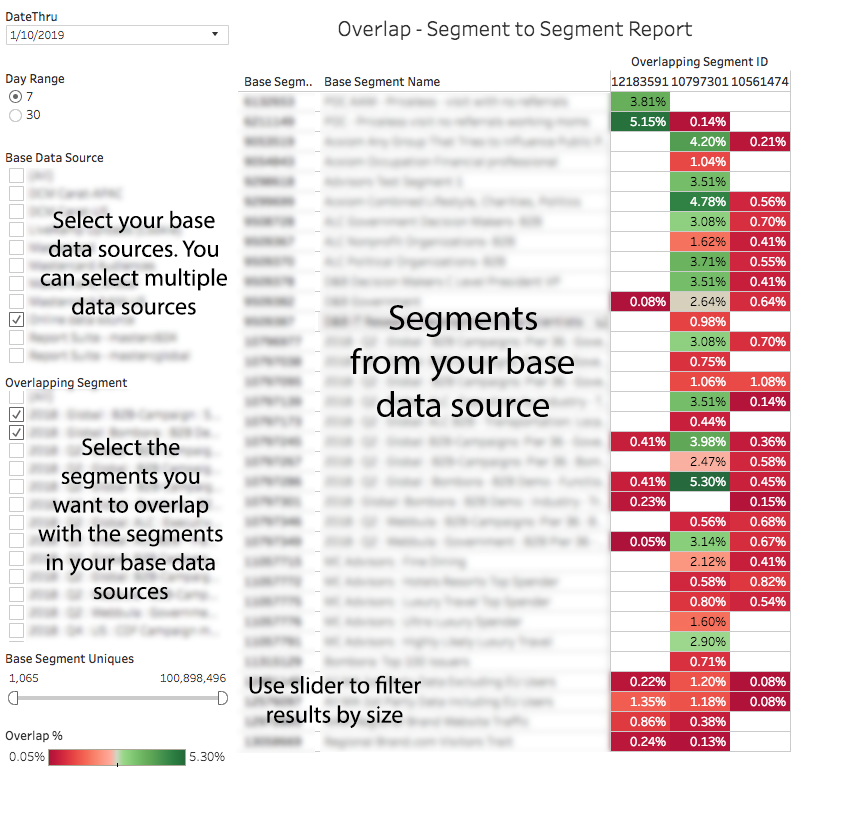

# 區段至區段重疊報表{#segment-to-segment-overlap-report}

傳回區段之間共用多少唯一使用者的資料。

>[!NOTE]
>
>Audience Manager中的「重疊」報表遵守CREAC原則。You can only see segments from data sources that you have access to based on the [RBAC User Group](/help/using/features/administration/administration-overview.md) that you belong to.

<!-- 

c_segment_segment_overlap.xml

 -->

## 概述

[!UICONTROL Segment-to-Segment Overlap] 報表可協助您：

* 根據您的需求識別高或低重疊的群體。高重疊特徵的特徵會為您指定目標對象，但不會讓獨特訪客看到。低重疊特徵可用來覆蓋較大、獨特訪客集。
* 尋找意外重疊，並使用該資訊建立新的高效能區段。

## 範例報表

The following illustration provides a high-level overview of the [!UICONTROL Segment-to-Segment Overlap] report.

>[!NOTE]
>
>[!UICONTROL Segment-to-Segment Overlap] 當報表比較相同區段時，報表會傳回空白欄位。

## 深入分析個別資料點

選取個別點，在彈出視窗中檢視資料詳細資料。您的點按動作會自動更新報表中顯示的資料。

## Segment-to-Segment Overlap Data Pop Fields Defined {#fields-defined}

<!-- 

r_s2s_data_pop.xml

 -->

[!UICONTROL Segment-to-Segment Overlap] 報表的快顯視窗包含下列度量。Note that the uniques metric in the table represents your *real-time users*.

| 量度 | 說明 |
|---|---|
| **[!UICONTROL Segment ID1]** | 顯示在報表結果中之區段的唯一數值ID。顯示為區段的列ID。 |
| **[!UICONTROL Segment ID2]** | 執行報表時所選區段的唯一數值ID。顯示為區段的欄ID。 |
| **[!UICONTROL Segment Name1]** | 顯示在報表結果列中的區段名稱。 |
| **[!UICONTROL Segment Name2]** | 執行報表時所選取區段的名稱。顯示在報表結果欄中。 |
| **[!UICONTROL Overlap %]** | 若要取得重疊的%，Audience Manager會使用下列公式：重疊唯一客戶數/(基本區段獨特值+重疊區段獨特值-重疊獨特客戶數) |
| **[!UICONTROL Overlap Uniques]** | 比較區段之間共用的獨特訪客數量。 |
| **[!UICONTROL Segment Uniques1]** | 區段中獨特訪客的數目。 |
| **[!UICONTROL Segment Uniques2]** | 區段中獨特訪客的數目。 |

>[!MORE_贊_ this]
>
>* [使用資料滑桿篩選報表結果](../../reporting/dynamic-reports/data-sliders.md)
>* [互動報表中使用的形狀、顏色和大小](../../reporting/dynamic-reports/interactive-report-technology.md#shapes-colors-sizes)
>* [報表圖示和工具說明](../../reporting/dynamic-reports/interactive-report-technology.md#icons-tools-explained)
>* [重疊報表：更新排程和最小區段大小](../../reporting/dynamic-reports/overlap-minimum-segment-size.md)
>* [選取Audience Manager報表中的資料取樣和錯誤率…](../../reporting/report-sampling.md)
>* [重疊報表的CSV檔案](../../reporting/dynamic-reports/overlap-csv-files.md)