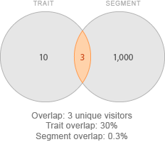

# 區段至特徵重疊報表{#segment-to-trait-overlap-report}

傳回特定特徵與整個區段之間共用之獨特使用者數量的資料。

>[!NOTE]
>
>Audience Manager中的「重疊」報表遵守CREAC原則。You can only see segments and traits from data sources that you have access to based on the [RBAC User Group](/help/using/features/administration/administration-overview.md) that you belong to.

<!-- 

c_segment_trait_overlap.xml

 -->

## 概述

As an optimization tool, the [!UICONTROL Segment to Trait Overlap] reports helps you build highly focused segments or expand segment reach. 例如，您可以建立焦點群體和高重疊特徵，覆蓋特定對象。但是，大部分的重疊可能表示獨特使用者人數較少(觸及率較低)。執行此報告可借由移除許多區段重疊並以較少的特徵取代特徵來擴充覆蓋範圍。

### 範例報表

The following illustration provides a high-level overview of the [!UICONTROL Segment-to-Trait Overlap] report.

### 深入分析個別資料點

選取個別點，在彈出視窗中檢視資料詳細資料。您的點按動作會自動更新報表中顯示的資料。

## Comparing Segments to Traits {#comparing-segments-to-traits}

說明如何比較區段和特徵，從結果衍生有意義的資訊。

<!-- 

c_compare_s2t.xml

 -->

### 比較特徵和區段唯一客戶數：範例

乍看之下，比較細分與特徵並嘗試從結果中得出結論似乎很不切實際。畢竟區段和特徵不同，因此從不同項目衍生的資料有甚麼意義？不過，在這種情況下，我們不會比較特徵和區段，但不比較在它們之間共用的獨特訪客數量。共用獨特訪客計數提供的通用值可讓區段進行特徵比較。

下圖說明特徵與其所屬區段之間的關係。在這種情況下，我們有10位訪客，以及一個有1,000位訪客的區段。共用共個獨特訪客。

獨特訪客計數是這些不同物件類別之間共用的通用常數值。因此，您可以判斷它們之間的獨特訪客關係：

* 特徵會以區段分享30%的獨特訪客(3/10=0.30)。
* 區段與特徵共用獨特訪客(3/1,000=0.003)

### 在區段中尋找值至特徵比較

查看特徵和區段之間的重疊，可以幫助您估計可用的訪客總存放量(預測)，或找出不有效率的區段，重疊過多。

<table id="table_5B211EF95216426299EB20253A5A9C1B"> 
 <thead> 
  <tr> 
   <th colname="col1" class="entry"> 使用案例 </th> 
   <th colname="col2" class="entry"> 說明 </th> 
  </tr>
 </thead>
 <tbody> 
  <tr> 
   <td colname="col1"><b>預測功能</b> </td> 
   <td colname="col2"> 
若要判斷可用訪客集區，請將特徵總計(不重疊)與區段總計(不重疊)相加。 
 
此區段特徵組合最多可覆蓋新使用者。 
 </td> 
  </tr> 
  <tr> 
   <td colname="col1"><b>尋找效率不彰的區段</b> </td> 
   <td colname="col2"> 
If a trait is part of an  AND group in a segment definition, the unique visitors who have that trait are already in the segment and not available for adding to the segment. 您可以使用此報表來找出低重疊的相關特徵，並將其新增至區段定義，從而增加該區段觀眾區的觸及面。 
 </td> 
  </tr> 
 </tbody> 
</table>

## Understanding the Data Filters in the Segment-to-Trait Overlap Report {#data-filters-s2t-report}

說明特徵和區段獨特重疊%滑桿的運作方式。

<!-- 

r_s2t_sliders.xml

 -->

[!UICONTROL Segment-to-Trait overlap] 報表可讓您使用兩個滑桿依特徵或區段來篩選重疊的資料。

* **[!UICONTROL Filter Trait Uniques %:]** 依特徵和區段之間共用的獨特訪客百分比篩選資料。
* **[!UICONTROL Filter Segment Uniques Overlap %:]** 依獨特訪客在區段和特徵之間共用的百分比篩選資料。

### 範例

下圖說明特徵唯一項目%與區段唯一客戶數%之間的差異。在此情況下，特徵和區段會共用個獨特訪客。比例：

* 特徵會以區段分享30%的獨特訪客(3/10=0.30)。
* 區段與特徵共用獨特訪客(3/1,000=0.003)

## Segment-to-Trait Data Pop Fields Defined {#fields-defined}

說明當您按一下個別資料點時，彈出式視窗中顯示的度量。

<!-- 

r_s2t_data_pop.xml

 -->

[!UICONTROL Segment-to-Trait Overlap] 報表的快顯視窗包含下列度量。Note that the uniques metric in the table represents your *real-time users*.

<table id="table_4AF72754276242FFB11543635B43AD90"> 
 <thead> 
  <tr> 
   <th colname="col1" class="entry"> 量度 </th> 
   <th colname="col2" class="entry"> 說明 </th> 
  </tr>
 </thead>
 <tbody> 
  <tr> 
   <td colname="col1"><b> 區段ID</b> </td> 
   <td colname="col2"> 區段的唯一數值ID。 </td> 
  </tr> 
  <tr> 
   <td colname="col1"><b> 資料提供者名稱</b> </td> 
   <td colname="col2"> 區段擁有者的名稱。 </td> 
  </tr> 
  <tr> 
   <td colname="col1"><b> 資料供應商類型</b> </td> 
   <td colname="col2">定義屬於特徵的提供者類型。可以是： 
    <ul id="ul_0477C04A33FD4F5D998B98984E6554D3"> 
     <li id="li_50FCA48EDB5843AB8FB6C34ED2C0067D">第一方(您自己的特徵)。 </li> 
     <li id="li_4F6148EDAEFE43FA8D505944E9FE3855">第三方(來自外部資料合作夥伴/供應商)。 </li> 
    </ul> </td> 
  </tr> 
  <tr> 
   <td colname="col1"><b> SID</b> </td> 
   <td colname="col2"> 區段的唯一數值ID。 </td> 
  </tr> 
  <tr> 
   <td colname="col1"><b> SID名稱</b> </td> 
   <td colname="col2"> 區段的名稱。 </td> 
  </tr> 
  <tr> 
   <td colname="col1"><b> 特徵獨特客戶數重疊%</b> </td> 
   <td colname="col2"> 與區段共用的獨特訪客百分比。 </td> 
  </tr> 
  <tr> 
   <td colname="col1"><b> 區段獨特訪客重疊%</b> </td> 
   <td colname="col2"> 區段與特徵共用的獨特訪客百分比。 </td> 
  </tr> 
  <tr> 
   <td colname="col1"><b> 重疊獨特訪客</b> </td> 
   <td colname="col2"> 區段與特徵之間共用的獨特訪客數。 </td> 
  </tr> 
  <tr> 
   <td colname="col1"><b> 區段獨特訪客</b> </td> 
   <td colname="col2"> 區段中獨特訪客的數量。 </td> 
  </tr> 
  <tr> 
   <td colname="col1"><b> 特徵獨特</b> </td> 
   <td colname="col2"> 特徵中的獨特訪客數。 </td> 
  </tr> 
 </tbody> 
</table>

>[!MORE_贊_ this]
>
>* [使用資料滑桿篩選報表結果](../../reporting/dynamic-reports/data-sliders.md)
>* [互動報表中使用的形狀、顏色和大小](../../reporting/dynamic-reports/interactive-report-technology.md#shapes-colors-sizes)
>* [報表圖示和工具說明](../../reporting/dynamic-reports/interactive-report-technology.md#icons-tools-explained)
>* [重疊報表：更新排程和最小區段大小](../../reporting/dynamic-reports/overlap-minimum-segment-size.md)
>* [選取Audience Manager報表中的資料取樣和錯誤率…](../../reporting/report-sampling.md)
>* [重疊報表的CSV檔案](../../reporting/dynamic-reports/overlap-csv-files.md)