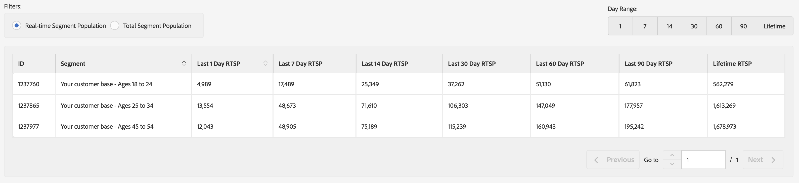

# 一般報表{#general-reports}

[!UICONTROL General] 報表會傳回特徵、區段和目的地上的績效資料。

## 概述 {#general-reports-overview}

<!-- 

c_general_reports.xml

 -->

[!DNL Audience Manager] uses [!UICONTROL Role Based Access Control] ([!UICONTROL RBAC]) to extend user-group permissions to the [!UICONTROL General] reports.使用者只能在報告中看到具有檢視權限的特性和區段。[!UICONTROL RBAC] 功能可讓您控制可供內部團隊檢視的報告資料。例如，管理不同廣告商帳戶的代理商可以設定使用者群組權限，讓管理廣告商A帳戶的團隊無法看見廣告商B的報表資料。

當您需要時執行 [!UICONTROL General] 報表：

* 依特徵、區段或目的地來檢閱績效。
* 追蹤印象(總計和獨特)1、7、14、30、60和90天間隔。
* 檢閱總計和獨特載入計數。
* 比較特徵和區段績效。
* 識別強大或不良的績效特徵和區段、分析需求，或比較第三方報表的負載/發射資料。
* 匯出資料(. csv格式)以進行進一步分析和共用。

下圖提供 [!UICONTROL General] 報表中關鍵元素的高階概述。

1. 設定以下選項: 

   * **報表類型：** 選取所要的報表類型(特徵、區段或目的地)。

   * **日期透過：** 指定報表的日期範圍。

2. 依名稱或ID搜尋特徵、區段或目的地。
3. 從資料夾清單中，拖放您要報告至右側 [!UICONTROL Selections] 面板的特徵、區段或目的地。
4. 產生報表以顯示在可導出表格中。

## Run a General Report {#run-general-report}

本節說明如何執行 [!UICONTROL General] 報表並設定時間和其他效能選項。

<!-- 

t_run_general_report.xml

 -->

1. 在 **[!UICONTROL Analytics]** 控制面板中，按 **[!UICONTROL General Reports]**&#x200B;一下。
1. 從 **[!UICONTROL Report Type]** 下拉式清單中選擇所要的類型：特徵、區段或目的地。
1. *條件* 點按日期方塊以顯示日曆，然後如果您想要指定今天以外的日期，請選取報表的結束日期。
1. 依名稱或ID搜尋特徵、區段或目的地。
1. 從資料夾清單中，拖放您要報告至右側 [!UICONTROL Selections] 面板的特徵、區段或目的地。
1. Click **[!UICONTROL Run Report]**.

   結果會顯示在可導出的表格中。按一下欄標題，以遞增或遞減順序排序結果。
2. 選取報表頂端所要的選項按鈕，以依效能( [!UICONTROL Unique Trait Realizations]、 [!UICONTROL Total Trait Realizations]或 [!UICONTROL Total Trait Population])或依時間(1、7、14、60或90天範圍)篩選資料。

   >[!NOTE]
   >
   >[!UICONTROL Total Trait Realizations] 僅供計算。[!UICONTROL Rule-based Traits]

3. *選擇性* 按 **[!UICONTROL Export to CSV]**&#x200B;一下。這可匯出 [!UICONTROL Unique Trait Realizations][!UICONTROL Total Trait Realizations]所有日期 [!UICONTROL Total Trait Population] 範圍。

## 一般報表結果說明 {#general-reports-explained}

這些數字 [!UICONTROL General Reports] 由我們直接產生 [!UICONTROL User Profile Store]。結果反映出在產生這些報告數目時後端 [!DNL Audience Manager] 包含的使用者人數。

* 這些數字不包含流量過多的訪客ID。在到達後端系統之前，會篩選機器人的流量。此外，當每周清理工作在後端執行時，會捨棄某些機器人流量。
* 如果您在 [!DNL Audience Manager] UUID中透過傳入處理輸入資料，且這些ID包含在我們的系統中已不再作用的使用者，這些非作用中 [!DNL Audience Manager] 的UUID永遠不會到達 [!UICONTROL User Profile Store] 且未回報。
* [!UICONTROL Total Trait Realizations] 僅供計算。[!UICONTROL Rule-based Traits]

## 特徵的一般報表結果 {#general-report-results-traits}

下列度量可在您執行一般報表並選擇 **[!UICONTROL Trait]** 報表類型時使用：

**獨特特徵實作**

此度量代表 [Audience Manager獨特使用者ID(UUID)](../reference/ids-in-aam.md) 在選定時間範圍內符合特徵的唯一數目(UUID)。例如，如果使用者在10/1上瀏覽首頁三次，就會看到一個獨特特徵實現。

**特徵實作總數**

此度量代表特徵在您所選時間範圍內引發的特徵總數。例如，如果使用者瀏覽首頁，然後瀏覽到您的技術新聞和您的體育新聞區段，則在「一般報表」中會顯示為三個整體特徵實作，以及一個獨特特徵實現。

**特徵總人數**

此度量代表目前適用於特徵的Audience Manager UUID總量。使用此數目可瞭解您可用於劃分和定位的使用者總數。一般而言，使用者會繼續屬於特徵的一部分 [120天](../features/traits/create-onboarded-rule-based-traits.md#set-expiration-interval)。例如，使用者今天瀏覽首頁三次，而不返回之後，則每天都以使用者身分繼續，直到120天後。在120天標記中，將會從人口中移除。請參閱我們 [的「特徵資格參考」](../features/traits/trait-qualification-reference.md) ，瞭解「獨特特徵真實性」和「特徵總人口數」之間的差異。

下圖顯示執行「特徵」報表類型一般報表的結果。

## 區段的一般報表結果 {#general-report-results-segments}

下列度量可在您執行一般報表並選擇 **[!UICONTROL Segment]** 報表類型時使用：

**即時細分人口**

此度量代表指定時間範圍內即時看到的實際訪客數量，以及Audience Manager檢視區段時的合格訪客人數。

**區段總人口數**

此度量代表在您選取的回顧期間內，符合區段資格的Audience Manager UUID總數。您的天「區段總計」代表您最準確的定位使用者群。

>[!NOTE]
>
>選取 **[!UICONTROL Include Destination Mappings]** 以查看已啓動目的地的區段人口劃分劃分。

下圖顯示執行區段報表類型一般報表的結果。

## 目標的一般報表結果 {#general-report-results-destinations}

下列度量可在您執行一般報表並選擇 **[!UICONTROL Destination]** 報表類型時使用：

**即時細分人口**

此度量代表指定時間範圍內即時看到的實際訪客數量，以及Audience Manager檢視區段時的合格訪客人數。

**區段總人口數**

此度量代表在回顧期間內，屬於一個群體的Audience Manager UUID總數。

下圖顯示執行「目標」報表類型一般報表的結果。

